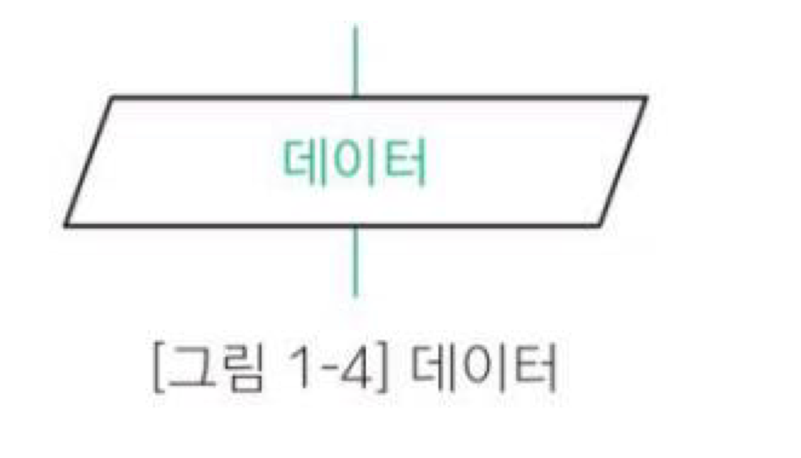
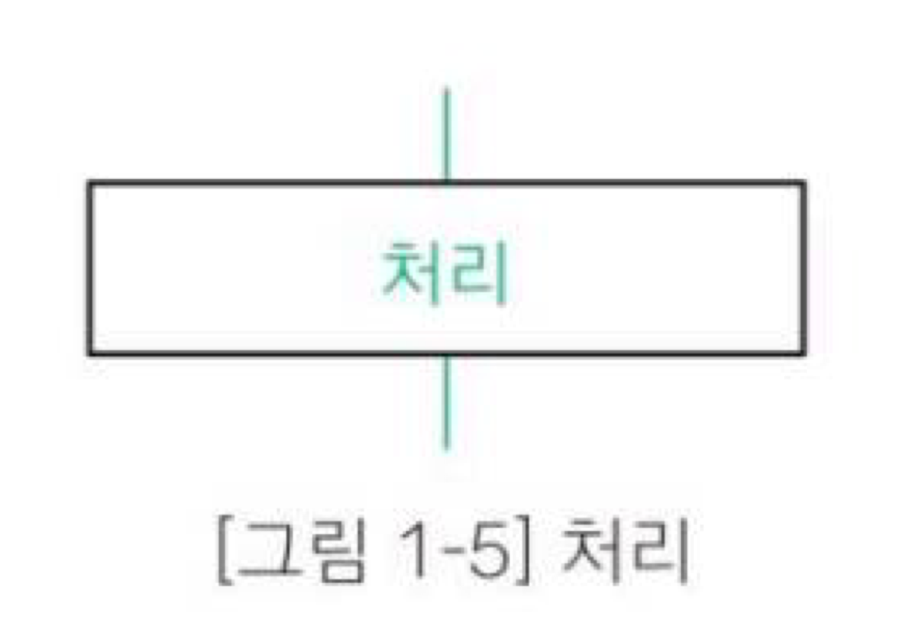
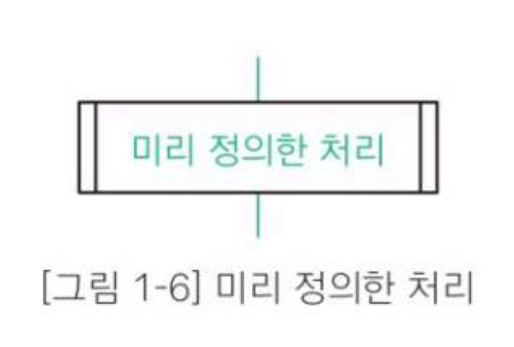
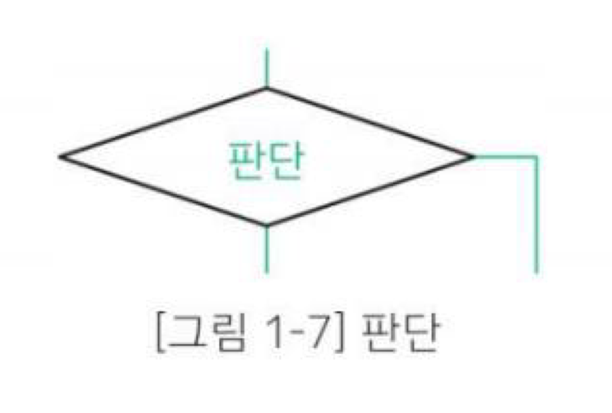
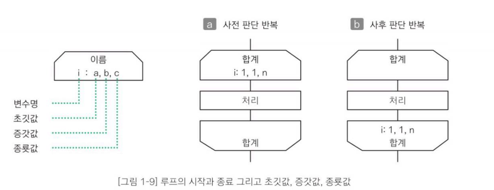
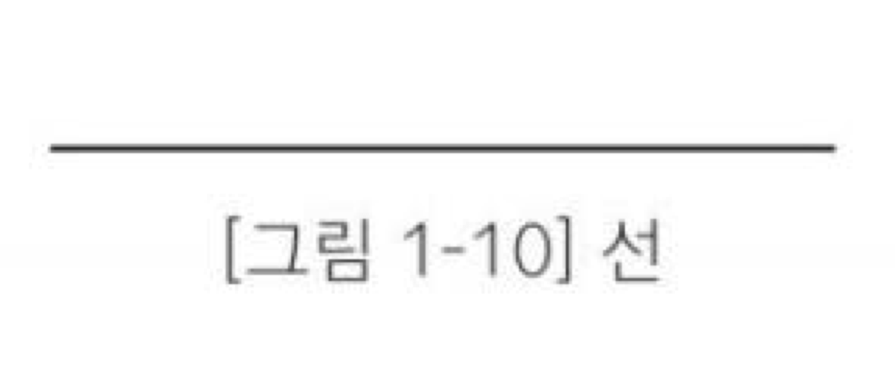
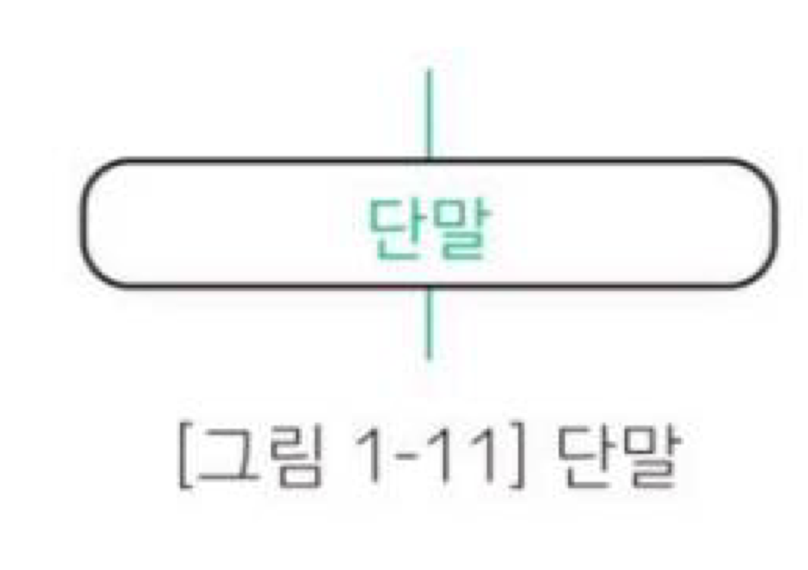

# 알고리즘이란?

- 순차(sequential) 구조 : 여러 문장이 순차적으로 실행되는 구조
- 선택(selection) 구조 : ( ) 안에 있는 식의 평가 결과에 따라 프로그램의 실행 흐름이 변경되는 구조
- 연산자
    - 단항 연산자 : 피연산자 1개
    - 2항 연산자 : 피연산자 2개
    - 3항 연산자 : 피연산자 3개
- 식
    - 변수
    - 상수
    - 변수나 상수를 연산자로 결합한 것
- 식의 평가
    - 프로그램을 실행할 때 식의 값을 알아내는 것을 평가라고 함
- 매개변수
    - 함수를 정의할 때 함수에 전달되는 값을 저장하기 위해 선언하는 변수
    - parameter or formal parameter라 함
    - 함수를 정의할 때는 매개변수, 함수를 호출할 때는 실인수

> 핵심
**알고리즘이란 어떤 문제를 해결하기 위한 절차로, 명확하게 정의되고 순서가 있는 유한 개의 규칙으로 이루어진 집합이다.**
> 

** 아무리 명확하게 알고리즘을 정의해도 변수값에 따라 결과가 맞기도 하고 틀리기도 한다면 올바른 알고리즘이 아님

- 조건 연산자
    - 3개의 피연산자를 갖는 3항 연산자 ? :
    - 식1 ? 식2 : 식3
- 프로그램 순서도 기호
    - 실제로 수행하는 연산을 나타내는 기호
    - 제어의 흐름을 나타내는 기호
    - 프로그램 순서도를 이해하고 작성하는데 편의를 부여하는 특수 기호
- 프로그램 순서도 기호
    - 데이터 : 입력과 출력
    
    
    
    - 처리 : 여러 종류의 처리 기능
    
    
    
    - 미리 정의한 처리 : 이미 정의한 하나 이상의 연산 또는 명령어들로 이루어진 처리
    
    
    
    - 판단 : 기호에서 정의한 조건을 평가하여 하나의 출구를 선택
    
    
    
    - 루프 범위 : 루프의 시작과 종료를 나타냄
    
    
    
    - 선 : 제어의 흐름을 나타냄
    
    
    
    - 단말 : 외부 환경으로 나가거나 외부 환경에서 들어오는 것
    
    
    

## 반복

- 반복 구조
    - 어떤 조건이 성립하는 동안 처리를 반복하여 실행하는 것
    - 일반적으로 루프라고 부름
- while문 반복
    - 실행 전에 반복을 계속할지 판단 → 사전 판단 반복 구조
    - 제어식의 평가값이 0이 아니면 프로그램 명령문이 반복됨
    - while (제어식) 명령문
- 카운터용 변수
    - 일반적으로 i와 같이 반복 제어에 쓰이는 변수
- for문 반복
    - 하나의 변수를 사용하는 반복문에 적합
    - for (식1; 식2; 식3) 명령문
- do 문
    - 일단 루프 본문을 한번 실행한 다음 계속 반복할 것인지 판단
        
        → 사후 판단 반복문
        
    - 제어식을 평가한 값이 0이 아니면 루프 본문의 명령문 반복

> **사전 판단 반복과 사후 판단 반복의 차이점**
사전 판단 반복의 경우 처음 제어식을 평가한 결과가 0이면 루프 본문이 한 번도 실행되지 않지만 사후 판단 반복문은 루프 본문이 반드시 한 번은 실행됨
> 

> **구조적 프로그래밍이란?**
하나의 입구와 하나의 출구를 가진 구성 요소만을 계층적으로 배치하여 프로그램을 구성하는 방법
순차, 선택, 반복이라는 3 종류의 제어 흐름을 사용함
> 

- 논리 연산자의 단축 평가
    - 논리 연산의 식 전체를 평가한 결과가 왼쪽 피연산자의 평가 결과만으로 정해지는 경우 오른쪽 피연산자의 평가를 수행하지 않는 것
- 드모르간 법칙
    - 각 조건을 부정하고 논리 곱을 논리합으로, 논리합을 논리곱으로 바꾸고 다시 전체를 부정하면 원래의 조건과 같다
- 다중 루프
    - 반복 안에서 다시 반복하는 것
    - 루프가 중첩되는 수준에 따라 이중 루프, 삼중 루프라고 함

> **개행 문자란?**
‘\n’로 텍스트의 한 행이 끝나고 새로운 행이 시작됨을 의미
줄 바꿈 문자, EOL(End-Of-Line)이라고도 함
>
