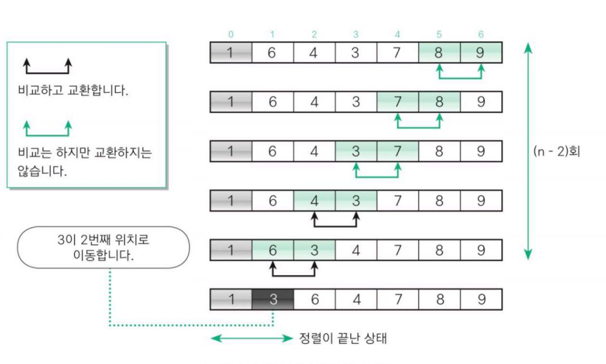
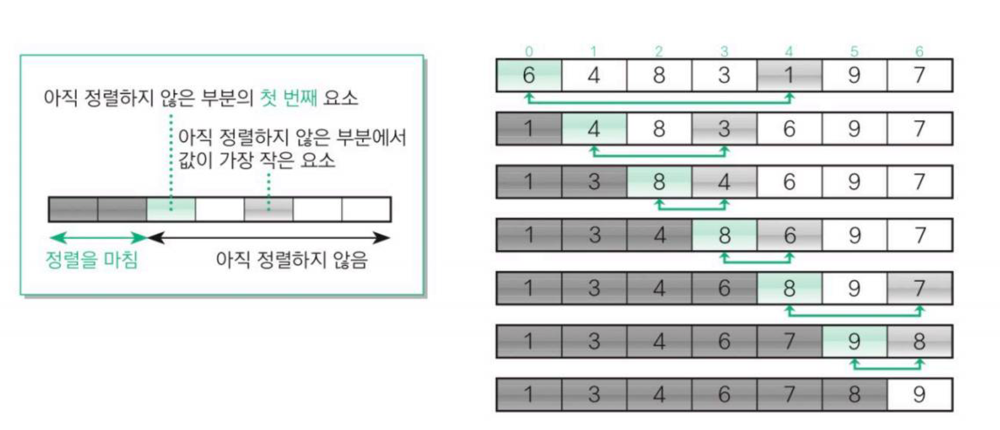
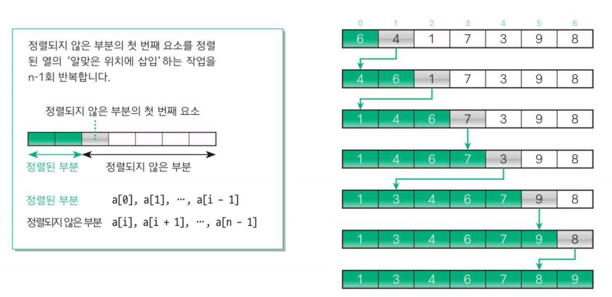
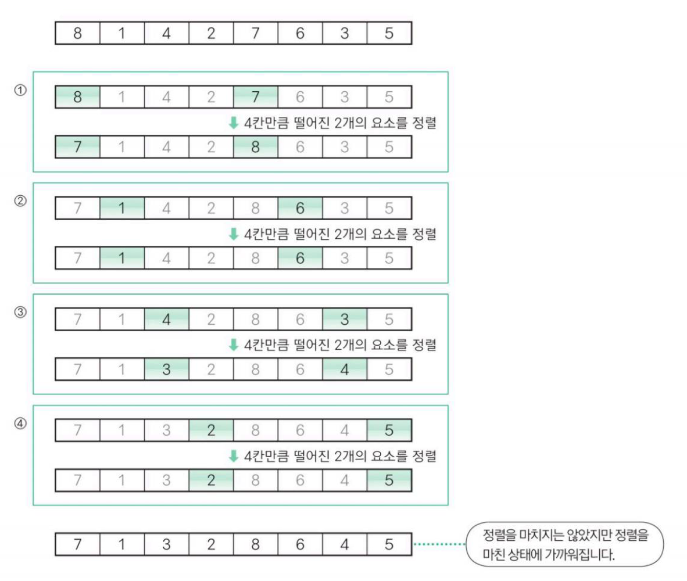
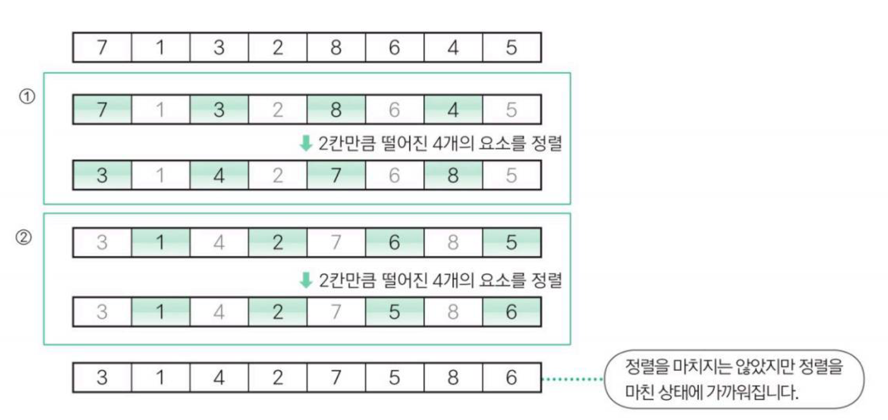
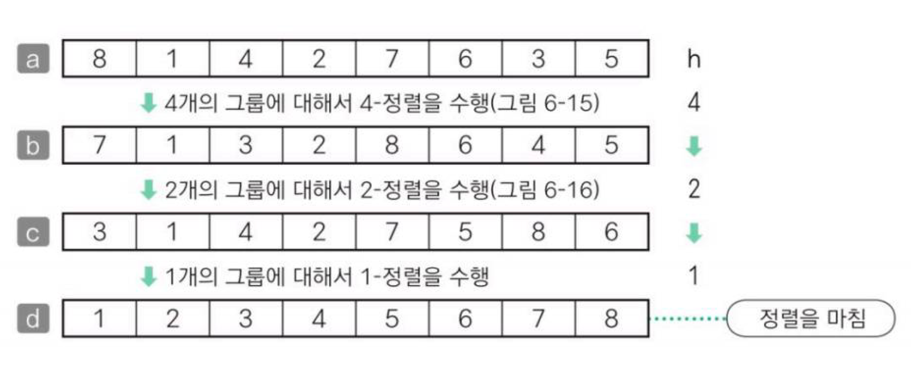
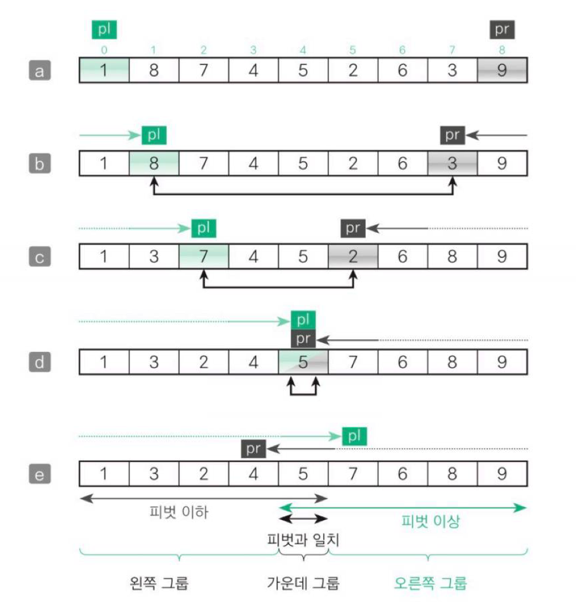
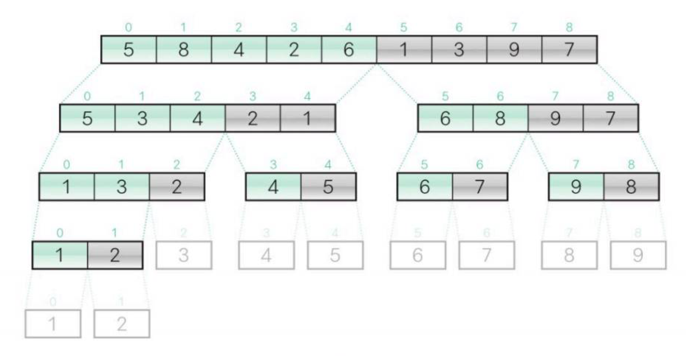

## 정렬

- 대소 관계에 따라 데이터 집합을 일정한 순서로 줄지어 늘어서도록 바꾸는 작업
- 정렬을 통해 검색을 더 쉽게 할 수 있음
- 종류
    - 오름차순 정렬 : 작은 데이터가 앞쪽에
    - 내림차순 정렬 : 큰 데이터가 앞쪽에
- 안정된 정렬
    - 같은 값의 키를 가진 요소의 순서가 정렬 전후에도 유지되는 것
    - 안정되지 않다면 같은 데이터일 경우 어떤 순서로 정렬되는지 확실하지 않음
- 정렬 알고리즘의 핵심 요소
    - 교환
    - 선택
    - 삽입

## 내부 정렬과 외부 정렬

- 내부 정렬 : 정렬할 모든 데이터를 하나의 배열에 저장할 수 있는 경우 사용
- 외부 정렬 : 정렬할 데이터가 너무 많아서 하나의 배열에 저장할 수 없는 경우 사용 → 내부정렬 응용

## 버블 정렬

- 이웃한 두 요소의 대소 관계를 비교하여 교환을 반복
- 패스 (pass) : 비교하고 교환하는 과정
- 패스를 k회 수행하면 앞쪽의 요소 k개가 정렬되고 모든 정렬이 끝나려면 n-1회의 패스가 수행되어야 함
- 알고리즘 개선
    1. 어떤 패스에서 요소의 교환횟수가 0이면 더 이상 정렬할 요소가 없다는 뜻이므로 정렬 작업을 멈춰도 됨
    2. 각각의 패스에서 비교, 교환을 하다가 어떤 시점 이후에 교환이 수행되지 않는다면 그보다 앞쪽의 요소는 정렬이 끝났다고 볼 수 있음

> **양방향 버블 정렬 or 셰이커 정렬**
 
홀수 번째 패스는 가장 작은 요소를 맨 앞으로 옮기고 짝수 번째 패스는 가장 큰 요소를 맨 뒤로 옮기는 방식의 알고리즘
> 

## 단순 선택 정렬

- 가장 작은 요소부터 선택해 알맞은 위치로 옮겨서 순서대로 정렬하는 알고리즘
- 교환 과정
    1. 아직 정렬하지 않은 부분에서 가장 작은 키의 값 선택
    2. 가장 작은 키의 값과 아직 정렬하지 않은 부분의 첫 번째 요소를 교환
- 서로 떨어져있는 요소를 교환하는 것이기 떄문에 안정적이지 않음
    - 중복한 값이 있을 때 두 요소의 순서가 바뀔 수도 있음

## 단순 삽입 정렬

- 선택한 요소를 그보다 더 앞쪽의 알맞은 위치에 삽입하는 작업을 반복하여 정렬하는 알고리즘
- 아직 정렬되지 않은 부분의 첫번째 요소를 정렬된 부분의 알맞은 위치에 삽입
- ‘알맞은 위치’ → 정렬된 요소에 각각 대입해 보면서 들어갈 자리 확인
- 단순 삽입 정렬의 특징
    - 장점 : 정렬을 마쳤거나 정렬을 마친 상태에 가까우면 정렬 속도가 매우 빨라짐
    - 단점 : 삽입할 위치가 멀리 떨어져 있으면 이동(대입)해야 하는 횟수가 많아짐

## 시간 복잡도

- 3가지 단순 정렬(버블, 선택, 삽입)의 경우 모두 O($n^2$)의 시간복잡도를 가지고 있음

## 셀 정렬

- 단순 삽입 정렬의 장점을 살리고 단점을 보완하여 좀 더 빠르게 정렬하는 알고리즘
- 정렬할 배열의 요소를 그룹으로 나눠 각 그룹 별로 단순 삽입 정렬을 수행하고, 그 그룹을 합치면서 정렬을 반복하여 요소의 이동 횟수를 줄이는 방법
- h-정렬
    - 셀 정렬 과정에서 수행하는 각각의 정렬
    
    ex) 
    
    1. 2개 요소에 대해 ‘4-정렬’ 수행
    
    
    
    1. 4개 요소에 대해 ‘2-정렬’ 수행
    
    
    
    1. 8개 요소에 대해 ‘1-정렬’ 수행
    
    
    
- 여러 그룹으로 나누어 정렬하는 이유
    - 단순 삽입 정렬의 장점은 살리고 단점은 보완하기 위해
- 정렬해야 하는 횟수는 늘지만 전체적으로 요소의 이동 횟수가 줄어들어 효율적인 정렬을 할 수 있음
- 중분값(h)
    - h값이 서로 배수가 되지 않도록 해야 함
        
        → 요소가 충분히 섞여 효율적인 정렬을 기대할 수 있음
        
    - 1부터 시작하여 3배한 값에 1을 더하눈 수열을 반대로 한 값
- 시간 복잡도 : O(n^1.25)
    - 기존보다는 빠르지만 멀리 떨어져 있는 요소를 교환해야 하기 떄문에 안정적이지 않음

## 퀵 정렬

- 피벗 : 그룹을 나누는 기준
- 피벗을 설정과 그룹 나눔을 반복하여 정렬

- 피벗 선택과 알고리즘 개선
    1. 나눌 배열의 요소 개수가 3 이상이면 임의로 3요소를 선택하고 그중에서 중앙값인 요소를 피벗으로 선택
    2. 나눌 배열의 처음, 가운데, 끝 요소를 정렬한 다음 가운데 요소와 끝에서 두 번째 요소를 교환
- 시간 복잡도 : $O(nlogn)$
    
    but! 정렬할 배열의 초깃값이나 피벗의 선택 방법에 따라 시간 복잡도가 증가는 경우도 있음
    
    → 최악의 시간 복잡도 $O(n^2)$
    

> **qsort**
 
같은 키값을 가지고 있는 데이터가 2개 이상인 경우 이름의 오름차순으로 정렬되지만 정렬 전후의 데이터가 같은 순서를 유지하지 않음
 
⇒ 안정된 정렬은 아님
> 

## 병합 정렬

- 배열을 앞부분과 뒷부분으로 나누어 각각 정렬한 다음 병합하는 작업을 반복하여 정렬을 수행하는 알고리즘
- 정렬을 마친 두 배열의 병합
    - 각 배열에서 선택한 요소의 값을 비교하여 작은 값의 요소를 꺼내 새로운 배열에 넣는 작업
- 알고리즘 순서
    1. 배열의 앞부분을 병합 정렬로 정렬
    2. 배열의 뒷부분을 병합 정렬로 정렬
    3. 배열의 앞부분과 뒷부분을 병합
- 시간 복잡도 : $O(nlogn)$
- 서로 떨어져 있는 요소를 교환하는 것이 아니기 떄문에 안정적인 정렬 방법임

## 힙 정렬

- 힙의 특성을 이용하여 정렬 수행
- 힙
    - 부모의 값이 자식의 값보다 항상 크다는 조건을 만족하는 완전이진트리
- 정렬 과정
    1. 힙에서 가장 큰 값인 루트를 꺼냄
    2. 마지막 요소를 루트로 이동
    3. 자기보다 큰 값을 가지는 자식 요소와 자리를 바꾸며 아래쪽으로 내려가는 작업 반복
        
        → 자식의 값이 작거나 앞에 다다르면 작업이 종료됨
        
- 선택 정렬을 응용한 알고리즘
- 아랫부분의 작은 부분 트리부터 시작해 올라가는 방식으로 배열을 힙으로 바꾼다면 전체 배열을 힙으로 만들 수 있음
- 시간 복잡도 : $O(nlogn)$

## 도수 정렬

- 요소의 대소 관계를 판단하지 않고 빠르게 정렬할 수 있는 방법
- 단계
    1. 도수분포표 만들기
    2. 누적도수분포표 만들기
    3. 목적 배열 만들기
    4. 배열 복사하기
- 데이터의 비교, 교환 작업이 필요 없어 매우 빠름
- 단일 for 문만을 사용하며 재귀 호출, 이중 for 문이 없어 아주 효율적인 알고리즘
- 하지만 도수분포표가 필요하기 때문에 데이터의 최솟값과 최댓값을 미리 알고 있는 경우에만 사용할 수 있음
