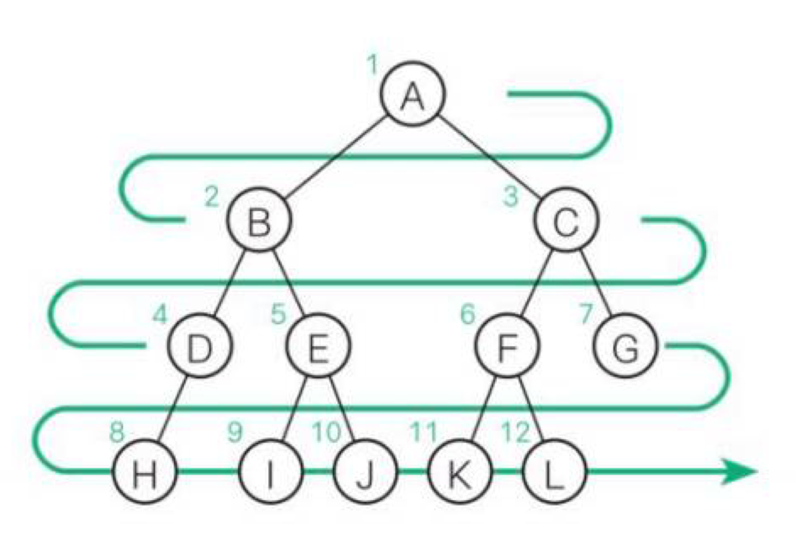

## 트리

- 데이터 사이의 계층 관계를 나타내는 자료구조
- 트리 관련 용어
    - 노드
    - 가지
    - 루트
        - 트리 가장 윗부분에 위치하는 노드
        - 하나의 트리에는 하나의 루트가 있음
    - 리프
        - 트리의 가장 아랫부분에 위치하는 노드
        - 더 이상 뻗어나갈 수 없는 마지막에 위치한 노드 의미
    - 안쪽 노드
        - 루트를 포함하여 리프를 제외한 노드
    - 자식
        - 어떤 노드로부터 가지로 연결된 아래쪽 노드
        - 노드는 자식을 여러 개 가질 수 있음
    - 부모
        - 어떤 노드에서 가지로 연결된 위쪽 노드
        - 노드는 1개의 부모를 가짐
    - 형제
        - 같은 부모를 가지는 노드
    - 조상
        - 어떤 노드에서 가지로 연결된 노드 모두
    - 자손
        - 어떤 노드에서 가지로 연결된 아래쪽 노드 모두
    - 레벨
        - 루트로부터 얼마나 떨어져 있는지에 대한 값
        - 루트로부터 가지가 하나씩 아래로 뻗어나갈 때마다 레벨이 1씩 증가
    - 차수
        - 노드가 갖는 자식의 수
    - 높이
        - 루트로부터 가장 멀리 떨어진 리프까지의 거리
    - 서브 트리
        - 트리 안에서 다시 어떤 노드를 루트로 정하고 그 자손으로 이루어진 트리
    - 널 트리
        - 노드, 가지가 없는 트리

## 순서 트리와 무순서 트리

- 순서 트리
    - 형제 노드의 순서를 따지는 트리
    - 탐색 방법
        - 너비 우선 탐색
            - 낮은 레벨에서 시작해 왼쪽에서 오른쪽 방향으로 검색하고 한 레벨에서의 검색이 끝나면 다음 레벨로 내려감
        
        
        
        - 깊이 우선 탐색
            - 리프까지 내려가면서 검색하는 것을 우선순위로 하는 탐색 방법
            - 더이상 검색을 진행할 곳이 없는 경우 부모에게 돌아감
        
        
        
- 무순서 트리
    - 형제 노드의 순서를 따지지 않는 트리

## 깊이 우선 탐색

- 전위 순회
    - 노드 방문 → 왼쪽 자식 → 오른쪽 자식
- 중위 순회
    - 왼쪽 자식 → 노드 방문 → 오른쪽 자식
- 후위 순회
    - 왼쪽 자식 → 오른쪽 자식 → 노드 방문

## 이진트리

- 노드가 왼쪽 자식과 오른쪽 자식을 갖는 트리
- 각 노드의 자식은 2명 이하만 유지해야 함
- 왼쪽 자식과 오른쪽 자식 구분
- 왼쪽 서브 트리 : 왼쪽 자식을 루트로 하는 서브 트리
- 오른쪽 서브 트리 : 오른쪽 자식을 루트로 하는 서브 트리

## 완전이진트리

- 루트부터 노드가 채워져 있으면서 같은 레벨에서는 왼쪽에서 오른쪽으로 노드가 채워져 있는 이진트리
- n개의 노드를 저장할 수 있는 완전이진트리의 높이는 log n

## 이진검색트리 조건

1. 어떤 노드 N을 기준으로 왼쪽 서브 트리 노드의 모든 키값은 노드 N의 키값보다 작아야 함
2. 오른쪽 서브 트리 노드의 키값은 노드 N의 키값보다 커야 함
3. 같은 키값을 갖는 노드는 없음

## 이진검색트리 특징

- 구조가 단순함
- 중위 순회를 하면 키값의 오름차순으로 노드를 얻을 수 있음
- 이진 검색과 비슷한 방식으로 빠르게 검색할 수 있음
- 노드를 삽입하기 쉬움
