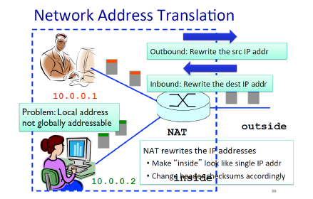

# 10강 - 네트워크계층2

### IP datagram format

- field(header, 20byte)
    - source IP address
    - destination IP address
    - checksum
    - time to live(TTL) : 0이 되면 해당 패킷 버려짐
        
        한정 시간만 네트워크 상에 존재하고 사라지기
        
    - Upper layer : IP(data + header)에 들어가는 data가 TCP인지 UDP인지 구분

### IP Address(IPv4)

- 32bit
- Hierarchical Addressing
    - Network and host partions
    - 같은 네트워크에 속한 호스트들은 동일한 네트워크 ID 가짐
        
        Network ID == Subnet ID == Prefix
        
        ex) 
        
        12.34.158.0/**24**
        
        앞에 24bit는  network ID
        
    - Subnet Mask
        
        어디까지가 Network ID 인지 알 수 있는 bit map
        

### Classfull Addressing

- class A : 8 (Network ID bits), 2^24개 호스트 주소 가질 수 있음
- class B : 16
- class C : 24

### Classless Inter-Domain Routing(CIDR)

- Network와 Host 경계를 자유롭게 끊음

### Subnets

- **같은 prefix**(subnet ID)를 가진 device의 집합
- router들을 거치지 않고 접근이 가능한 호스트들의 집합

router는 여러 개의 IP주소를 갖지만, IP 주소들의 prefix가 다 다름

즉, router는 여러 개의 서브넷에 속해 있음(교집합) 

router를 통해 다른 집합으로 갈 수 있음

### IPv6

- 주소 공간을 32bit → 128bit로 늘림

### Network Address Translation(NAT)

- IPv4 체계에서 각 divece들이 고유한 IP 주소를 가지기 힘듦
    
    따라서 NAT를 사용(IP Address 재사용)
    
- 내부 네트워크에서는 고유한 IP 주소를 가지고
    
    외부로 패킷이 나갈 때는 NAT 기능을 하는 라우터의 IP 주소로 변경
    
    port도 변경해야 함
    
    