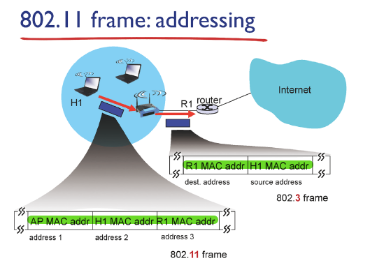
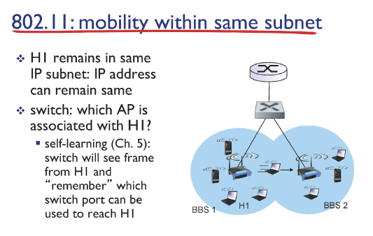

# 19강 - 무선이동네트워크2

### frame : addressing

- AP가 무선 인터페이스와 유선 인터페이스로 연결되어 있는 경우
    
    MAC protocol이 다름
    
    따라서 frame이 다름
    
    
    
    - 802.11 frame : **무선** frame
        
        AP는 link로 구현 따라서 **3개의 address** 주소 필요
        
    - 802.3 frame : **유선** frame

### mobility

- 동일 subnet일 경우) 나의 IP, port 변화가 없으므로 **TCP 연결이 유지**됨
- 이동하였는데 나의 IP, port가 변화는 없고, BBS만 변화가 있다면
    
    self-learning을 통해 switch table의 해당 host의 interface만 변경하면 됨
    
    