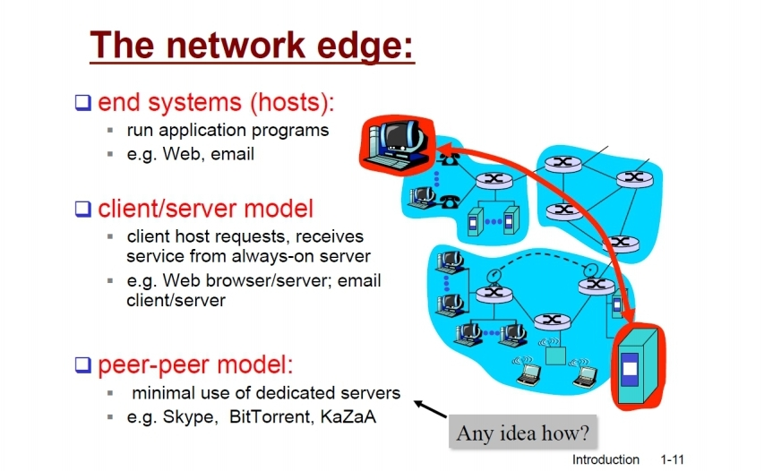
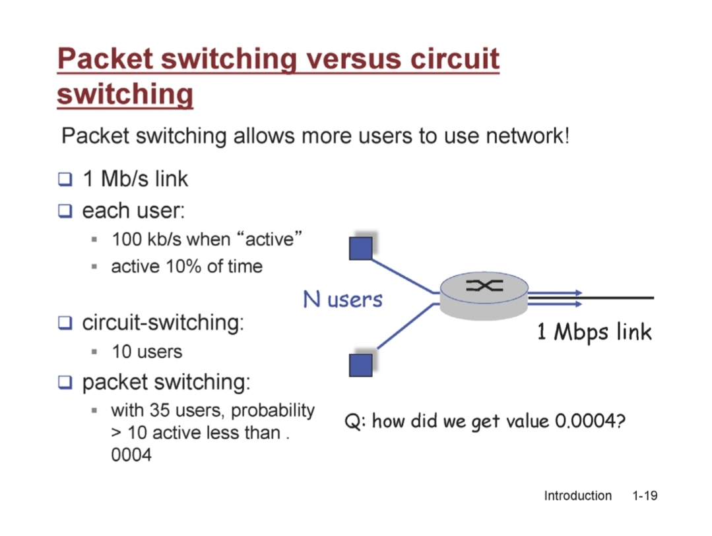
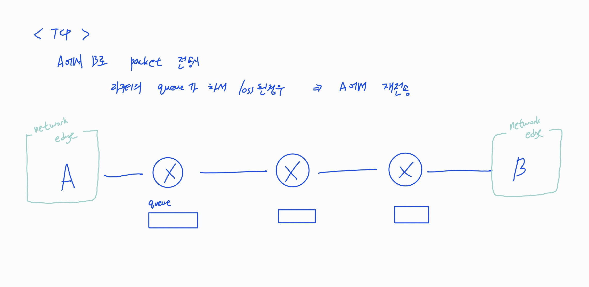

# 1강 - 컴퓨터네트워크 기본1

주차: 1일차, 1주차
키워드: network edge, packet delay

### 인터넷 정의

> 수많은 노드(컴퓨터)들이 연결됨
> 

### network structure

- network 구성요소
    - network edge
        
        ex) labtop, 노트북, 웹서버 등
        
        
        
    - network core
        
        ex) 라우터
        
    - link
        
        edge와 core를 연결하는 것
        

### 인터넷 통신 방법

1. connection-oriented service
    - **TCP(Transmission Control Protocol)**
    - TCP가 제공하는 것
        1. reliable, in-order byte-stream data transefer
            
            신뢰성 있게 전송
            
            순서를 유지하여 전송
            
        2. flow control
            
            sender가 receiver 능력에 맞춰 전송 속도를 조절
            
        3. congestion control
            
            sender와 receiver 사이 네트워크 상황에 맞춰 전송을 조절
            

1. connectionless service
    - **UDP(User Datagram Protocal)**
        - UDP가 제공하는 것
            1. connectionledd
            2. unreliable data transfer
            3. no flow control
            4. no congesetion control
        - UDP 특징
            - 신뢰성 중요 X
                
                따라서 신뢰성이 보장되지 않아도 되는 경우에는 UDP 사용하면 됨
                
                ex) 보이스콜 등
                

### Protocol 개념

- communication을 위한 일종의 약속

### Router가 data를 전송하는 방식

1. circuit switching
    - 출발지에서 목적지까지 가는 길을 예약하고,
        
        특정 사용자만 사용할 수 있음
        
    
    ex) 유선 전화망
    
2. packet-switching
    - packet(bit들의 집합) 단위로 받아서 들어오는 대로 forwarding
        
        인터넷에서 주로 사용하는 방식
        

- circuit switching VS packet-switching
    
    동시에 packet-switching이 더 많은 사람들에게 제공할 수 있음
    
    
    

### Four sources of packet delay (It’s a packet-switching)

1. nodal processing
    
    packet 검사, 알맞는 목적지 선정 등
    
    - router의 성능이 좋으면 processing delay 감소
2. queueing
    
    나가는 속도보다 들어오는 속도가 빠를 경우를 대비해 저장하기 위한 router에 **queue(or buffer)** 존재
    
    queue에서 기다리는 시간
    
    - data가 몰리는 것은 cotrol 불가
        
        queue가 넘치는 경우에는 packet 유실 발생
        
3. transmission delay
    
    첫번째 bit부터 마지막 bit까지 나가는데(link에 올라타는데) 걸리는 시간
    
    <aside>
    💡 time to send bits into link = packet length(L)/link bandwidth(R)
    
    </aside>
    
    - bandwidth 늘리면 transmission delay 감소
4. propagation delay
    
    link에 올라단 마지막 bit가 다음 라우터까지 도달하는데 걸리는 시간
    
    - link의 길이와 비례

### Packet loss시 재전송

- network edge가 재전송
    
    