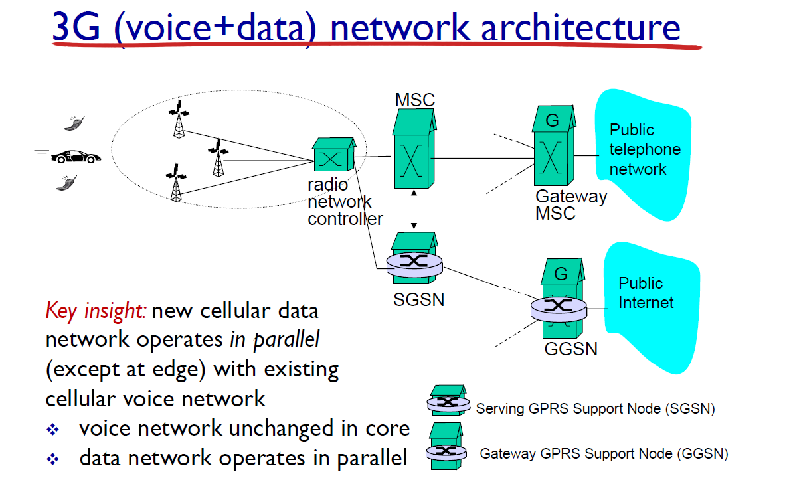

# 20강 - 무선이동네트워크3

키워드: Cellular Network

### Rate adaptation

- 채널 환경에 따라서 전송하는 rate가 달라짐
- 채널 환경 지표
    - SNR
        - signal-to-noise ratio
        - SNR 값이 높을 수록 채널 성능 좋음
            
            ex) AP에 가까울 수록 채널 성능 좋음
            
        - 무선 채널은 아날로그, 보내려는 데이터는 디지털(0,1로 구성)
            
            즉, 디지털 데이터를 아날로그 신호에 실어 보내야 함
            
    - BER
        - 비트당 에러가 발생할 확률
        - 높을 수록 안 좋음
        - 에러가 많이 발생하면 CSMA/CA에서 ACK가 오지 않아 계속 재전송하여 성능 떨어짐

### Cellular Network

- 전체 지역을 cell이라는 단위로 나눠서
    
    cell 하나에 기지국 심고 그 cell 안에 host를 담당
    
    
    
- Cellular Network protocol
    - channel partitioning protocols
        - FDMA : frequency division
        - TDMA : time division
        - CDMA : code division (3G부터 사용)
- 3G 구조
    
    RNC - SGSN - GGSN
    
    mobile IP 주소는 GGSN이 할당
    
    