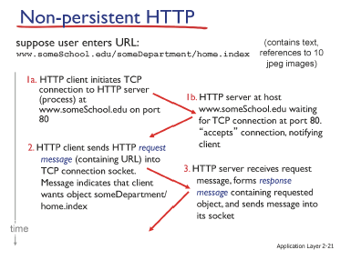
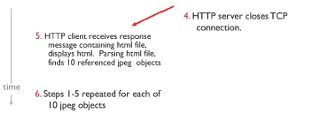

# 2강 - 컴퓨터네트워크 기본2

주차: 1일차, 1주차
키워드: HTTP, network layer

### network layer

- Network edge(client, server)에 **App~Phy**까지 존재
    
    router에는 **Net~Phy**까지만 존재
    

| layer | protocol |
| --- | --- |
| Application | HTTP |
| Transport | TCP/UDP |
| Network | IP |
| Link | WiFi, LTE, Ethernet |
| Physical |  |

### Client-Server Architecture

- server : 고정된 IP 주소
    
    client : IP 주소가 고정되지 않아도 됨
    
- Client와 Server 사이에 통신은 **process와 process 사이에 통신**임
    
    다른 process와 통신을 하기 위해서 **IP Addr, Port**를 알아야 함
    
    IP Addr - 어떤 컴퓨터인지 구분
    
    port - 어떤 컴퓨터 안에 돌아가고 있는 프로세스인지 구분
    

### App에서 Tran 계층에서 제공되기 원하는 서비스

1. data integrity : data가 유실되지 않고, 온전히 목적지에 도착
2. timing : XX 시간 내에 목적지에 도착
3. troughput : XXbps 보장 (전송량)
4. security : 보안

그러나 Transport에서는 **data integrity**만 제공

data integrity는 TCP protocol이 제공

UDP는 data integrity도 제공 X

Transport에서 제공해주지 않는 제공은 App 계층에서 담당

### HTTP(hypertext transfer protocol)

- 텍스트를 전송하는 프로토콜
- HTTP message
    - request
    - response
- HTTP는 TCP를 사용하기 때문에
    
    TCP connetction을 해야 함
    
- **stateless** (무상태)
    
    상태를 기억하지 않음
    
- TCP connetction을 사용하는 방식에 따라 달라지는 HTTP
    1. non-persistent HTTP
        
        TCP connetction을 지속적으로 사용 X
        
        
        
        
        
    2. persistent HTTP
        
        TCP connetction을 지속적으로 사용, 유지, 재사용