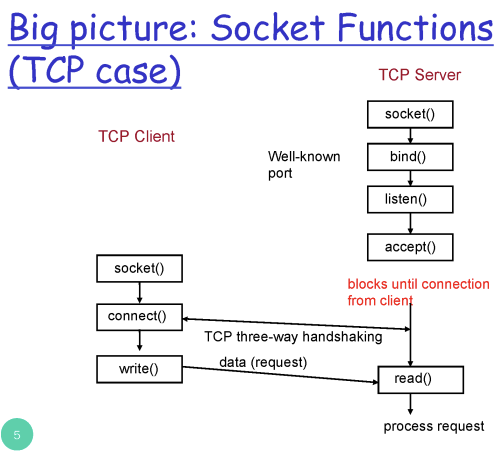
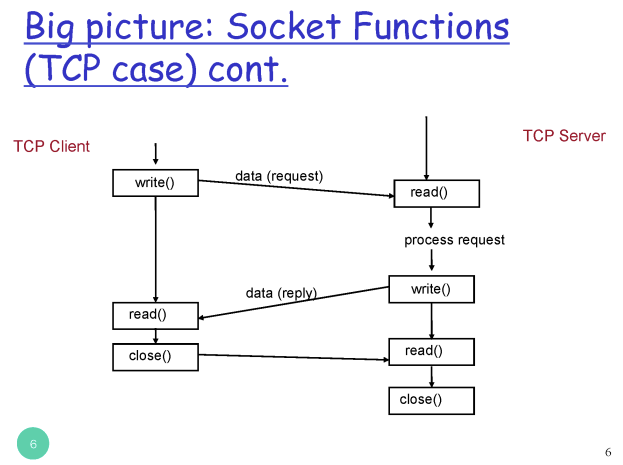
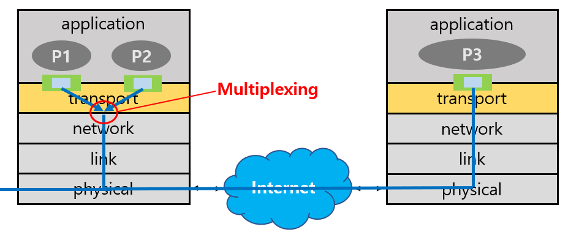
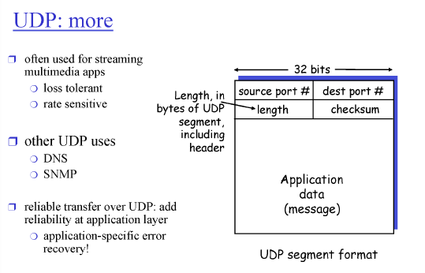

# 3강 - 애플리케이션 계층1

### Socket Programming

- client와 server의 통신은
    
    곧, application process(program)의 통신
    
    **Socket** : process와 process 간에 API
    

### types of sockets

1. SOCK_STREAM(a.k.a. TCP)
2. SOCK_DGRAM(a.k.a. UDP)

### socket functions

1. server - socket() : (TCP) socket 생성
2. server - bind() : 생성한 소켓을 server의 특정 port에 bind
3. server - listen() : 생성한 소켓을 listen 용도로 사용
4. server - accept() : client로 부터 요청을 받을 준비 완료

여기까지 수행되면 client로부터 connection이 들어올 때까지 block

1. client - socket() : socket 생성
2. client - connect() : 원하는 server의 socket에 connect
server의 주소와 port 번호가 파라미터로 들어가야 함

connect 후 client와 server 간 연결고리 형성

이후로 wirte(), read()으로 통신 진행

통신이 끝나면 close()

### Network Units

| layer | data naming | consist |
| --- | --- | --- |
| Application | message |  |
| Transport | segment | application data + header |
| Network | packet | transport data + header |
| Link | frame | network data + header |
| Physical |  |  |

### Multiplexing/demultiplexing

- Multiplexing : 여러 어플리케이션의 Socket들로부터 들어오는 데이터를 모아, segment로 만들어 하위 계층으로 전달
- demultiplexing : segmet에서 message를 꺼내 app의 여러 socket 중 하나로 보내는 것
    
    즉, 어떤 socket으로 올려보낼까
    
    - connection-oriented demux
        
        TCP의 경우) source IP, source port, destination IP, destination port 필요
        
        네 가지 중 하나라도 다르면 다른 socket으로 전달
        
    - connectionless demux
        
        UDP의 경우) destination IP, destination port 필요
        

### UDP(User Datagram Protocol)

- connectionless
- UDP 기능
    - Multiplexing/demultiplexing
    - error checking
- UDP segment
    - header : filed 4개 존재
    
    