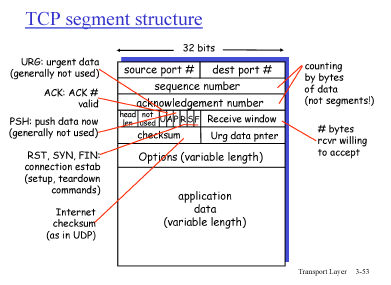

# 6강 - 전송계층2

### TCP

- point-to-point : 소켓 하나와 소켓 하나의 통신
- reliable, in-order byte stream : 하나도 유실되지 않고, 순서대로
- pipelined
- send & receive buffer
    
    send buffer - window(재전송 위해), receive buffer - packet 보관
    
- full duplex data : 데이터가 양방향으로 이동
- connection-oriented
- flow controlled : receiver가 받을 수 있는 만큼만 sender가 보냄
    
    
- TCP에서 ACK 의미
    
    ACK10 : 9번까지 받았으니까 10번 줘!
    
    (Go-Back에서 ACK10 : 10번까지 받았다)

### TCP Segment Structure

- header filed
    - source port(16bit)
    - destination port(16bit)
    - sequence number : 패킷의 시작하는 byte 값
    - checksum
    - Receive window : buffer의 빈 공간이 얼마나 되는지
    
    
    

### Timeout - RTT(Round Trip Time, 왕복 시간)

- RTT의 편차가 크기 때문에 timeout으로 사용하기에 적합하지 않음
- 따라서 EstimatedRTT(보정한 RTT) 사용
    
    Timeout은 EstimatedRTT에 4*DevRTT(넉넉한 마진)을 더함
    
    <aside>
    💡 **TimeoutInterval = EstimatedRTT + 4*DevRTT**
    
    </aside>
    

### TCP에서 동작하는 reliable data transfer

- Pipelined 방식
- Cummulate ACK
- Timer : 개수 - 1개, 특정 패킷 하나만 재전송