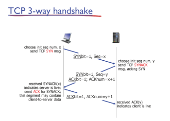
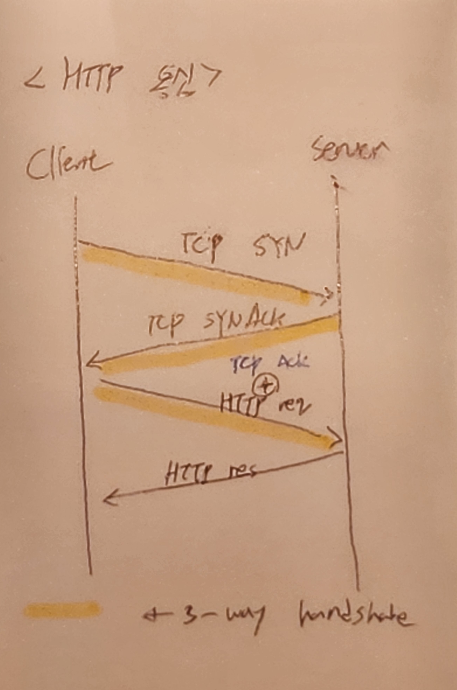

# 7강 - 전송계층3

키워드: 3-way handshake

### flow control

- receive buffer에 빈 공간만큼 packet을 보내는 주는 것
    
    보내는 양을 조절
    

### Connection Manage

- 3-way handshake

### TCP 3-way handshake

1. Client) TCP SYN send
    
    header의 SYN를 1로 하여 server와 TCP 통신을 하고 싶다고 전달
    
    client의 sequnece # 알려줌
    
2. Server) SYN ACK send
3. Client) ACK (SYN ACK에 관한 ACK)

{: width="40%"}

### Closing TCP Connection

1. Client) FIN send
2. Server) ACK send
3. Server) Close after FIN send
4. Client) ACK send

### Congestion Control

- public Network(resource) 혼잡되면 TCP는 더욱 network를 악화시킴
    
    따라서 network를 혼잡되게 하면 안되므로, 
    
    network 상황에 따라 데이터 전송량을 조절해야 함
    
- Congestion Control 방식
    1. End-end Congestion Control
    2. Network-assisted Congestion Control