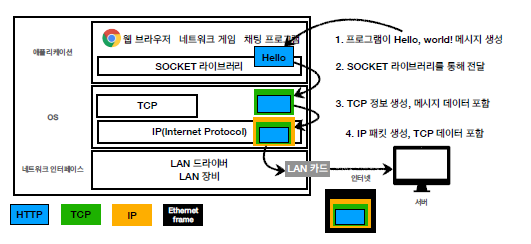
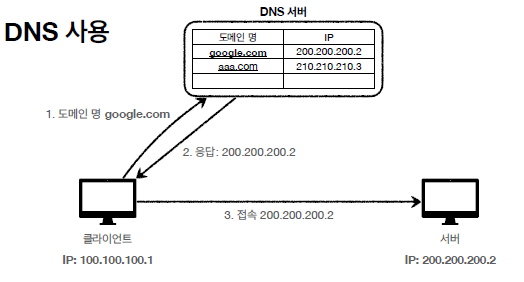

# 섹션1. 인터넷 네트워크

## 인터넷 통신

- 인터넷 상에서 컴퓨터 둘의 통신이 이루어지는 것을 이해하기 위해서는 IP를 알아야 함

## IP(인터넷 프로토콜)

### 인터넷 프로토콜 역할

- 지정한 IP 주소에 데이터 전달
- packet이라는 통신 단위로 데이터 전달

### IP 패킷 정보

- 출발지 IP
- 목적지 IP
- 기타

### IP 프로토콜의 한계

- 비연결성
    - 패킷을 받을 대상이 없거나 서비스 불능 상태여도 패킷 전송
- 비신뢰성
    - 중간에 패킷이 사라지면?
    - 패킷이 순서대로 안오면?
    
    → 이러한 IP 프로토콜의 한계를 TCP가 해결
    
- 프로그램 구분
    - 같은 IP를 사용하는 서버에서 통신하는 애플리케이션이 둘 이상이면?
    
    → PORT가 해결
    

## TCP, UDP

### 인터넷 프로토콜 스택의 4계층

| 애플리케이션 계층 | HTTP, FTP |
| --- | --- |
| 전송 계층 | TCP, UDP |
| 인터넷 계층 | IP |
| 네트워크 인터페이스 계층 |  |

### TCP 특징

- 전송 제어 프로토콜(Transmissio Control Protocol)
    - 연결지향 - TCP 3 way handshake (가상연결)
    - 데이터 전달 보증
    - 순서 보장
- 신뢰할 수 있는 프로토콜
- 현재는 대부분 TCP 사용

### TCP 3 way handshake

1. client : SYN 전달 
2. server : SYN + ACK
3. client : ACK
4. client-server : 데이터 전송

참고) TCP는 논리적으로만 연결 (물리적 연결 X)

### UDP 특징

- 사용자 데이터그램 프로토콜(User Datagram Protocol)
    - 하얀 도화지에 비유(기능이 거의 없음)
    - 연결 지향(TCP 3 way hanshake) X
    - 데이터 전달 보증 X
    - 순서 보장 X
    - 데이터 전달 및 순서가 보장되지 않지만, 단순하고 빠름
- IP와 거의 같다
    
    +PORT
    
    +체크섬 정도만 추가
    
- 애플리케이션에서 추가 작업 필요

## PORT

- 같은 IP 내에서 프로세스 구분
    
    IP는 목적지 서버를 구분,
    
    PORT는 서버 안에서 실행되는 애플리케이션 구분
    
- packet 구성
    - 출발지 IP, PORT
    - 목적지 IP, PORT
    - 전송 데이터
    - 기타

## DNS

- 도메인 네임 시스템(Domain Name System)
    - 전화번호부
    - 도메인 명을 IP 주소로 변환
- DNS 서버
    
    DNS 서버에 도메인 명과 IP 등록
    
    클라이언트는 DNS 서버에 도메인 명을 보내 IP 주소 요청
    
    