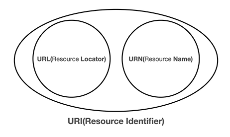
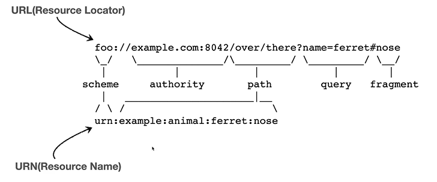
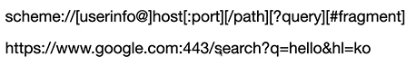
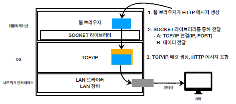
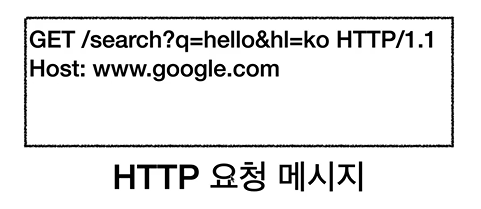
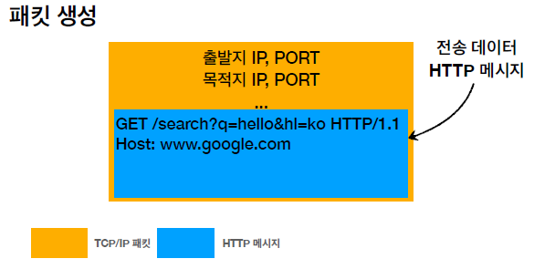

# 섹션2. URI와 웹 브라우저 요청 흐름

주차: 2일차, 3주차

## URI

### Uniform Resource Identifier

- Uniform : 리소스를 식별하는 통일된 방식
- Resource : 자원, URI로 식별할 수 있는 모든 것(제한 없음)
- Identifier : 다른 항목과 구분하는데 필요한 정보

### URI? URL? URN?

- URI는 로케이터(locator), 이름(name) 또는 둘 다 추가로 분류될 수 있다.
    
    
    
    
    
- URL - Locator : 리소스가 있는 위치를 지정
- URN - Name : 리소스에 이름을 부여

### URL 전체 문법

- scheme
    - 주로 프로토콜 사용
        
        프로토콜 : 어떤 방식으로 자원에 접근할 것인가 하는 약속 규칙
        
        ex) http, https, ftp 등
        
- userinfo
    - URL에 사용자 정보를 포함해서 인증
    - 거의 사용 X
- host
    - 호스트명
    - 도메이명 또는 IP 주소를 직접 사용 가능
- port
    - 접속 포트
    - 생략시 http는80, https는 443
- path
    - 리소스 경로, 계층적 구조
- query
    - key = value 형태
    - ?로 시작, &로 추가 가능
    - query parameter, query string 등으로 불림
- fragment
    - html 내부 북마크 등에 사용
    - 서버에 전송하는 정보 X
    

## 웹 브라우저 요청 흐름

1. 웹 브라우저 : URL로부터 HTTP 요청 메세지 생성
    - DNS 조회하여 IP 주소 찾고, port 정보 찾음
    
    
    
2. Socket 라이브러리를 통해 TCP/IP 계층에 전달
3. TCP/IP 패킷 생성, HTTP 메세지 포함
    
    
    
4. 요청 패킷을 인터넷 망으로 전달

그후 서버는 TCP/IP 패킷은 까서 버리고,

HTTP 메세지를 가지고 요청하는 정보 찾아 HTTP 응답 메세지 생성