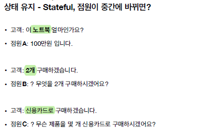
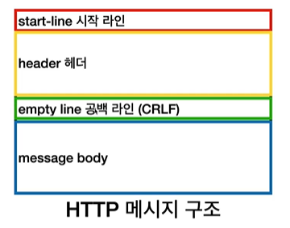

# 섹션3. HTTP 기본

키워드: stateless

## 모든 것이 HTTP

### HTTP

- Hyper Text Transfer Protocol
- HTTP 메세지에 모든 것을 전송
    - HTML, TEXT
    - IMAGE, 음성, 영상, 파일
    - JSON, XML (API)
    - 거의 모든 형태의 데이터 전송 가능
    - 서버간에 데이터를 주고 받을 때도 대부분 HTTP 사용
- HTTP 역사
    - HTTP/1.1 : 가장 많이 사용

### 기반 프로토콜

- HTTP/1.1, HTTP/2 : **TCP** 기반 개발(위에 동작)
- HTTP/2 : **UDP** 기반 개발

### HTTP 특징

- 클라이언트 서버 구조
- 무상태 프로토콜(스테이스리스), 비연결성
- HTTP 메세지
- 단순함, 확장 가능

## 클라이언트 서버 구조

- Request Response 구조
- 클라이언트는 서버에 **요청**을 보내고, 응답을 대기
- 서버가 요청에 대한 결과를 만들어서 **응답**

## Stateful, Stateless

### 무상태 프로토콜 (스테이스리스, Stateless)

- 서버가 클라이언트의 상태를 보존 X
    
    상태 유지는 Stateful
    
    ex)
    
    상태 유지는 중간에 점원이 바뀌면 장애 발생
    
    무상태는 고객이 필요한 정보를 매순간 전달하므로, 중간에 점원이 바꿔도 장애 발생 X
    
- 장점 : 서버 확장성 높음(스케일 아웃)
- 단점 : 클라이언트가 추가 데이터 전송

### Stateful, Stateless 차이

- 상태 유지:  항상 같은 서버가 유지되어야 함
    
    장애 발생 시 처음부터 진행
    
- 무상태: 아무 서버나 호출해도 됨
    - 갑자기 고객이 증가해도 점원을 대거 투입할 수 있다.
    - 갑자기 클라이언트 요청이 증가해도 서버를 대거 투입할 수 있다.
- 무상태는 응답 서버를 쉽게 바꿀 수 있다. -> **무한한 서버 증설 가능**
    
    스케일 아웃 - 수평 확장 유리
    

### Stateless 실무 한계

- 모든 것을 무상태로 설계할 수 있는 경우도 있고, 없는 경우도 있음
- 무상태
    
    ex) 로그인이 필요 없는 단순한 서비스 소개 화면
    
- 상태 유지
    
    ex) 로그인
    
- 로그인한 사용자의 경우 로그인 했다는 상태를 서버에 유지
- 일반적으로 브라우저 쿠키와 서버 세션등을 사용해서 상태 유지
- 상태 유지는 최소한만 사용

## 비 연결성(connectionless)

### 연결 유지 VS 연결 유지 X

- 연결을 유지하는 모델
    - 서버는 연결을 계속 유지
    - 서버 자원 소모
- 연결을 유지하지 않는 모델
    - 서버는 연결 유지 X
    - 최소한의 자원 사용

### 비 연결성

- HTTP는 기본이 연결을 유지하지 않는 모델
- 일반적으로 초 단위의 이하의 빠른 속도로 응답
- 1시간 동안 수천명이 서비스를 사용해도 실제 서버에서 동시에 처리하는 요청은 수십개 이하로 매우 작음
    
    ex) 웹 브라우저에서 계속 연속해서 검색 버튼을 누르지 않음
    
- 서버 자원을 매우 효율적으로 사용할 수 있음

### 비 연결성 한계와 극복

- TCP/IP 연결을 새로 맺어야 함 - 3 way handshake 시간 추가
- 웹 브라우저로 사이트를 요청하면 HTML 뿐만 아니라 자바스크립트, CSS, 추가 이미지 등 수많은 자원이 함께 다운로드
- 지금은 HTTP 지속 연결(Peresistent Connections)로 문제 해결
- HTTP/2, HTTP/3에서 더 많은 최적화

## HTTP 메세지

### 시작 라인

- 요청 메세지
    - request-line
        - HTTP 메서드 (GET, POST, PUT, DELETE …)
        - 요청 대상 (절대 경로로 시작)
        - HTTP Version
- 응답 메세지
    - status-line
        - HTTP 상태 코드
            - 200 : 성공
            - 400 : 클라이언트 요청 오류
            - 500 : 서버 내부 오류
        - 이용 문구 : 사람이 이해할 수 있는 짧은 상태 코드 설명 글
        - HTTP Version

### HTTP 헤더

- field-name“:” OWS field-value
    
    OWS : 띄어쓰기 허용
    
    ex) Host: www.google.com
    
- 용도
    - HTTP 전송에 필요한 모든 부가 정보
        
        ex) 메세제 바디의 내용, 메세지 바디의 크기, 압축, 인증, 요청 클라이언트(브라우저) 정보,
        
        서버 애플리케이션 정보, 캐시 관리 정보 …
        
    - 표준 헤더가 너무 많음
    - 필요시 임의의 헤더 추가 가능

### HTTP 메세지 바디

- 용도
    - 실제 전송할 데이터
    - byte로 표현할 수 있는 모든 데이터 전송 가능
        
        HTML 문서, 이미지, 영상 JSON 등