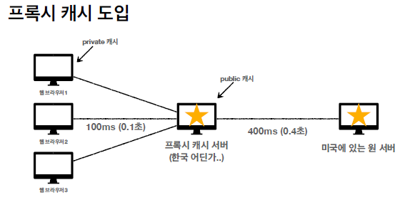

# 섹션8. HTTP 헤더2 - 캐시와 조건부 요청

## 캐시 기본 동작

### 캐시 기본 동작

1. 첫 번째 요청
    - 서버에서 HTTP 헤더에 cache-control을 넣어 전달
        
        cache-control : 캐시가 유효한 시간(초)
        
    - 응답 결과를 브라우저 캐시에 저장
2. 두 번째 요청
    
    캐시 유효 시간 검증
    
    - 캐시 시간 초과 X
        - 브라우저는 캐시에서 조회
    - 캐시 시간 초과
        - 서버를 통해 데이터를 다시 조회하고, 캐시를 갱신
        - 이때, 다시 네트워크 다운로드가 발생
    

### 캐시 적용

| 캐시 없을 때 | 캐시 적용 |
| --- | --- |
| 데이터가 변경되지 않아도 계속 네트워크를 통해서 데이터를 다운로드 받아야 한다 | 캐시 덕분에 캐시 가능 시간동안 네트워크를 사용하지 않아도 된다 |
| 인터넷 네트워크는 매우 느리고 비싸다 | 비싼 네트워크 사용량을 줄일 수 있다 |
| 브라우저 로딩 속도가 느리다 | 브라우저 로딩 속도가 매우 빠르다 |
| 느린 사용자 경험 | 빠른 사용자 경험 |

## 검증 헤더와 조건부 요청

> 캐시 유효 시간이 초과해도, 서버의 데이터가 갱신되지 않으면
304 Not Modified + 헤더 메타 정보만 응답(바디X)

클라이언트는 서버가 보낸 응답 헤더 정보로 캐시의 메타 정보를 갱신
클라이언트는 캐시에 저장되어 있는 데이터 재활용
결과적으로 네트워크 다운로드가 발생하지만, **용량이 적은 헤더 정보만 다운로드**
> 

 

### 검증 헤더

- 캐시 데이터와 서버 데이터가 같은지 검증하는 데이터
- Last-Modified, ETag

### 조건부 요청 헤더

- 검증 헤더로 조건에 따른 분기
- If-Modified-Since: Last-Modified 사용
    
    이후에 데이터가 수정이 되었나요?
    
- If-None-Match: ETag 사용
    
    캐시용 데이터에 임의의 고유한 버전 이름을 달아둠
    
    ETage만 서버에 보내서 같으면 유지, 다르면 다시 받기
    
    **캐시 제어 로직을 서버에서 완전히 관리**
    
- 조건이 만족하면 200 OK
    
    조건이 만족하지 않으면 304 Not Modified
    

## 캐시와 조건부 요청 헤더

### 캐시 제어 헤더

- Cache-Control : 캐시 제어
    - Cache-Control: max-age  //캐시 유효 시간
    - Cache-Control: no-cache //데이터는 캐시해도 되지만, 항상 원(origin)서버에 검증하고 사용
    - Cache-Control: no-store //데이터에 민감한 정보가 있으므로 저장하면 X
- Pragma : 캐시 제어(하위 호환)
- Expires : 캐시 유효 기간(하위 호환)
    
    캐시 만료일을 정확한 날짜로 지정
    

### 검증 헤더

- ETag
- Last-Modified

### 조건부 요청 헤더

- If-Match, If-None-Match : ETag 값 사용
- If-Modified-Since, If-Unmodified-Since : Last-Modified 값 사용

## 프록시 캐시

## 캐시 무효화

### Cache-Control의 무효화

- Cache-Control: no-cache, no-store, must-revalidate
    - no-cache
        
        원 서버에 접근할 수 없는 경우 서버 설정에 따라서 캐시 데이터를 반환할 수 있음
        
        (오류 보다는 오래된 데이터라도 보여주자)
        
    - must-revalidate
        
        원 서버에 접근할 수 없는 경우, 항상 오류가 발생해야 함
        
- pragma: no-cache