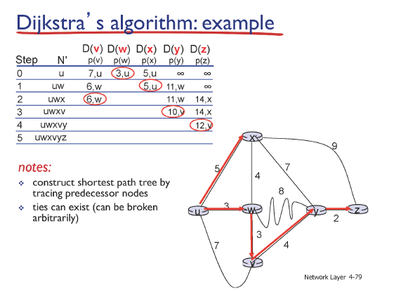

# 12강 - 네트워크계층4

### ICMP

- internet  control message protocol
- 네트워크 상에서 control message를 운반하기 위한 protocol
    
    네트워크 내 장치가 데이터 전송과 관련된 문제를 전달하기 위해 사용하는 프로토콜
    

### Routing

- forwarding이 이루어질 때 참고하는 forwarding table은 누가 만들었을까?
    
    → routing 알고리즘이 채움
    
- routing 알고리즘 목적
    
    : 목적지까지 최소 cost의 경로를 찾는 것
    
    - routing 알고리즘
        1. link state 
        2. distance vector

### link state routing algorithm

- 모든 노드들이 링크 정보(link state)를 네트워크에 올림
    
    네트워크의 link state를 알고 시작
    
    - **Dijkstra’s algorithm**
        
        **N’에 속한 노드는 최단 거리 확정**
        
        D(N) : cost, node로 작성하는데, 이때 node는 N으로 가기 바로 직전 node 의미
        
        