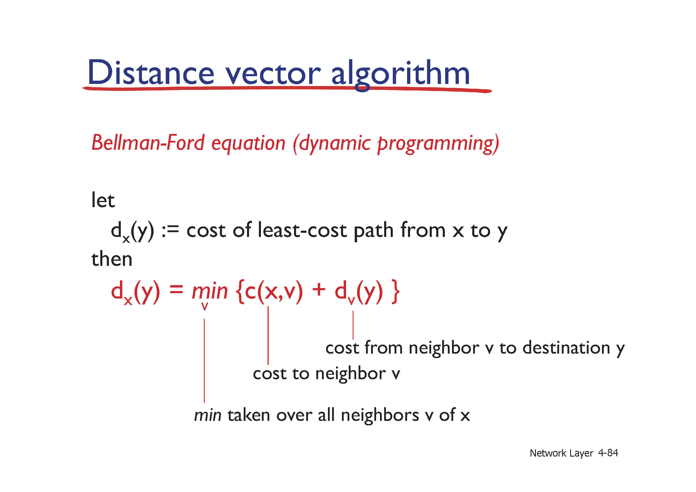

# 13강 - 네트워크계층5

키워드: distance vector algorithm

### Distance vector algorithm

- x에서 y까지의 최단 거리를 재귀적으로 구함
    
    특정 노드에서 distance vector 중에 하나라도 업데이트 되면, 이웃에 정보를 전달
    
    더 이상 업데이트가 되지 않으면 최단 경로를 다 찾은 상황
    
    
    
    - Bellman-Ford algorithm