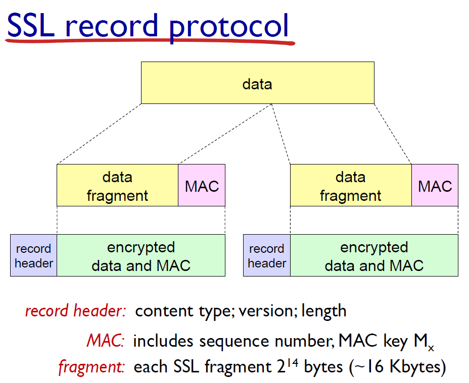

# 23강 - 네트워크보안2

키워드: SSL

### SSL

- HTTPS = HTTP + SSL
- SSL은 TCP 기반으로, 메세지를 주고 받기 전 무조건 TCP connection이 되어 있어야 함
- Application 메세지에 MAC이 붙어 record로 주고 받음
    
    MAC은 key를 사용하여 보안 처리된 것
    
    
    

### Firewalls

- 네트워크 gateway 자리에서 외부로 들어오고 나가는 packet 모니터링
- 원래 Gateway라면 IP 헤더까지만 확인을 하면 되는데,
    
    Gateway에서 Firewall을 구현하면 TCP 헤더까지 확인해야 함