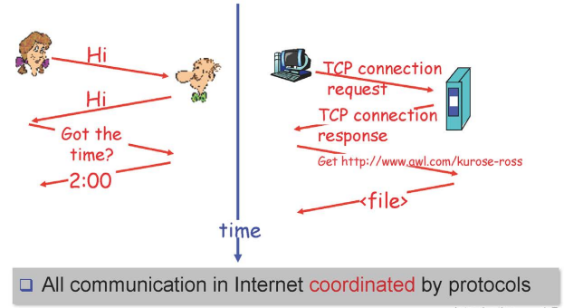
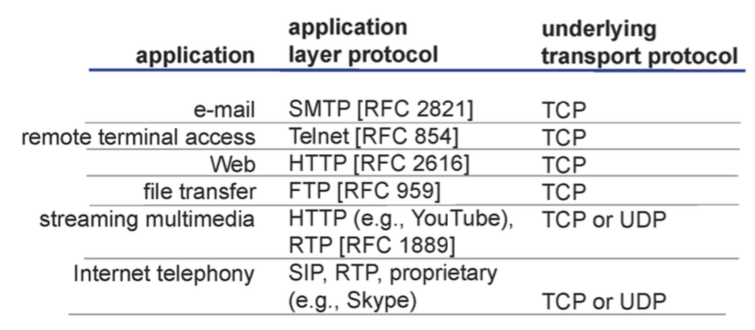

# Day 1

## 네트워크 구성 요소

- 네트워크 엣지
    - 컴퓨터, 노트북, 서버 등
- 네트워크 코어
    - 라우터
- 네트워크 연결선
    - 연결 링크들 (유선 링크, 무선 링크)

## 네트워크 엣지

- 클라이언트
    - 서버로부터 요청을 보내 요청에 해당하는 것을 받아오는 것
- 서버
    - 24시간 연결되어 클라이언트의 요청을 기다리는 것

## 데이터 통신 서비스

- connection-oriented service
    - TCP
        - 신뢰성있게
        - 순서대로
        - reciver가 수용할 수 있는 속도에 맞게
        - 네트워크 상황에 맞춰서
        
        ⇒ 사용자에게 전달
        
        ex) 웹서비스 등
        
- connectionless service
    - UDP
        - 그 어떤것도 제공해주지 않음 → 대신 속도가 빠름
        
        ex) realtime이 필요한 경우 사용 (전화 등)
        

## 프로토콜이란?

- 암묵적인 약속

## 네트워크 코어

- 라우터 집합
- 라우터 전달 방식
    - circuit switching
        - 출발지에서 목적지까지 가는 길을 미리 예약한 후 특정 사용자만 사용할 수 있도록 함
    - packet switching
        - 패킷을 받아서 순서대로 목적지를 향해 보냄

가정) 1Mb/s link , each user 100kb/s

| circuit switching | packet switching |
| --- | --- |
| 최대 10명 가능 | 들어오는 대로 가능 (제약 없음)
동시에 들어오지 않는 이상 10명 이상 가능 |
- 보다 많은 사람들에게 제공할 수 있기 때문에 packet을 사용함

## 패킷 스위치로 인해 생기는 지연들

1. 프로세싱 딜레이
    - packet 검사하는 동안의 시간
    - 좋은 라우터를 사는 것으로 시간을 줄일 수 있음
2. queueing
    - 앞 순서가 다 나갈때까지 걸리는 시간
    - 사용자의 패턴에 따른 것이기 때문에 컨트롤 할 수 없음
    - 큐의 크기보다 packet이 많아지면 packet loss 발생 → 해당 단계에서 대부분 유실됨
3. transmission delay
    - 첫번째 bit 부터 마지막 bit 까지 나가는데 걸리는 시간
    - 케이블을 더 키우면 시간을 줄일 수 있음
4. propagation delay
    - 마지막 bit가 나가는 순간부터 다음 라우터까지 도달하는데 걸리는 시간
    - 빛의 시간으로 가는 것이기 때문에 컨트롤 할 수 없음

## Packet loss 재전송

- packet loss가 발생하면 출발지에서 다시 재전송 진행
- 네트워크 엣지에만 정보가 있도록 설계했기 때문
- 라우터에서 처리하는 것이 많기 때문에 단순작업에 극대화시킴

# 애플리케이션 계층

| APP | http 등 |
| --- | --- |
| Transport | TCP/UDP 등 |
| Network | IP 등 |
| Link | wifi, LTE, 이더넷 등 |
| Physical |  |

** 프로세스와 프로세스 사이의 통신에 신경쓰기!

## 네트워크 애플리케이션

- 서버
    - 24시간 동작
    - 고유한(고정된) IP주소를 가지고 있어야 함
- 클라이언트
    - 고정된 IP주소를 가질 필요 없음

## 프로세스 커뮤니케이션

- 다른 프로세스와의 통신을 위해 소켓을 사용
- 소통할 소켓은 IP주소와 포트를 통해 구분
- 사람들에게 편리함을 주기 위해 DNS를 도입하여 문자와 IP주소를 맵핑

## 80번 포트를 사용하는 이유

- DNS는 포트를 변환해주지 않음 → IP주소만 변롼
- 웹사이트별로 포트 번호가 다르면 DNS가 더 복잡해짐

## Transport 계층에서 제공해줬으면 하는 기능

- 데이터가 유실되지 않고 목적지까지 도착하기를
- 데이터가 특정 시간 안에 목적지에 도착하기를
- 데이터가 특정 속도로 목적지까지 도착하기를
- 보안적으로 안전한 데이터가 도착하기를

## Transport 계층에서 제공하는 기능

- Data Integrity
    - 데이터가 유실되지 않고 목적지까지 도착하는 기능
    - TCP에서만 제공

** 나머지 희망하는 기능은 APP 계층에서 구현해야 함

## 유명한 애플리케이션에서 구현하고 있는 프로토콜

## HTTP (Hypertext Transfer Protocol)

- TCP 사용
- stateless
    - 상대방의 상태를 기억하지 않음
    - 요청이 들어오면 그 요청에 대한 응답만 보냄
- request
    - 받고 싶은 웹페이지의 하이퍼텍스트 요청
- response
    - 요청한 웹페이지의 하이퍼텍스트 응답

## HTTP 연결

- non-persistent
    - 요청을 받아서 해당하는 요청을 보내고 끊는 것
    - 매번 새로운 TCP연결 생성
- persistent
    - 요청을 받아서 해당하는 요청을 보내고 계속 연결을 유지하는 것
    - 처음 연결된 TCP 연결 계속 사용
- persistent HTTP를 주로 사용
