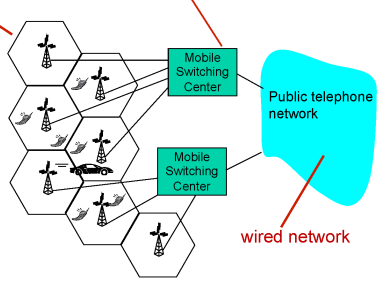

## Cellular Network

- 전체 담당하는 지역을 셀로 나눠서 셀 하나에 기지국을 놓고 그 셀에 속하는 host를 담당
- host와 기지국은 무선으로 연결되어 있고 기지국과 라우터는 유선으로 연결되어 있음

## Multiple access techniques

- 2G - FDMA/TDMA 방식 사용
- 3G - CDMA 방식 사용

## Cellular evolution

- 2G, 3G, 4G 등을 나누는 기준은 속도
- 4G (LTE-A) → 1Gbps 속도 제공
- 5G는 4G의 20배

## Mobility

- 이동 중에도 네트워크가 끊기지 않게 개발된 기술 → 실제 상용화 X
- 3단계
    1. 이동 없이 한 곳에서만 인터넷 사용
    2. 이동은 하지만 TCP 연결을 끊고 이동 수 새롭게 TCP 연결
    3. TCP 연결을 유지한 채로 이동

# Multimedia Networking

---

## Multimedia

- audio
    - 아날로그 시그널을 디지털 신호로 변환하는 것을 sampling이라고 함
- video
    - 초당 나타내는 프레임 수를 coding rate이라고 함

## Multimedia networking : 3 application types

1. streaming, stored audio/video
2. conversational voice/video over IP
3. streaming live audio/video   

## Streaming mulimedia : DASH

- Dynamic, Adaptive, Streaming over HTTP
- 서버에서 주는 그대로 플레이 하는 것이 좋지만 네트워크 상황 때문에 바로 송출하기 어려움
    
    → 바로 송출하지 않고 잠시 버퍼에 담았다가 버퍼가 어느 정도 차면 그 때 송출
    
    ⇒ DASH 프로토콜 사용
    
- manifest file
    - 각 chunk별 인코딩된 url을 담아 놓는 테이블
    - 사용자가 영상을 시청하면 이 파일을 넘겨줌
    - 네트워크 상황에 따라 chunk 크기를 달리하여 전송
- 유튜브의 경우 모든 영상이 한 곳에 저장되어 전세계 사람들이 요청하게 되면 수용하지 못함
- 파일 저장 서버를 여러 곳에 두는 CDN 방식 사용
    - 사용자 요청이 들어오면 메인 서버는 manifest file만 넘겨주고 사용자는 근처 서버에서 데이터를 받아옴
