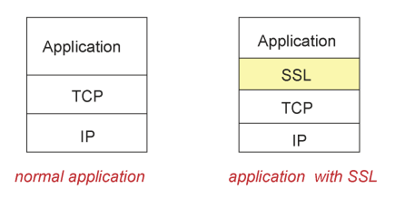

## Network security

> **4가지 요소**
> 
> 1. confidentiality: 기밀성, sender와 receiver의 통신 내용을 제 3자가 알아서는 안됨
> 2. authentication: 인증, 상대방이라는걸 확신할 수 있어야 함
> 3. message integrity: 중간에 메시지 변경이 일어나면 안됨
> 4. access and availability: 항상 서비스가 제공되어야 함
- 위의 4가지 요소들은 OSI 계층에 포함되어 있지 않아 문제가 생길 때 마다 각 계층에 패치를 추가하는 방식으로 보안 구축

## Language of **cryptography (암호화)**

- symmetric key (대칭키)
    - 암호화를 위해 2가지의 key가 필요함
    - sender와 receiver가 같은 key를 가지고 있어야 함
- RSA78 (public key)
    - 두 종류의 키를 사용
    - public key / private key
    - key의 적용 순서가 상관 없음

## SSL and TCP/IP

- HTTPS - HTTP를 SSL을 사용하여 socket를 내려보냄
- SSL은 TCP 연결이 되어있어야 함

## Firewalls

- 외부로 나가고 들어오는 packet을 중간에 검사
- 대부분의 곳에서 사용
