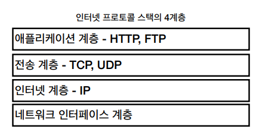
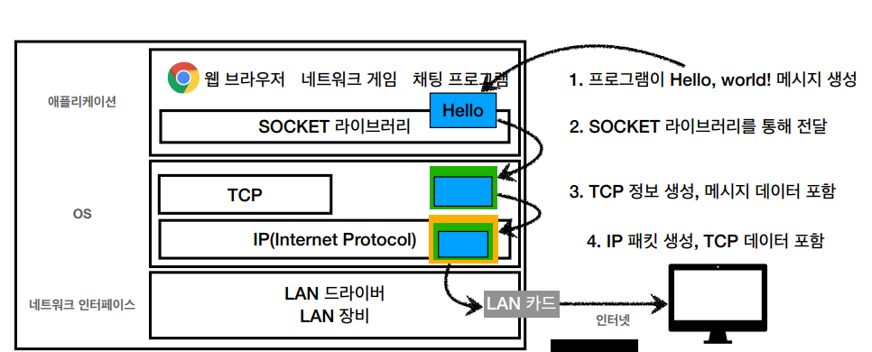
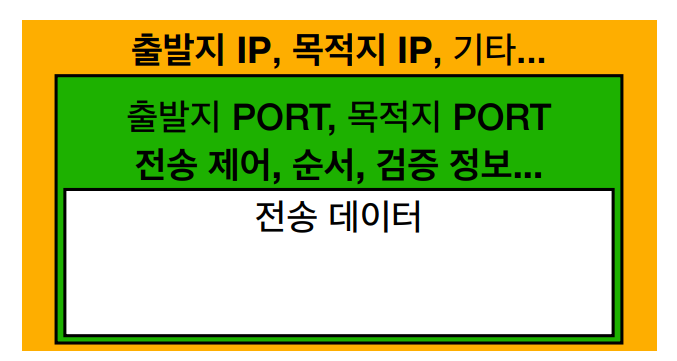

## 인터넷 통신

- 인터넷 상에서 컴퓨터 통신이 이루어지는 것을 이해하기 위해서는 IP를 알아야 함

## IP (인터넷 프로토콜)

- 메세지를 보내기 위한 규칙
- 지정한 IP 주소에 데이터 전달
- 패킷(Packet)이라는 통신 단위로 데이터 전달

## IP 프로토콜의 한계

- 비연결성
- 비신뢰성
- 프로그램 구분 못함

## 통신시 문제

1. 대상이 서비스 불능 상태
2. 패킷이 전송되다 소실
3. 패킷 전달된 순서가 전송된 순서와 다름

⇒ 이를 해결하기 위해 TCP 사용

## 인터넷 프로토콜 스택의 4계층

## 채팅 프로그램으로 Hello World를 보내려면?

** 패킷? 수화물 + 버킷 합성어

## TCP/IP 패킷 정보

## TCP

- IP의 한계를 보완해줌
- 연결 지향 - TCP 3way handshake (가상 연결)
- 데이터 전달 보증
- 순서 보장

⇒ 신뢰할 수 있는 프로토콜

⇒ 대부분 사용

## UDP

- TCP 3way handshake X
- 데이터 전달 보증 X
- 순서 보장 X
- 데이터 전달 및 순서가 보장되지 않지만 **단순하고 빠름**

⇒ IP와 거의 같음 + PORT와 체크섬 정도만 추가

⇒ 애플리케이션에서 추가 작업 필요

→ 과거와 달리 각광 받고 있음

## PORT

- 같은 IP 내에서 프로세스 구분
- 0 ~ 1023 : 잘 알려진 포트 , 사용하지 않는 것이 좋음

## DNS

- IP 주소를 기억하기 어렵다
- IP 주소는 변경될 수 있다

⇒ 도메인 명을 IP 주소로 변환해줌

## URI

- 리소스를 식별하는 통일된 방식
- 로케이터, 이름 또는 둘다 추가로 분류될 수 있다
    - 로케이터 : URL - 리소스가 있는 위치 지정
    - 이름 : URN - 리소스에 이름 부여
    
    ** URN 이름만으로 실제 리소스를 찾을 수 있는 방법이 보편화 되지 않음
    
    ⇒ URI 와 URL을 구분하지 않고 통칭하여 진행
    

## URL

- scheme
    - 주로 프로토콜 사용
    - http : 80포트 , https : 443포트
    - 포트 생략 가능
- userinfo
    - 거의 사용하지 않음
- host
    - 호스트명
- port
    - 대부분 생략
- path
    - 리소스 경로
    - 계층적 구조로 되어있음
- query
    - key=value 형태
    - ?로 시작
    - &로 추가 가능
    - query parameter, query string 으로도 불림
- fragment
    - 잘 사용 안함
    - html 내부 북마크에서 사용

## 웹브라우저 요청 흐름

1. DNS 조회
2. IP 주소 확인
3. HTTP 메시지 전송
    1. HTTP요청 메시지 생성
    2. SOCKET 라이브러리를 통해 전달
    3. TCP/IP 패킷 생성, HTTP 메세지 포함
4. 요청 패킷 전달
5. 서버에서 요청 패킷 받아서 해석
6. 서버에서 HTTP 응답 메시지 생성하여 메시지 전송
7. 응답 패킷 해석하여 웹페이지 보여줌

# HTTP

HyperText Transfer Protocol

- 거의 모든 형태의 데이터 전송 가능
- 서버간의 데이터 송신에서도 대부분 사용
- 지금은 HTTP 시대!
- 현재 사용하고 있는 HTTP ⇒ HTTP/1.1
    - 이후 버전은 개선한 버전들
    - 1.1이 우리에게 가장 중요

## 기반 프로토콜

- TCP : HTTP/1.1, HTTP/2
- UDP : HTTP/3

## HTTP 특징

- 클라이언트 - 서버 구조
    - Request Response 구조 ⇒ 분리해 놓은 것이 중요!
        - 분리를 통해 클라이언트는 아키텍쳐만 서버는 정책만 집중하기 좋음
    - 클라이언트는 서버에 요청을 보내고 응답 대기
    - 서버가 요청에 대한 결과를 만들어서 응답
- 무상태 프로토콜
    - 서버가 클라이언트의 상태 보존 X
    - 응답 서버를 쉽게 바꿀 수 있어 확장성이 높음 (스케일 아웃 유리)
    - 실무에서는?
        - 모든 것을 무상태로 설계할 수도 있고 없을 수도 있음
        - 최소한의 상태 유지를 사용
- 비연결성
    - 최소한의 자원으로 서버 유지 가능→ 서버 자원을 효율적으로 사용할 수 있음
    - HTTP가 연결을 유지하지 않는 모델임
    - 한계
        - TCP/IP 연결이 끊어지면 다시 연결해야 함
        - 현재는 지속 연결로 문제 해결함 → ver2, 3에서는 더 최적화됨
- HTTP 메시지
- 단순함, 확장 가능

## HTTP 메시지

| 시작라인 |
| --- |
| 헤더 |
| 공백라인 |
| 메세지 바디 |
- 시작 라인
    - request - line (요청)
        - HTTP 메서드
        - 요청 대상
        - HTTP 버전
    - status - line (응답)
        - HTTP 버전
        - HTTP 상태 코드
        - 이유 문구
- HTTP 헤더
    - HTTP 전송에 필요한 모든 부가정보를 넣음 - 메세지 바디를 제외한 필요한 모든 메타정보
- HTTP 메시지 바디
    - 실제 전송할 데이터
    - byte 로 표현할 수 있는 모든 데이터 전송 가능
