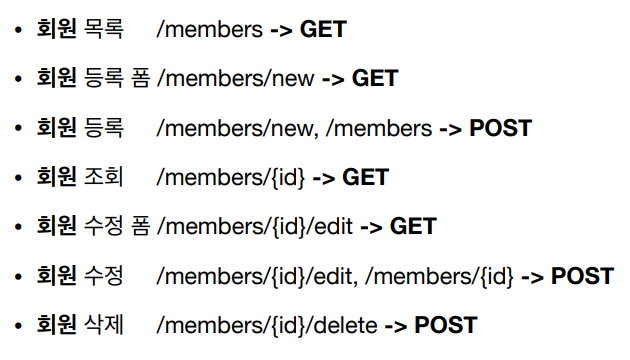

## API URI 설계

- 리소스를 정확히 파악하기!! - 공통 리소스 파악
- 계층 구조 활용
- 리소스와 행위를 분리하기!!
    - URI는 리소스만 식별하기
    - 행위는 HTTP 메서드로 분리

## HTTP 메서드

- GET : 조회
- POST : 요청 데이터 처리
- PUT : 리소스 대체
- PATCH : 부분 변경
- DELETE : 삭제

## GET

- 조회시 사용
- 서버에 전달하고 싶은 데이터는 쿼리를 통해 전달
- 메세지 바디를 사용하는 것은 권장 X

## POST

- 요청 데이터 처리
- 메시지 바디를 통해 서버로 요청 데이터를 전달
- 서버는 요청 데이터 처리
- 주로 신규 리소스 등록이나 프로세서 처리에 사용
- 다른 메서드로 처리하기 애매한 경우에도 사용

## PUT

- 리소스 대체 - 있으면 대체 없으면 생성
- **클라이언트가 리소스를 식별!!**
    - 클라이언트가 리소스 위치를 알고 URI 지정함 - POST와의 차이점

## PATCH

- 부분 수정을 위해 사용
- 사용 못하는 경우도 있음 - POST 사용하면 됨

## DELETE

- 리소스 삭제시 사용

## HTTP 메서드 속성

- 안전
    - 호출 해도 리소스를 변경하지 않음
    - 리소스 변경 유무만 생각
- 멱등
    - 몇 번을 호출하든 최종 결과가 똑같음
    - POST 는 멱등이 아님
    - 활용
        - 자동 복구 메커니즘에 사용 가능
    - 외부 요인으로 리소스가 변경되는 것은 고려 안함
- 캐시 가능
    - GET, HEAD, POST, PATCH 캐시 가능 - 실제로는 GET, HEAD정도만 캐시 사용

## HTTP 메서드 활용

- 클라이언트에서 서버로 데이터 전송
    - 쿼리 파라미터 사용 - GET
    - 메시지 바디 사용 - POST, PUT,  PATCH
    - 4가지 상황일 때
        - 정적 데이터 조회
            - GET 사용
            - 쿼리파라미터가 필요 없이 가능
        - 동적 데이터 조회
            - 쿼리 파라미터를 사용해서 조회(GET)
        - HTML Form을 통해 데이터 전송
            - POST 전송 - 저장
            - applicaion/~
                - form 의 내용을 메시지 바디를 통해 전송
            - GET 전송 - 조회
            - multipart/form-data
                - 바이너리 데이터 전송시 사용
                - 다른 종류의 여러 파일과 폼의 내용과 함께 전송 가능
            - **GET, POST 만 지원**
        - HTTP API를 통한 데이터 전송
            - 서버 to 서버 통신시 주로 사용
            - 앱 & 웹 클라이언트와 통신시 사용
            - Content-type은 application/json 주로 사용
    

## HTTP API 설계 예시

- 회원 관리 시스템 - POST 기반
    
    
    
- 파일 관리 시스템 - PUT 기반
    
    
    
- HTML FORM 사용 - GET, POST만 지원 → 설계에 제한이 있음
    
    
    
    - 컨트롤 URI 사용
        
        → 동사로 된 리소스 경로 사용
        
        - HTTP 메서드로 해결하기 애매한 경우 사용함(HTTP API에서도 사용)

## 참고

https://restfulapi.net/resource-naming/

