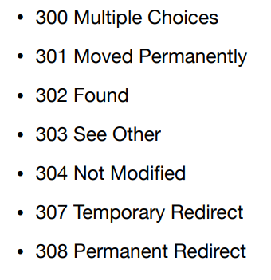

## HTTP 상태코드

- 1xx - informational
    - 거의 사용 X
- 2xx - successful
    - 성공적으로 처리 시 사용
    - 200 OK
    - 201 Created
    - 202 Accepted
    - 204 No Content
- 3xx - redirection
    - 유저의 추가 조치 필요
    
    
    
    - 리다이렉션 종류
        - 영구 리다이렉션 - 301, 308
        - 일시 리다이렉션 - 302, 307, 303
        - 특수 리다이렉션
- 4xx - client error
    - 400 Bad request
    - 401 Unauthorized
    - 403 Forbidden
    - 404 Not Found
- 5xx - server error
    - 500 Internal Server Error
    - 503 Service Unavailable

- 잘 모르는 상태 코드를 받게 되면 큰 범위로 해석함
