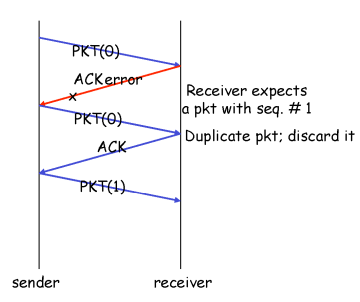
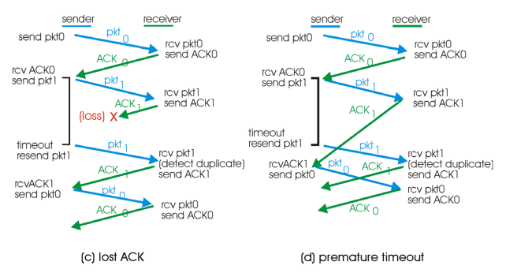

# Day 2

## 소켓이란?

- OS에서 제공하는 다른 프로세스와 소통하는 인터페이스 (일종의 API)
- OS에 구현되어 있는 것만 사용 가능
- Transport 계층에서 제공해주는 TCP/UDP 둘 중 하나를 선택하여 사용

## 소켓 종류

- SOCK_STREAM
    - TCP 사용
- SOCK_DGRAM
    - UDP 사용

## 소켓 API

- 서버는 클라이언트로부터 요청이 올 때까지 기다림
- 클라이언트에서 소켓이 생성되어 서버에 요청을 보내면 연결이 생성됨
- 특별한 관계 생성

## Server 쪽 Function

1. socket() : 소켓 생성
2. bind() : 특정 포트에 bind
3. listen() : 생성한 소켓을 listen용도로 사용 & backlog 크기만큼 큐에 저장
4. accept() 
    - 클라이언트로부터 요청이 올 때까지 기다림 (block)
    - 요청을 받은 후 return시 클라이언트의 IP 주소와 포트를 알게 됨

## Client 쪽 Function

1. socket() : 소켓 생성
2. connect() : 서버의 IP 주소와 포트를 넣어 연결 시도
    
    ** 특정 포트에 bind 할 필요가 없기 때문에 connect 사용
    

## 공통 Function

1. write()
2. read()
3. close() : 통신이 끝났을 때 사용

## Transport Layer - **Multiplexing/Demultiplexing**

- Multiplexing
    - Socket 으로부터 들어오는 데이터를 segment로 만들어 아래로 전달
- Demultiplexing
    - 아래로부터 받은 데이터를 적절한 socket으로 전달
    - 어떤 socket으로 전달할지는 segment의 header를 통해 판단
    
    ** Segment 구조
    
    | Header | Data |
    | --- | --- |
    - 헤더에 source port와 dest port가 있어 어떤 socket으로 보낼지 판단 가능
    

## **Demultiplexing 과정 (in UDP)**

- 목적지 IP주소와 포트만 같으면 전송

> **추가 검색**
> 
> - Port number를 이용 socket을 생성.
> - UDP socket은 목적지의 IP와 port number만 알면 식별 가능
> - segment의 도착지 port number를 검사해서 적절한 socket으로 전달.
> - UDP segment는 출발지 IP나 port number가 같지않아도 동일한 목적지 IP와 port number를 갖는다면 동일한 socket을 통해 process에 전달.
> - 소켓이 줄어 들어서 시스템의 리소스 점유가 적음
> - server의 제작자가 client도 배포 해야 함.(DP와 IP를 알아야 하기 때문에) ex) 게임이나 메신저등의 특정 프로그램

## **Demultiplexing 과정 (in TCP)**

- TCP socket identified by 4-tuple : 아래의 4개가 모두 같은 소켓으로 전달된다.
    - source IP address : IP 주소
    - source port number : 포트 번호
    - destination IP address : 목적지 IP 주소
    - destination port number : 목적지 포트 번호
- 각 클라이언트를 위해 소켓을 생성하고 관리하기 때문에 자원을 많이 사용

> **추가 검색**
> 
> - TCP socket은 4개의 요소(source IP, source port number, destination IP, destination port number)로 식별.
> - host는 도착한 segment를 적절한 socket으로 전송하기 위해 4개의 요소를 전부 사용
> - server host는 동시에 여러 개의 TCP socket을 지원하며 4개의 요소로 구별
> - web server는 각각의 client의 접속에 대해 서로 다른 socket을 이용.
> - non-persistent HTTP의 경우 모든 요청마다 다른 socket을 이용.
> - 각각의 object마다 새로운 TCP connection을 이용.

## UDP segment Header

- 필드 4개 → 동작이 단순함을 알 수 있음
- 한 필드는 16bit (0 ~ 65,536)
- 각 필드 기능
    - port number ⇒ Multiplexing/Demultiplexing에서 사용
    - length
    - checksum : 전송 도중에 에러가 발생하는지 확인
    
    ⇒ 에러가 발생한다면 Demultiplexing에서 drop
    

## Un**reliable 일 경우**

- 전송에 에러 발생
- 데이터 유실 발생

## R**eliable 데이터 통신 원리(2.0)**

- 에러가 있을 경우
    - checksum → 에러 유무 확인
    - feedback
        - receiver가 전송
        - 긍정적(ACK)이든 부정적(NAK)이든 피드백 전송
    - retransmission
        - sender가 NAK을 받았을 경우 재전송

- receiver가 같은 데이터인지 판별할 수 있도록 sequence number를 넣어 전송

## **sequence number**

- 시퀀스 넘버를 넣을 수 있는 헤더 필드에 제한이 있음 (헤더의 크기는 작을수록 좋음)
- 직관적으로 0부터 1씩 늘려가기엔 크기가 너무 커짐
- sequence number는 1bit면 충분함

## NAK 없는 프로토콜(RDT 2.2)

- 무조건 ACK를 보내면서 이전에 받은 시퀀스 넘버를 포함해서 전송
- 전송한 시퀀스 넘버와 ACK로 받은 시퀀스 넘버를 비교하여 제대로 전송이 되었는지 확인

## 유실 발생 시 (RDT3.0)

- Timer
    - 일정 시간 내에 피드백이 오지 않으면 유실됐다고 판단하여 재전송
    - 시간은 적당히 선택 → 정확한 수치로 정하기 어려움
    - 짧으면 reaction이 빠름 하지만 오버헤드 발생 가능성이 있음
    - 길면 loss 발생 시 대처가 늦음

## 정리

- packet error를 위해
    - error detection
    - feedback
    - retransmission
    - sequence#
- packet loss를 위해
    - Timeout
- RDT는 1개의 패킷을 보내는 경우만 고려 → 실제 세계에서는 적용하기 어려움
