## RDT 3.0 stop and wait

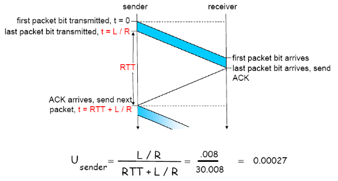

- RTT 프로토콜은 신뢰성 있지만 성능이 좋지 않음

## Pipelined protocol

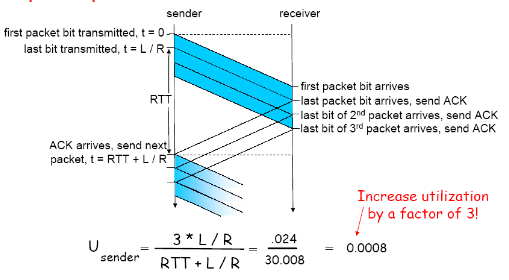

- 패킷을 한번에 많이 보냄
- Go-Back-N 방식과 Selective repeat 방식이 있음

## Go-Back-N

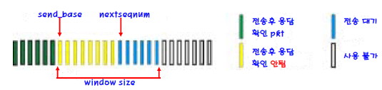

- 에러가 발생하면 N개만큼 돌아와서 다시 전송
- window size 만큼 피드백을 받지 않고 전송
- 모든 일을 sender에서 진행
- window
    - 전송 되었지만 확인되지 않은 packet을 위해 허용할 수 있는 sequence number의 범위

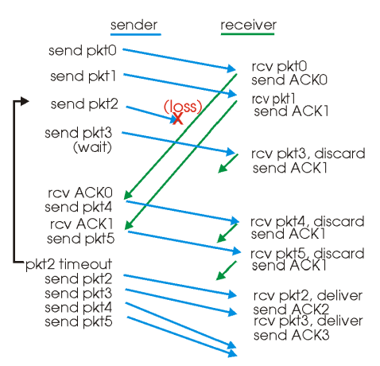

> 추가
> 
> - timeout이 발생하면 ACK가 없는 packet이후 모든 패킷을 재전송하고, ACK를 받게 되면 다른 패킷으로 send base가 옮겨짐
> - 통신 중 packet이 손실된 경우에는 해당 packet에 대한 ACK를 수신할때 까지 해당 pkt를 재송신하며 이후에 오는 ACK는 무시하다가 ACK를 수신하면 해당 packet 이후 sequence number를 가진 packet을 모두 재전송
> - 통신 중 ACK가 손실된 경우에는 손실된 ACK의 다음 ACK가 도착한다면 receiver가 손실된 ACK가 정상적으로 수신한 것으로 간주

## **Selective repeat**

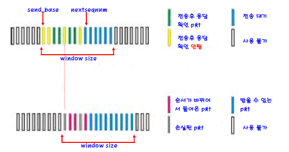

- 소실된 패킷만 보내기 때문에 네트워크에 부담이 덜 됨
- receiver가 일을 해야함

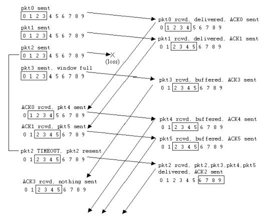

> 추가
> 
> - receiver가 수신한 packet에 대한 개별적인 ACK를 요구.
> - 중간에 packet이 소실되면 하위 sequence number를 가진 packet이 수신 될 때 까지 buffering됐다가 해당 sequence number의 packet이 도착하면 buffering됐던 ACK까지 포함해서 전송.
> - sender는 ACK가 없는 packket에 대해서만 재전송을 하며 각각 timer를 유지하고, ACK를 수신한 pkt는 timer를 제거
> - sender의 window는 send_base pkt의 ACK를 받아야만 이동.
> - 통신 중 packet이 손실된 경우에는 해당 packet에 대한 ACK를 수신할때 까지 window를 받고 window내의 다른 packet에 대한 ack는 저장하다가 ACK를 수신하면 수신한 마지막 ACK의 다음 packet으로 send_base가 이동
> - 통신 중 ACK가 손실된 경우에는 손실된 ACK를 받을때까지 window 고정되고 window내 다른 packet의 ACK는 저장. 수신층의 윈도우 사이즈는 계속해서 이동. 만약 window밖에 있는데 그 이전 패킷을 받는다면 해당 패킷에 대한 ACK만 주고 window의 변화는 없음.

## **Selective Repeat Dilemma**

- sequence number를 넣을 header에는 한계가 있음 → header는 작을수록 좋음
- 재전송 되는 패킷과 새로 전송되는 패킷을 구분할 수 있어야함
- window size가 n일 때 sequence#의 범위는 최소 n*2여야 함

## TCP

- point to point
    - 한 쌍의 통신만 책임짐
- reliable in order
- piplined
- send & receive buffer
    - 모두가 sender 면서 receiver
    - 두 가지 버퍼 모두 갖고 있음
- full duplex data
- connection-oriented
- flow controlled
    - receiver가 받을 수 있는 만큼만 sender가 보냄

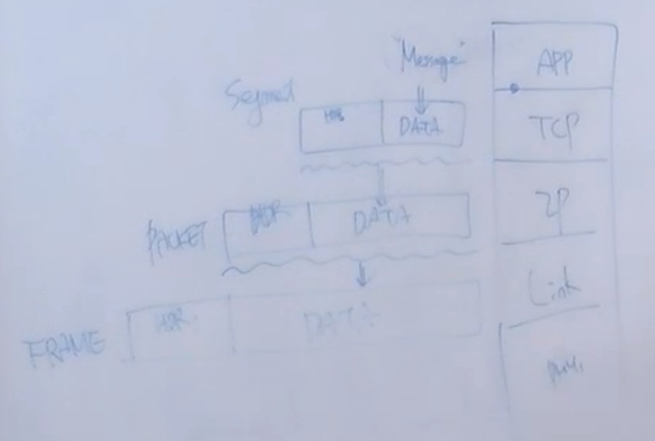

## TCP segment 구조

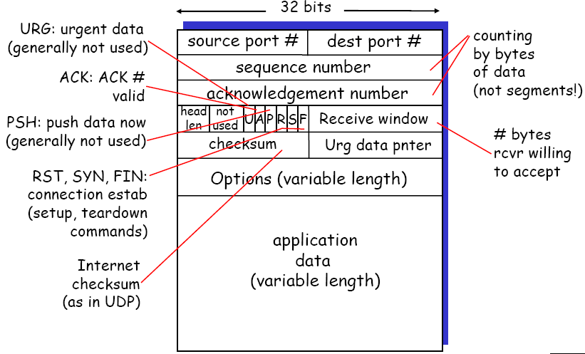

- Header
    - source port# (16bit)
    - dest port# (16bit)
    - sequence number
    - acknowledgement number
    
    ---
    
    - header len(gth)(4bit)
        - options가 만약 생기면 늘어날 수 있음
    - not used(6bit)
        - header length의 다음 6bit는 아직 사용하지 않음.
    - U(URG)
        - urgent point
        - 1이면 urg data pointer를 읽어야하고, 0이면 무시.
        - 현재는 사용하지 않아서 U와 urg data pointer 모두 사용하지 않아 쓰레기값이 들어있음
    - A(ACK)
        - 1이면 acknowledgement number를 읽고, 0이면 무시
        - 0이면 응답 패킷이 아니라는 의미
    - P(PSH)
        - packet의 우선순위를 정함
        - 사용하지 않음.
    - R(RST)
        - 1이면 tcp connection을 reset(초기화)
        - reset의 의미는 연결을 끊지않고 기존의 socket을 유지하면서 접속을 초기화.
        - client나 server 누구나 먼저 보낼 수 있음
    - S(SYN)
        - client가 먼저 보냄
        - syn signal. 접속이 없어서 접속을 하기위해 신호
        - 첫번째 신호는 client가 server에게 1을 보내고 server가 client에게 다시 1을 보내고 세번째 신호를
        - sequence number와 window size에 대해서 주고 받음.
        - 3번째 신호는 의미가 없음.
        - syn flooding 공격에 사용됨.
    - F(FIN)
        - 대부분 client가 먼저 보냄.
        - 접속을 끊는 것.
    - receive window 또는 flow control용 window size
        - 패킷을 보낼때마다 가용할 수 있는 메모리 버퍼 사이즈를 알려줌.
        - 일종의 흐름제어
    - checksum
        - 패킷이 손상됐는지 확인
        - IP와 달리 전체 packet이 깨졌는지 확인
    - urgent point(urgent data pointer)
        - 사용하지 않음
    
    ---
    

## **TCP sequence number와 ACK**

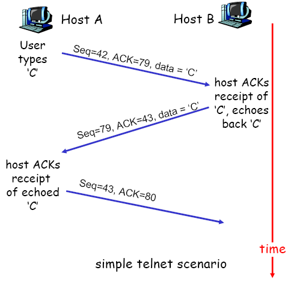

- sequence number
    - segment의 첫번째 byte의 stream에서의 byte 순서 번호
- ACKs
    - 다음에 받을 첫번째 byte의 순서 번호

> 추가
> 
> 
> **seq=42, ACK=79, data='C'**
> 
> - a(client)가 b에게 c라는 data를 보냄.
> - 내가 지금 보내는게 sequence number는 42번, ack는 78번째 byte까지 잘 받았고 79번째 byte부터 보내라는 의미
> 
> **seq=79, ACK=43, data='C'**
> 
> - b가 다시 a에게 c라는 data를 보냄.
> - 내가 지금 보내는게 sequence number가 79번, ack를 42번까지 잘 받았고 43번째 byte부터 보내라는 의미

## **RTT & Timeout**

- 같은 경로라도 queing delay 때문에 편차가 큼 → timeout으로 사용하기 적합하지 않음
- 보정 된 RTT인 **estimatedRTT** 사용
- 그래도 estimatedRTT를 그대로 timeout으로 사용하기 부담이 있음
    
    ⇒ 넉넉한 마진을 추가하여 timeout로 사용
    

## **TCP RDT(reliable data transfer)**

- TCP는 비신뢰적인 IP 상위에서 신뢰적인 통신 서비스를 제공.
- Pipelined segment 사용
- 누적 ACK 사용.
- TCP는 segment 각각에대한 timer가 아닌 단일 재전송 timer를 사용.
- 전송 segment 각각에 대한 timer는 개념적으로는 쉽지만 overhead가 크다.
- timeout, 중복 ACK이 일어나면 재전송 한다.
- 간소화된 TCP sender는 중복 ACK, 혼잡제어, 흐름제어 무시

## TCP 시나리오

1. ack loss
    
    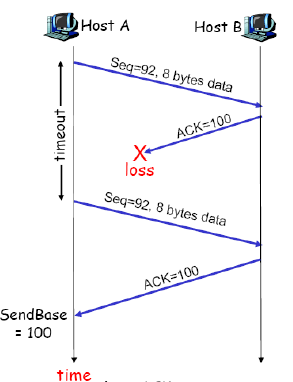
    
    - a가 시퀀스 92번부터 8bye인 data를 99번까지 보냄
    - ack가 100인 packet을 보냈는데 loss
    - a가 다시 보내고 이번에는 응답
    - 이 그림은 pipeline을 하지 않음
2. timeout!
    
    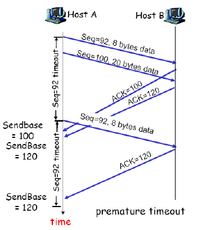
    
    - sequence number가 92, data가 8byte인 packet 전송.
    - sequence number 100으로 이동
    - sequence number가 100, data가 20byte인 packet 전송.
    - ack 100이 오기전에 timeout이 발생해서 sequence number가 92, data가 8byte인 packet 재전송.
    - ACK가 100인 packet을 기다리는데 100인 packet과 120인 packet이 둘 다 날라와서 sendbase를 100으로 옮겼다가 다시 120으로 이동
    - 그 다음에 한번 더 오는 ACK가 120인 packet은 그냥 무시
3. 누적 ACK인 경우
    
    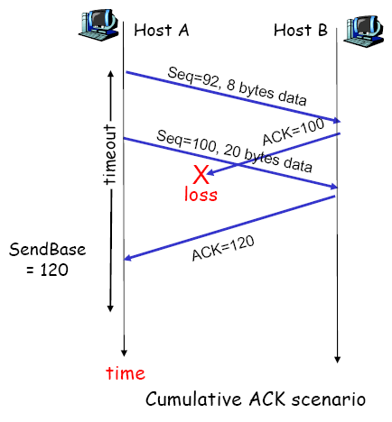
    
- sequence number가 92, data가 8byte인 packet 전송.
- ACK가 100인 packet을 보내다가 loss
- sequence number 100으로 이동
- sequence number가 100, data가 20byte인 packet 전송.
- ACK가 120인 packet 전송
- 기다리던 ACK가 100인 packet은 안오고 ACK가 120인 packet이 들어옴
- sendbase는 ack가 120인 packet을 보고 100인 packet이 들어오지 않았지만 send base를 120으로 옮김

## TCP 권고 사항 - fast retransmit

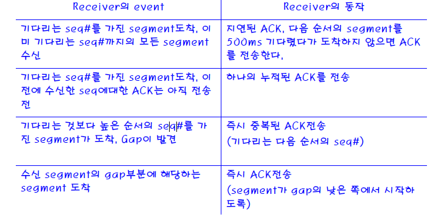

- 타이머 터지기 전에 해결하도록 권고

> 자세 설명 (추가)
> 
> 
> 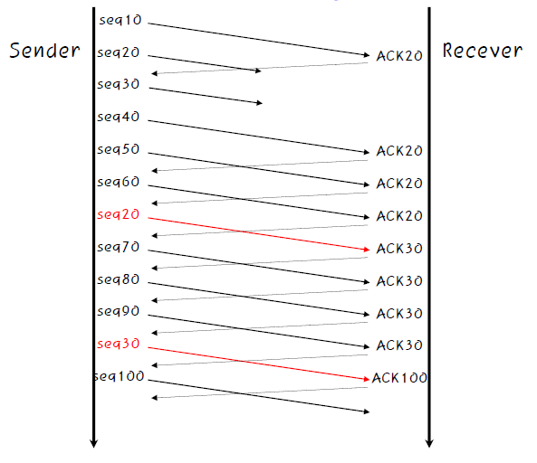
> 
> **timeout이 유발하는 재전송의 문제**
> 
> - timeout이 길어 segment를 잃어 버렸을때 송신자를 기다리게 해서 종단간 지연이 증가.
> 
> **중복된 ACK와 segment loss**
> 
> - 수신자는 기다리는것보다 큰 sequence number의 segment를 수신하면 이를 buffering하고 중복 ACK를 전송
> - segment를 손실하면 많은 중복된 ACK가 전송 됨.
> 
> **3번의 중복된 ACK가 sender에게 전송된 경우**
> 
> - 해당 segment가 loss되었다고 판단
> - 이 경우에는 timeout이전이라도 해당 segment를 재전송(fast retransmit)
>     
>     ex) sequence number가 10, 20, 30, 40, ...일때 20이 loss되면 그 이후의 packet을 보낼때 마다 ACK(20)이 중복해서 sender에게 전달.
>
