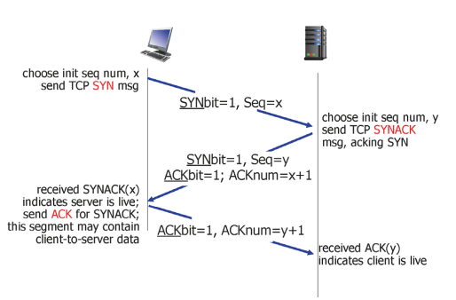
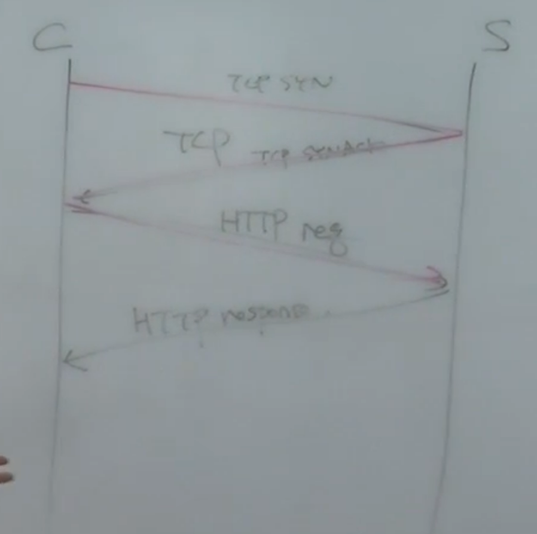
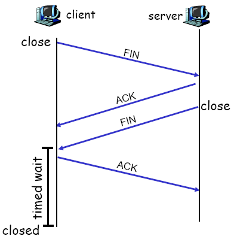
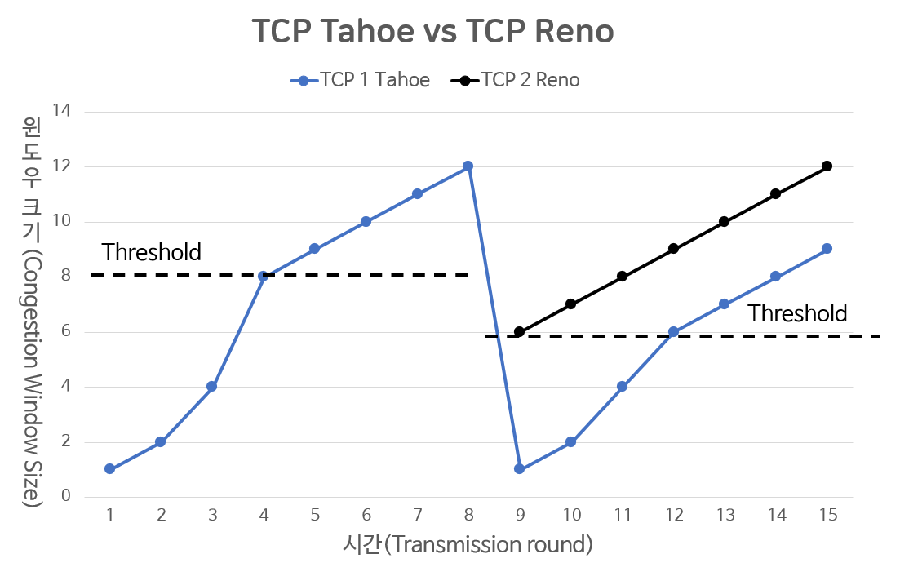
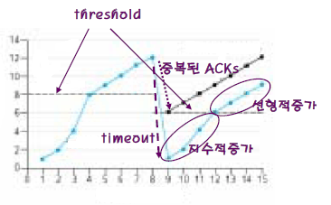
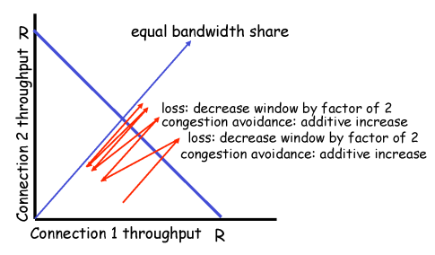

# Day 4

## **TCP Flow control(흐름 제어)**

- sender가 receiver buffer의 빈 공간만큼 전송하는 것
- receiver가 가능한 버퍼의 크기를 알려주어 흐름을 제어

## **TCP 3-way handshake**

1. client가 server에게 TCP SYN segment를 전송
2. server는 SYN를 수신 후 SYN-ACK를 전송
3. client는 SYN-ACK수신 후 ACK전송

⇒ 이후부터는 syn은 1이 아님

### +) in HTTP 통신

## C**losing TCP Connection**

1. client는 connection 종료하기 위해 FIN bit가 1로 설정된 TCP segment를 server에게 전달
2. server는 FIN을 수신하면 ACK를 응답하고 connection을 종료한다는 FIN를 client에게 전송
3. client는 FIN을 수신하면 ACK를 응답하고 일정 시간 기다린 후(time wait) connection을 종료
4. server는 ACK를 수신하면 connection 종료

## **Congestion Control**

- Network(public)이 막히지 않도록 데이터 전송량을 조절하는 것 → 모두를 위해
- 방식
    - End-end Congestion Control → 실제 구현된 방식
    - Network-assisted Congestion Control

## TCP Congestion control

- 통신 시 네트워크 상황을 잘 유추해서 조절해야 함
- 3 main phases
    - slow start
        - 네트워크 상황을 잘 모르기 때문에 하나만 전달
    - additive increase (선형 증가)
    - multiplacaticve decrease (배로 감소)
- threshold 지점을 넘으면 전송량을 감소시킴
- 네트워크의 상황에 따라 전송 속도가 달라짐

## TCP Tahoe (ver.1) VS TCP Reno (ver.2)

- packet 유실을 탐지하는 법
    - timeout → 3번 중복된 ACK 때보다 network가 더 심각하다고 판단
    - 3 duplicate ACK → network가 거의 한계에 도달했다고 판단

## TCP Fairness

- 모든 TCP 가 공평한가? → 공평해진다

