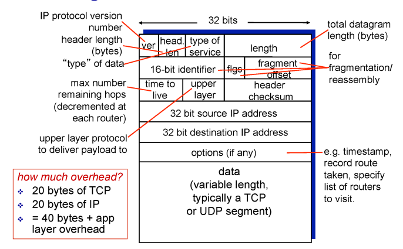
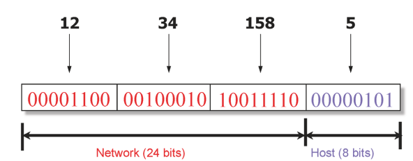
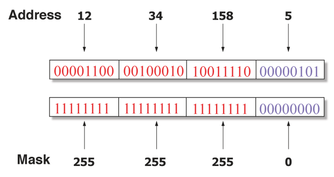
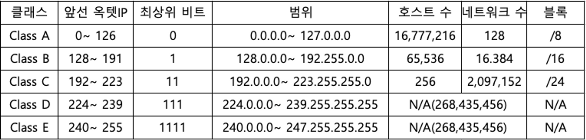
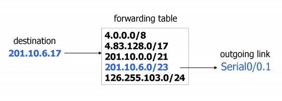
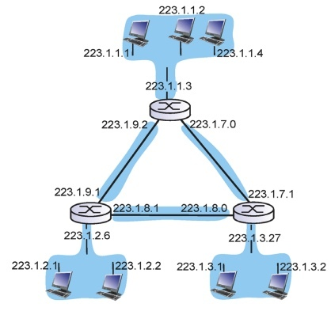
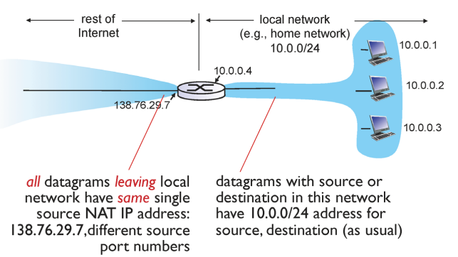
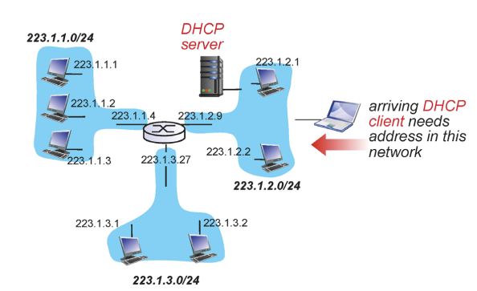
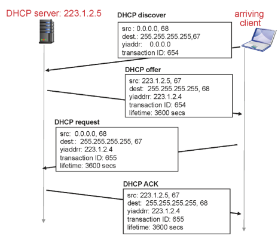
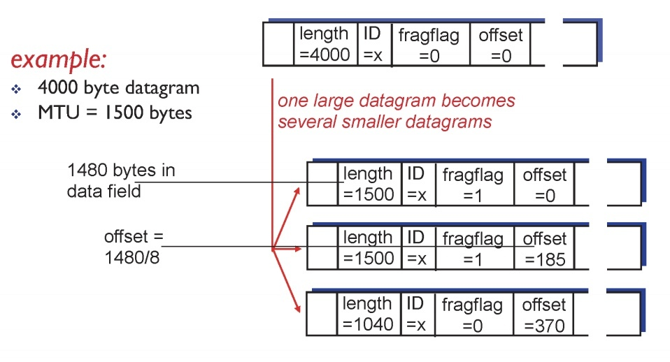

# Day 5

## Network Layer

- TCP segment 전송
- 라우터를 경유하여 데이터 전송 → 라우터에도 네트워크 계층 존재

## Router가 하는 일

- forwarding
    - 표를 확인하여 어디로 보낼지 확인해서 전송
    - forwarding table은 사람이 만들지 않음
- routing
    - 목적지까지 경로 결정

## IP datagram format

- IP Header (20 bytes)
- TCP (20 bytes)

⇒ 총 40bytes와 application layer의 overhead를 갖게 됨

## IP Address (IPv4)

- 32bit 체계로 구성
- 8bit씩 끊어서 10진수로 읽음
- 호스트에 들어있는 네트워크 인터페이스를 지칭

## IP주소 계층화

- network ID = prefix = subnet ID
- forwarding table을 만들기 쉬움
- 새로운 호스트를 추가하기 쉬움

## 서브넷 마스크

- 어디까지가 네트워크 ID인지 알려줌

## Classful Addressing

## **Classless Inter-Domain Routing (CIDR)**

- 이전의 배정 시스템이 비효율적이라 없애고 나온  개념
- 8bit 단위로 prefix가 끊어지는 것이 아닌 자유롭게 끊어짐
- forwarding table 크기가 줄어짐

## ****Longest Prefix Match Forwarding****

- 라우터가 패킷을 받으면 destination IP Address를 받게 되는데, 이를 forwarding table내 엔트리와 매칭되는지 확인

## Subnet

- 같은 prefix를 가진 디바이스의 집합
- 라우터를 거치지 않고 접근 가능한 호스트들의 집합
- 6개 서브넷 예시

## ****NAT (Network Address Translation)****

- 부족한 IP 주소를 해결하기 위한 트릭
- IP 주소 재사용이 가능해짐
- 라우터가 네트워크 뿐만 아니라 다른 계층의 데이터도 수정할 수 있게 됨 - **layer violation**
- 포트 넘버가 기존의 역할 외의 다른 역할도 하게 됨
- 깨끗한 방식의 해결책이 아니기 때문에 다른 해결책을 강구해야 함

## ****DHCP (Dynamic Host Configuration Protocol)****

- 호스트 정보를 동적으로 세팅해줌
- 주소를 일정 시간만 빌려주는 것
- 네트워크에 접속했을 때 주소가 할당되고 일정 시간 이후에 회수하여 다른 호스트에게 할당

## DHCP 동작 과정

- discover
    - 아무것도 모르는 상태에서 도움을 요청하는 단계
- offer
    - DHCP 서버에서 도움을 주는 메세지
    - 해당 src를 일정 시간 사용하는건 어떤지 제안
- request
    - 받은 다양한 offer 중에 맘에 드는 offer를 준 서버에 전송
- ACK
    - 사용자가 사용할 IP 주소를 전달

## ****IP Fragmentation / reassembly****

- 네트워크 링크 레이어에는 MTU(max transfer size)가 있음
- MTU를 넘어서면 전송을 할 수 없으니 이에 맞춰 쪼개고(fragment) 다시 조합(reassemble)하는 것
- 확인 Header
    
    
    
    - identifier (ID)
        - 쪼개진 패킷들에 기존 패킷과 동일한 ID가 적힘
    - flag
        - 뒤에 쪼개진 패킷이 있는지 여부를 표시
            - 있음 (1) / 없음 (0)
    - fragment offset
        - 쪼개진 경우 패킷이 위치한 곳
