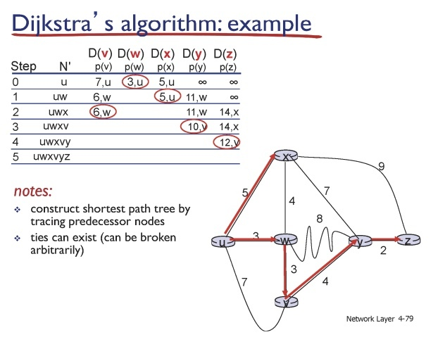
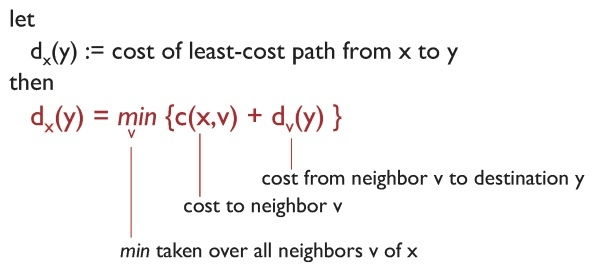

## **ICMP (I**nternet Control Message Protocol)

- 네트워크에서 컨트롤 메세지를 운반하기 위한 프로토콜

## ****Routing Algorithms****

- forwarding
    - 패킷 내 헤더의 목적지 정보를 보고 포워딩 테이블 내 가장 적합한 엔트리와 연결해줌
    - 여기서 포워딩 테이블은 라우팅 알고리즘을 통해 만들어짐
- 목적
    - 목적지까지 최소 비용 경로를 찾는 것
- 종류
    - link state 알고리즘
    - distance vector 알고리즘

## **Link State Routing Algorithm**

- 다익스트라 알고리즘이 대표적임
- 그래프 내 모든 간선의 비용을 알고, 한 지점에서 다른 지점까지 최소 비용을 구하기 위해 사용
    
    
    
- 전 세계 인터넷의 비용을 알 수 없음 → 동일한 도메인에 속하는 네트워크에서만 알고리즘 사용

## **Distance vector algorithm**

- 주변부까지 거리 + 주변부에서 목적지까지 비용을 구하는 것
- 재귀 형태로 진행
- 수식에 따라 인접 점들의 값을 계산하고 노드를 업데이트하는 것을 반복하여 최단 경로를 계산
- 한 기관의 내부 네트워크에서 주로 사용됨

** 중간에 비용이 바뀌게 되면 다시 계산하여 경로를 찾음

## ****Count-to-infinity****

- 중간 간선이 소실되어 기존 노드 간의 경로가 무한대로 향하는 문제 → 일부 네트워크가 죽는 문제
- 해당 문제에 유의하여 distance vector를 사용해야 함

참고 ) https://leechamin.tistory.com/545?category=991722
