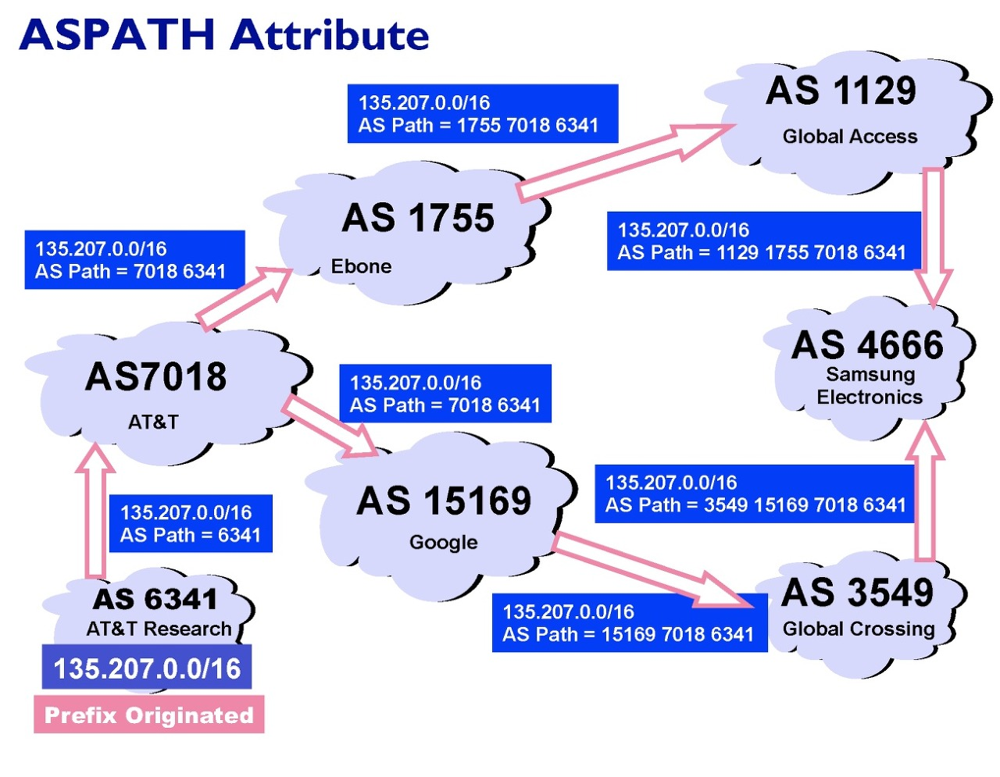
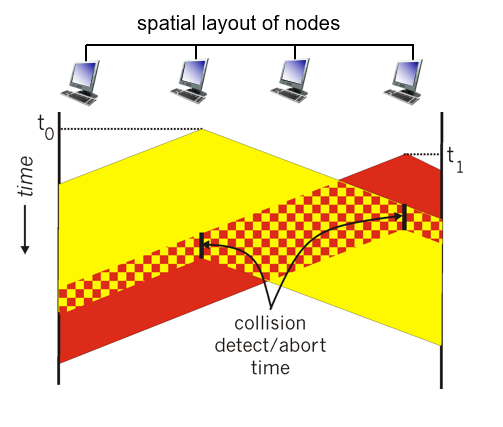

## count-to-infinity 해결 방안

- poisoned reverse
    - 라우팅 정보를 돌려주지만 기존 값이 아닌 무한대를 전달하여 경로를 쓰지 못함을 알림
    - 문제 발생 시 다시 되돌아가 값을 갱신하는 것을 방지할 수 있음

## ****Hierarchical Routing (계층화)****

- 네트워크 스케일이 큰 경우 사용
- AS(Autonomous systems)
    - 자체 네트워크 의미
- intra - AS
    - 내부에서 사용하는 알고리즘
- Inter-AS 라우팅
    - 외부에서 사용하는 것

## I****ntra-AS and Inter-AS****

- intra-AS ⇒ RIP(distance vector), OSPF(link state)
    - 최단 경로로 연결하는 것이 목적
- inter-AS ⇒ BGP
    - 최단 경로는 아님, 정해진 것도 없음

## ****BGP (Border Gateway Protocol)****

- 정치/경제적인 요소에 의해 경로가 결정됨
    
    
    
- 최소의 비용, 최대의 이득이 되는 경로를 선택

## 링크계층

- 패킷은 gateway router한테 보냄
- 패킷을 보내면 physical layer에서 전파 신호로 변환하여 갈 수 있는 곳으로 전파됨
- 충돌이 발생하지 않아야 함!
- 발생했을 때 해결하는 곳이 link layer
- 어댑터 (NIC (Network Interface Card) 에 위치해 있음

## Multiple access links, Protocols

- brodcast medium ⇒ 브로드케스트 매체
- MAC (Multiple Access Control)
    - 같은 매체를 사용하면서 발생하는 충돌을 최소화 하기 위한 기술
    

## **MAC protocols: taxonomy**

1. channel partitioning
2. random access
3. taking turns

## Channel Partitioning MAC protocol

- TDMA
    - 각 host 별로 time slot 지정
    - 주어진 시간에만 전송 ⇒ 자원이 낭비됨
- FDMA
    - TDMA와 비슷
    - 도메인이 frequency
    - 정해진 주파수만 사용하여 전송 가능 ⇒ 자원 낭비

## Random Access Protocols

- 충돌이 일어날 가능성이 있음
- 충돌을 어떻게 처리하는가가 중요
- slotted ALOHA
- ALOHA
- CSMA, CSMA/CD, CSMA/CA

## CSMA **(Carrier Sense Multiple Access)**

- listen before transmit → 전송 전 데이터가 전송 중인지 확인
- CSMA conllisions
    - 충돌이 발생하면 packet 전송 시간을 낭비
    - propagation delay 가 발생하므로 충돌 발생

## CSMA/CD (collision detection)

- 충돌을 감지하면 전송을 멈춤
- 멈춘 후 binary backoff 방식을 사용하여 기다림
    
    ⇒ 충돌이 많이 발생할수록 대기 시간이 길어짐
    

## “**Taking turns” MAC Protocols**

- polling
    - master controller가 전송 순서를 정해줌
    - master가 작동을 멈추면 다같이 멈춤
- token passing
    - token을 가지고 있는 host만 전송 가능
    - 단점 : token을 잃어버리면 문제 발생
