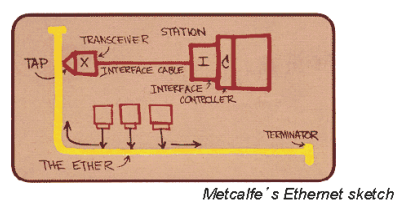
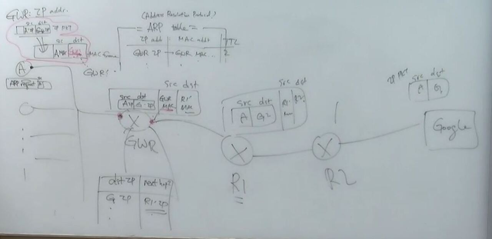
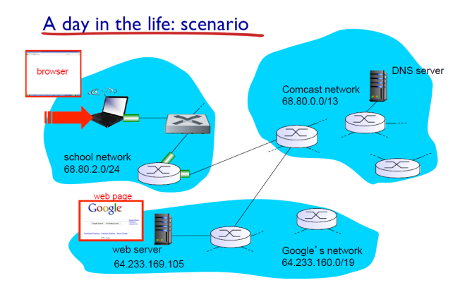

## **LAN (Local Area Network)**

- 라우터를 거치지 않고 host끼리 연결할 수 있는 네트워크 집합

## Ethernet

- LAN에서 사용하는 대표적인 프로토콜
- 현재는 switch를 사용하여 star 방식 사용

## Ethernet frame structure

- CRC : 에러 체크
- data : 어떤 타입의 protocol인지에 대해
- Ethernet은 MAC protocol로 CSMA/CD 사용

## MAC address

- IP Address와 다른 것
- 48bit 크기, 16진수로 끊어서 표현
- IP 주소는 변경되지만 MAC 주소는 변경되지 않음
- 하나의 gateway여도 interface가 다르므로 다른 MAC주소를 가짐

## ARP

- address resolution protocol
- Gateway Router의 IP는 아는데 MAC address를 모를 때 MAC Address를 알아오기 위한 프로토콜
- ARP table
    - IP 주소에 맞는 MAC주소를 가짐
    - 찾는 MAC 주소가 없다면 ARP request를 통해 주소를 알아냄

## IP 패킷이 목적지에 도달하는 과정

## Ethernet : physical topology

- bus - 충돌 많이 발생
- star - switch가 domain을 분리 시켜 충돌을 줄여줌

## Switch : multiple simultaneous transmissions

- switch table을 통해 어떤 interface가 어떤 node와 연결되는지 알 수 있음
- switching table은 self-learning으로 생성
    - 처음 위치를 찾을 때만 모두 탐색하고, 한번 탐색 이후에는 table을 사용하여 바로 전송

## Data center networks

- 사용자가 많아질수록 계층화
- 각 계층의 이음새는 switch가 담당

