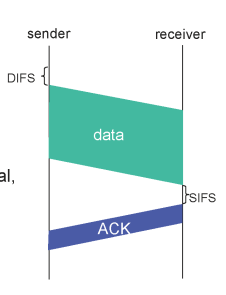
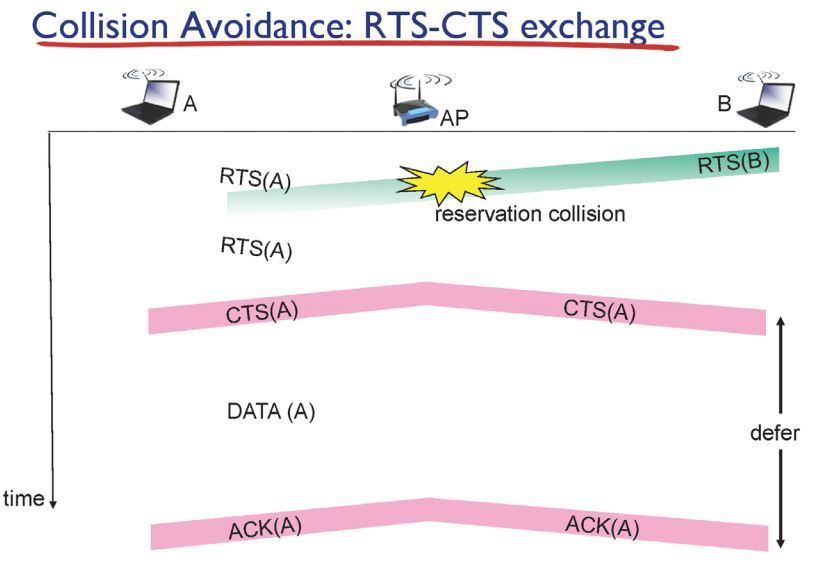
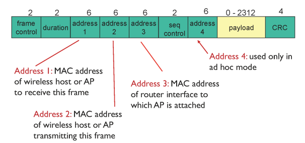

## Wireless

- 무선 네트워크
- 공기라는 매체를 통하여 전송
- 첫 hop만 무선이고 나머지는 유선

## Wireless link 특징

- CDMA/CD 불가능
    - 신호의 세기가 유지되지 않기 때문

## **Wi-Fi (IEEE 802.11)**

- Wireless Fidelity
- 공유기 하나당 하나의 AP를 가지고 있고 유선으로 스위치 혹은 라우터에 연결되어 있음
- 모든 AP가 주기적으로 자신의 AP를 브로드캐스트 함
- 호스트는 그 중 하나의 AP에 연결
- 사용하는 MAC protocol → CSMA/CA
    - AP가 ACK를 보내서 충돌 감지
        
        
        
        - DIFS만큼 시간을 기다린 후 다른 데이터 전송이 감지되지 않으면 전송
        - AP는 데이터를 받고 SIFS만큼의 시간을 기다린 후 잘 받았다고 ACK 보냄
        - sender는 데이터를 보낸 후 ACK를 받아야만 데이터 전송이 이루어졌다고 봄
        - ACK를 받지 않는다면 충돌이 발생했다고 판단하고 랜덤한 시간 이후에 재전송
    - CSMA/CA 에 RTS-CTS 추가하여 collision 줄임
        
        
        
        - RTS-CTS에는 얼마만큼의 데이터를 얼마 동안 보내겠다는 정보가 있음
        - RTS, CTS를 받을 수 있는 인터페이스들은 그 정보를 받고 해당 기간 동안 데이터 전송X

## **802.11 frame : addressing**

- free 주파수 대역을 채널 단위로 나눠서 사용
- 다른 채널끼리는 충돌이 없지만 같은 채널을 쓰는 AP끼리는 경쟁하여 데이터 전송

- address1 - 데이터를 받을 AP의 MAC 주소
- address2 - 데이터를 보내는 host의 MAC 주소
- address3 - 데이터를 받을 라우터의 MAC 주소

## **802.11 : mobility within same subnet**

- 인터넷 사용 중 AP 가 바뀔 때
- TCP 연결은 본인 IP주소&port, 목적지 IP주소&port가 바뀌지 않으면 연결이 유지됨
- AP만 바뀌고 같은 서브넷 안에 있기 때문에 IP가 바뀌지 않음 → 연결이 끊어지지 않음
- AP 변경 시 나와 라우터 사이의 스위치들의 스위치 테이블 정보를 갱신
