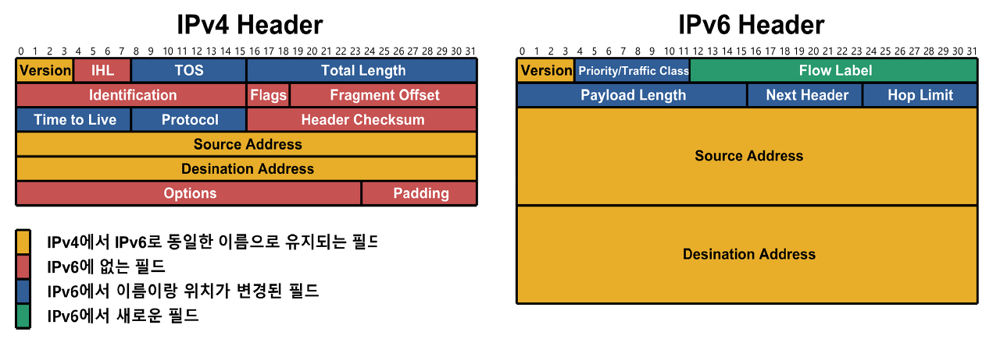
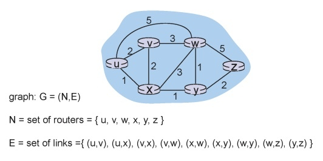

# 강의 12. 네트워크 계층4

# IP

인터넷 프로토콜(IP)

유저 데이터를 운반하는 유일한 프로토콜

ip 패킷

헤더 + 데이터

헤더: 목적지, 소스 정보 등과 같은 부가적인 정보

데이터: 실제로 두 호스트가 주고받고자 하는 메시지(⇒ tcp segment: 사용자가 실제로 보내고자 하는 메시지)

# ICMP(Internet Control Message Protocol) ?

ICMP 는 TCP/IP에서 IP 패킷을 처리할 때 발생되는 문제를 알려주는 프로토콜이다.

사실, IP 프로토콜은 전송상태에 대한 관리가 이루어지지 않는 신뢰할 수 없는 프로토콜이다.

예를 들어, source → destination으로 데이터 전송시 destination port가 안 열려 있는 상황이 발생했다고 가정하자. 이때 destination측에서는 port가 안 열려있었기 때문에 받은 데이터를 자연스럽게 drop 하는데, source는 자신이 보낸 데이터가 잘 갔는지? 아니면 중간에 drop 되었는지? 전혀 모른다.

따라서 네트워크에서 일어나는 특정 event에 대해서 source(출발 호스트)에게 report할 필요가 생긴다. 따라서 이러한 control message를 운반하기 위한 protocol이 바로 ICMP이다.

즉, 전송상태에 대한 관리가 이뤄지지 않는 IP의 부족한 점을 메꾸기 위해 사용되는 것이 바로 ICMP 프로토콜!

ICMP은 사용자가 보내는 data가 아니다. 네트워크 상에서 발생하는 control message를 운반하기 위한 protocol이다.

## ICMP 실습-리눅스 traceroute 명령어

`traceroute` 명령어

- 실행하는 컴퓨터에서 목적지 서버로 가는 **네트워크 경로**를 확인시켜 줍니다.
- ping과 동일하게 ICMP 프로토콜을 이용하여 경로를 확인해주는 역할
- ICMP 프로토콜을 제한하는 라우터가 중간에 있는 경우 해당 정보를 파악할 수 없습니다.(얘: 통신사망) 이를 제한하는 이유는 보안적 이슈가 있어 해당 정보를 숨기는 것

`traceroute` 명령어를 사용하는 방법은 간단

아래와 같이 traceroute 와 확인할 도메인 또는 IP 주소를 입력

```
$ traceroute [도메인명 혹은 IP주소]
```

확인해볼 서비스 도메인: 구글(google.co.kr)


- 라우팅 경로를 확인하는 중 7번 라인을 확인해보면 `* * *`와 같이 표시된 것을 확인 할 수 있음.
- 이 표시가 ICMP 프로토콜을 제한하는 라우팅 영역. `*`의 개수는 로딩 타임을 뜻함.

`traceroute` 실행 시 좌측에는 라우팅한 수를 표시하는 숫자는 기본적으로 30단계까지 진행되어 표시하며 30단계의 제한에 걸리면 종료됨.

이 단계를 네트워크에서는 **홉(hop)**이라고 합니다.

이를 통해 우리 컴퓨터에서 특정 서버에 접근할때까지 거치게되는 모든 라우팅 경로를 알 수 있음.

## IPv6

**IPv4 / IPv6 헤더 비교**

IPv6는 IPv4에 비해 단순한 구조임.

그러나 현재 사용하고 있는건 IPv4임. 따라서 학계에서도 IPv6에 대한 자세한 논의 ing중…

더 중요한건 IPv6로 가든, 새로운 프로토콜로 가든가에 어쨌든 새로운 프로토콜로 가는 과정에는 분명 과도기를 거치기 마련임.

이와 같은 과도기때는 IPv4의 라우터들이 _이해할 수 있도록_ 새로운 protocol의 message(=header format)를 변경해 줄 필요성이 있음.

이러한 방법 중 하나가 **Tunneling**임.

### **Tunneling**

여러 홉을 거쳐서 가야하는 목적지를 마치 다이렉트로 땅굴을 파서 다음 홉에 있는 것처럼 보이게 하는 기술

즉, 출발지 host와 목적지 host에서만 사용하고 그 사이에서는 사용하지 않는 프로토콜을 전송해 양측간 통신이 가능하게끔.

이때,

터널링의 핵심은 **캡슐화(Encapsulation)**임.

**캡슐화**란?

OSI 구조에 대해 공부할때 많이 들어본 내용일 것.

네트워크를 계층별로 나눠서 좀 더 편하고 간단하게 적용될 수 있도록 만들어진 구조임.

예를 들어 7계층의 데이터는 6계층으로 내려오면서 6계층의 헤더 뒤에 감싸지고 다시 6계층은 5계층으로 내려오면서 5계층으 헤더뒤에 감싸지게 됨.

이러한 방식이 바로 **캡슐화💊**

### **Tunneling ≠ Encapsulation**

이때 **터널링**과 **캡슐화**는 동의어가 아니다.

**캡슐화**는 OSI 7계층을 참조해 통신을 하기 위해 하위계층에서 상위 계층의 데이터를 포장하는 개념임.

**터널링**은 계층이 동일하거나 _하위의 다른 프로토콜을 숨기기 위해_ 상위에서 데이터를 캡슐화하고, 외부 네트워크를 통과해 목적지에 도착한 후 다시 캡슐화를 푸는 작업인 디캡슐화(Decapsulation)까지 하는 모든 통신 과정을 일컫는 말임.

즉, 캡슐화하고 그걸 전송하고 목적지에 도착한 후 디캡슐화하는 전체의 과정이 터널링임.

즉 다시 IPv4 와 IPv6의 과도기에 대해 돌아오면..

host와 host 사이에 통신이 어떤 프로토콜을 사용하던 간에 일단 터널이 구성되면 그 안에 있는 원래 내용(packet)은 감싸지기(캡슐화)때문에 내용물이 무엇인가는 중요하지 않게 됨.

따라서 새로운 버전인 IPv6의 패킷을 과거의 버전인 IPv4의 헤더 부분이 아닌 **데이터부분으로 집어넣고** IPv4 헤더를 적용해, 버전이 맞게끔 사용하면 된다.

# Routing Algorithms

라우터의 주 역할 중 하나는 forwarding임.

## forwarding?

forwarding 을 복습해보자.

포워딩이란 패킷 헤더부분의 목적지 주소를 보고 포워딩 테이블 내 가장 적합한 엔트리에 매칭해서 연결시켜주는 것임.

즉, 포워딩 작업은 포워딩 테이블 `Look up`에 지나지 않음.

이때 사용하는 매칭 알고리즘은 `Longest prefix matching`

그렇다면, 포워딩 테이블은 누가 태초에 만들어놨는가?

→ 앞으로 공부할 `라우팅 알고리즘` 이 채워놓았다.


네트워크는 실제로 위와 같이 되어있고, 이는 자료구조 상으로는 node(노드)와 edge(간선)로 이뤄진 그래프임.

각각의 노드는 router이다.

이때 한 노드(router)에서 다른 노드(router)를 연결하려고 할때의 다양한 경로가 있지만, 가장 좋은 방법은 `최단 경로` 이다.

즉, *목적지로 가는 경로 중 최소 비용인 경우*를 포워딩 테이블에 저장해주면 됨.

이러한 포워딩 테이블을 구하기 위해 어떠한 알고리즘을 사용할 지 선택해야 함.

**그래프의 상태**에 따른 2가지 방법

## Global

- 모든 라우터가 각각이 연결된 비용을 알고 있을때
- **Link State** 알고리즘 사용.
  why Link State?
  - 노드들이 자기 자신의 **link 정보**를 전체 네트워크에 broadcast해서 정보를 알고 있게 만들기 때문

## Decentralized

- ?

이번 강의에서는 link state 알고리즘에 대해 살펴보자.

## Link State Routing Algorithm

대표적인 알고리즘: 다익스트라 알고리즘

**포워딩 테이블**을 작성하는 것이 핵심임.


## Decentralized 일때

- 라우터가 물리적으로 인접한 **이웃** 라우터에 대한 비용만 알고 있을 때
- 이 경우, 반복적으로 인접한 라우터를 방문해 최소 비용을 구해나간다
- **Distance vector** 알고리즘 사용.

### Distance vector Algorithm

- 들어가기 전, Link State와 달리 Distance vector 알고리즘은 분산 처리 시스템에 사용하기때문에 직관적이지 않음에 주의

source x → y까지의 최소 경로 구하기


- `주변부에서 목적지까지 비용 + 주변부까지의 거리` 를 구함.
- v에서 y로 가는 부분은 다시 위 식을 반복 → `재귀` 형태로 진행.
- 주변부의 값만 알고 있기 때문에, 우선 확실한 인접 부분에 대한 비용을 더하고 나머지는 반복해 알아내는 방식 인 것

자세한 내용은 다음 강의에 계속…
