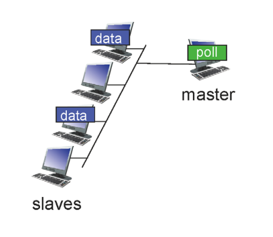

# 강의 15. Link layer

`패킷 → Gateway Router → Forwarding…`

개념적으로는 이렇게 말할 수 있지만, 실제로는?

많이 사람들이 공유하고 있는 매체를 통해서 데이터를 전달하기 때문에, **충돌(collision)**이 발생하지 않아야 다음 hop까지 데이터를 잘 보낼 수 있다

link layer는 NIC(Network Interface Card)에 위치해 있다.

# Multiple access links, Protocol

즉, 중요한 요지는 **한 hop을 넘어갈 때 어떻게 충돌(collision)없이 넘어갈 것인가?**

현실의 네트워크는 각각의 host-client 전용선이 있는 게 아니라 **여러 사람이 공유하는 채널**인 경우가 많다**(== broadcast medium: 브로드캐스트 매체)**

**MAC(Medium Access Control)**

매체에 접근할때, 접근을 조절해 충돌을 최소화하는 기술

즉, **충돌**에 대한 해결책임.

## Ideal Multiple Access Protocol

다음의 조건을 만족하는 이상적인 MAC 프로토콜.

1. 한 노드가 데이터를 보낼 때 온전히 R의 속도로 보낸다(R: bps, link의 channel bandwidth)
2. M개의 노드가 데이터를 전송할 때 평균적으로 R/M의 속도로 보내지게 됨.
3. 분산 처리
4. 단순한 방식

# MAC protocols: taxonomy

1. Channel Partitioning
2. Random Access
3. “taking turns”

# 1. Channel Partitioning

## TDMA

각 host별로 Time Slot을 지정하고, 자기 차례가 왔을때만 전송한다.

단점: 자원이 낭비된다.

## FDMA

TDMA와 동일한 방식이지만, domain이 Frequency인 점이 차이점!

각 채널 별로 주파수가 배정되었다고 가정.

단점: 자원 낭비되는 문제

# 2. Random Access

그냥 자기가 보낼 수 있을 때 보내자!

그러면 충돌이 불가피 하잖아?

**→ 충돌을 어떻게 처리할 것인가?**

e.g. MAC의 Random Access protocol중 처음으로 제안된 protocol: ALOHA

개선된 protocol: CSMA

## CSMA(Carrier Sense Multiple Access)

- Listen Before Transmit: 데이터가 전송 중이면 대기, 전송 중인 데이터가 없으면 데이터 전송.
  - 인간의 소통 방식과 유사.
  - 상대방의 말이 끝날때까지 기다렸다가 말을 하듯이
- 하고 싶은 이야기: frame → link을 통해서 → 퍼져나감
- 이때 충돌이 발생하는 이유?
  - **propagation delay(전파 지연)**로 인해 node로 전달되는 시간의 차이가 발생하므로 충돌이 발생한다
- 따라서 **propagation delay 를 0로 만드는 건 불가하므로, 충돌은 불가피함.**

_propagation delay?_

- 신호의 전송거리, 전송 매개체로 결정
- 네트워크 신호의 전달 속도는 광 케이블, 구리 선은 진공 상태가 아니기 때문에(진공상태의 빛의 속도보다 작기 때문에) 전송 속도의 지연 발생.

## CSMA/CD(Collision Detection)

- 일상생활에서 말의 충돌이 났을때, “먼저 하세요~”라고 하고 자신의 말을 멈추듯이.
- CSMA 방식에서 충돌이 났을 경우 즉시 전송을 멈춘다⛔️

중단 이후의 **재전송** 방식 : **NIC enters binary backoff**

- 충돌을 감지하고 멈춘다 → 물러선다 → 얼만큼 물러설것인가?(다시 돌아와야 하는데)
- m번의 충돌이 있었다면 {0, 1, 2, 3, … , 2^m-1} 중 하나의 수를 random하게 선택해 대기(random access)
- 충돌이 많아질 수록(사람이 많아질 수록) 선택하는 random 숫자의 범위도 증가 → 오래 기다릴 가능성 증가.
- backoff는 delay임. delay 시간이 길어질수록..
- 충돌이 많이 날때 == 사람이 많아질 때 → 네트워크가 느려짐

---

Channel partitioning: 사람이 많을 수록 유리, but 사람이 적으면 자원 낭비(효율성 ↓)

Random Access: 사람이 적을 수록 유리, but 사람이 많으면 충돌 ↑(back off ↑)

## 3. Taking turns

### polling

Channel partitioning과 random access의 절충안

- master node⇒ 토크쇼의 MC 역할
- 이야기가 끝나면 다음에 얘기할 사람을 정해준다.
- 치명적인 단점: master node가 문제 발생하면 전체 네트워크에 영향.

### token passing

- token을 가지고 있을 경우 데이터 전송 가능
- 전송할 데이터 없다면 다른 node에 토큰 전달
- 치명적인 단점: token 유실 시 문제 발생한다.

이처럼 하나에 의존해서 sink를 맞추는 개념 → 단일장애점(SPOF, Single Point Of Failure)을 발생시킴.

SPOF?

시스템 구성 요소 중 하나가 동작하지 않으면 전체 시스템이 중단되는 요소.
