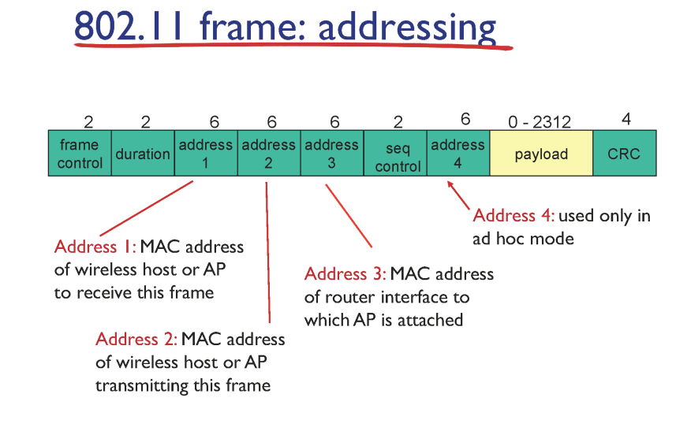
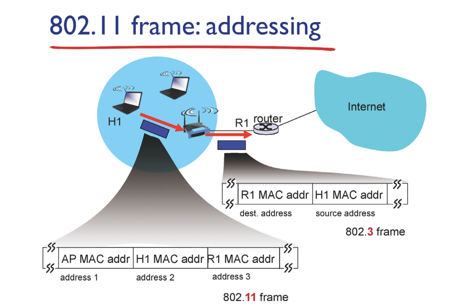

# Wifi Frame 구조

각 header field의 크기(byte)

address 가 무려 3개인 점?

- address 4는 무시해도 좋음.

address1: AP MAC address

address2: interface MAC address(transmit 해주는 사람(?)의 MAC address)

address3: ip 패킷을 처리할 라우터의 MAC address

# 특별한 AP

왼쪽은 무선 interface

오른쪽은 유선 interface

WLAN 입장: AP는 link layer device임.

router 입장: H1을 포함한 무선 device가 있는 것.(AP가 안보임. 스위치라서)

그래도 아직도 이해가지 않은.. 왜 3개의 주소가 필요할까??

만약, 2개로 가정한다면

src:

desc: AP or Router

이 Frame을 AP가 받음.

AP는 link layer device이므로 network layer가 없음.

받긴 받되, 데이터를 끄집어내서..(?? 초등학생에게 수학의 정석을 준 격임)

데이터 부분에는 IP 패킷 존재.

src: H1 IP

dest: Google.

→ 이 정도의 고급 정보(?)는 Router가 이해할 수 있음.

따라서 3개의 주소가 필요함

- AP가 router에게 보내기 위한 mac address가 필요하기 때문이다.(AP는 link layer device이므로, IP로는 불가하다)

많은 무선 host 중 유선으로 나가기 위한 유일한 AP → 멀티플렉싱임(하나의 통신 채널에 둘 이상의 데이터를 전송하는 데 사용되는 기술)

Q. _Router의 MAC Address는 어떻게 알지?_

1. H1가 주변의 Beacon message를 받아서 어떤 어떤 AP가 있는지 알게됨.
2. 근데 나의 IP, 네트워크 연결 정보를 모름.
3. DHCP를 통해 나 자신을 알아야 함.(일단 MAC address는 알되, IP를 모르기 때문에)
   1. DHCP → 내 `IP`, `Subnet mask`, `Gateway Router IP`, `Local Name Server IP`
4. H1이 참조하는 Table → ARP

   만약 비었다면, ARP Query 보냄(src: H1 IP)

# **802.11: Mobility Within Same Subnet**

- 이동과정에서 AP의 연결을 유지하는 것이 핵심인.
  - 연결 → `CONNECTION`
  - TCP에서 많이 들은 개념!
  - Client(Socket)와 Server(Socket)간의 TCP 연결.
  - HOW 유일하게 TCP Connect 인덱싱??
    - **src ip/port & dest ip/port**만 동일하게 유지되면 TCP 연결은 유지된다!
    - 하나만 변경되어도 연결 유실.
- 다른 AP로 이동하는데, 연결 끊이냐 안 끊이냐를 결정 → **IP**가 변경되느냐 아니느냐임!
