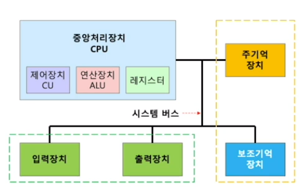
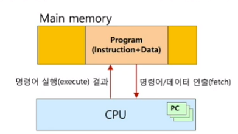
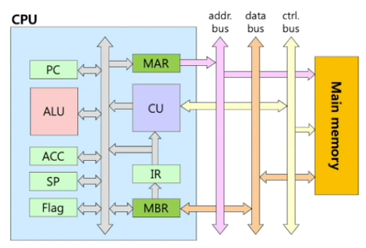
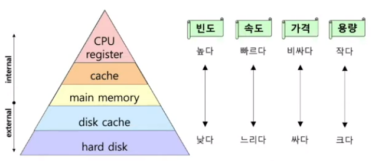

[[운영체제 개념(Operating System Concepts)]](https://youtube.com/playlist?list=PLV1ll5ct6GtzIovBUtBb6MXhxqwvKLKRj&si=_qSKQNqyplQgI4f4)

## 컴퓨터 시스템 소개

- 모니터
- 키보드
- 메인 보드
    - 그래픽 카드
    - 전원 연결 장치
    - CPU - 중앙처리장치
    - 메인 메모리
    - 외부 저장장치 - 하드 디스크, SSD 등

## 컴퓨터 하드웨어의 구성

- 보조 기억 장치 - 반영구적 저장
- 주 기억 장치 - 실행에 필요한 데이터들을 저장, 일시적

## 폰 노이만 구조

- 프로그램 내장 방식
    - 명령어와 데이터로 구성된 프로그램을 2진 비트열로 주 기억 장치에 적재하고 CPU가 순차적으로 실행하는 방식
    - 인출 - 해석 - 실행 (fetch - decode - execute) 주기의 반복
    - 현재 대부분 컴퓨터의 기본 구조
    
    
    

## CPU 와 Main memory 연결 구조

- CPU
    - ALU - 산술 논리 연산 장치
    - CU - 제어 장치
    - Register set (초록색 부분)
        - PC - 다음에 실행할 명령어 저장
        - IR - 현재 수행하는 명령어 저장
        - ACC - 연산을 위한 데이터 저장
        - Flag - ALU 연산의 결과를 저장
        - SP - 현재 메인 메모리의 주소 저장 (스택의 최상단)
    - Internal bus (회색 부분)
    - MAR - 현재 CPU가 지정할 주소 값을 저장
    - MBR
- 시스템 버스
    - 주소 버스 (Address Bus)
        - CPU가 지정하는 주소 정보를 전송하기 위한 신호 선들의 집합
        - CPU가 접속할 수 있는 최대 기억 장치 용량 결정
        - MAR과 연결
    - 데이터 버스 (Data Bus)
        - CPU가 다른 구성 요소들과 데이터를 주고 받기 위한 신호 선들의 집합
        - 한 번에 전송할 수 있는 비트 수를 결정
        - MBR과 연결
    - 제어 버스 (Control Bus)
        - CPU가 다른 구성 요소들의 동작을 제어하기 위한 신호 선들의 집합
        - CU와 연결

## 시스템 버스를 통한 장치 간의 연결

- 각 하드웨어는 시스템 버스를 통해 연결
    - 이를 통해 각종 제어 신호와 데이터와 주고 받음
- 입출력 장치를 관장하는 제어기와 CPU와 연결되어 신호를 주고 받음
    - 훨씬 단순하게 신호를 주고받을 수 있음

## 정보의 저장 및 조작

- 실행될 명령어와 데이터는 주기억장치의 지정된 위치에 저장됨
    - 보통 1바이트 단위로 저장됨
        - Byte Addressing
    - 보통 1워드(4 Byte) 단위로 조작됨
        - CPU로 한 번에 전송될 수 있는 비트 수
        - CPU에 의해 한 번에 처리될 수 있는 비트의 수
        - 한 바이트씩 조작된다면 비효율적으로 운영됨

## 기억장치의 계층적 구조

- 가격대비 성능을 위해 계층적으로 구성

## 캐시 메모리

- CPU와 Main memory의 속도 차이로 인한 성능 저하를 방지하기 위한 방법
    - 데이터를 이동시키는 중간 버퍼로 작용
    - CPU와 사용자에게 transparent
    - 주기억장치보다 고속, 소량의 메모리

## 지역성의 원리

- 정의
    - 프로그램이 실행하는 동안 CPU가 액세스 하는 기억장치는 몇몇 특정 영역에 집중되는 경향이 있음
- 근거
    - 반복 루프와 서브 루틴
    - 표나 데이터 배열에 대한 연산은 집단을 이루고 있는 데이터를 집중적으로 액세스

## 가상 메모리

- 주기억장치가 클수록 더 많은 프로그램을 실행할 수 있기 때문에 보조기억장치에서 일부를 가상으로 주기억장치처럼 사용하는 것
- 무한의 가상적인 메모리 공간
    - 실행을 위해 프로그램의 일정 부분만을 메모리에 할당
    - 실행에 필요한 데이터를 저장하는 곳
