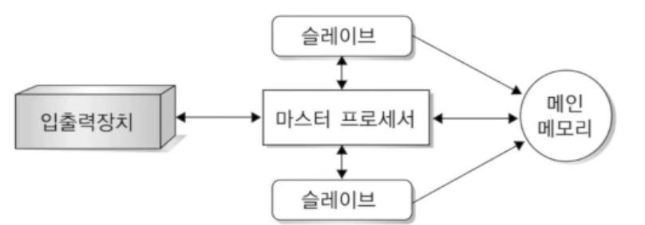
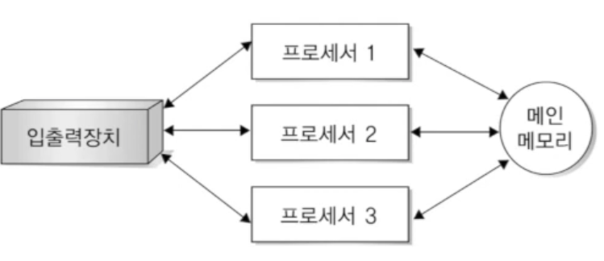

[[운영체제 개념(Operating System Concepts)]](https://youtube.com/playlist?list=PLV1ll5ct6GtzIovBUtBb6MXhxqwvKLKRj&si=_qSKQNqyplQgI4f4)

## 다중 프로그래밍 시스템

- 프로세서가 항상 수행할 작업을 가지도록 하여 프로세서의 이용률을 증진시키는 방법
    - 동시에 주기억장치에 여러 작업을 적재하고 OS는 그 중 하나의 작업을 선택하여 실행
    - 작업 중 입출력 처리 수행으로 프로세서가 대기해야 하는 경우 다른 작업으로 전환하여 수행

## 다중 프로그래밍 시스템의 특징

- 프로세서 이용륭 향상 가능
- 이전의 방식에 비해 복잡한 구성
    - 여러 작업을 준비상태로 메모리에 보관해야 하기 떄문에 메모리 관리 필요
    - 여러 작업 중 하나를 선택하기 위한 결정 필요

## 시분할 시스템

- 다중 프로그래밍을 논리적으로 확장한 개념
    - 프로세서 스케줄링과 다중 프로그래밍 사용
    - 대화식 컴퓨터 시스표을 구성하기 위해 사용됨
        - 응답시간 최소화 목표
- 다음 작업을 위해 필요한 것을 찾기 위한 시간이 쌓여서 오버헤드가 발생할 가능성이 있음
    
    → 똑같은 시간 대비 작업률이 좋지 않음
    

## 시분할 시스템의 특징

- 멀티 테스킹 시스템
    - 프로세서가 다수의 작업들을 교대하며 수행
    - 작업들의 교대는 매우 빈번하게 발생
- 다수의 사용자가 동시에 컴퓨팅 자원을 공유
    - 프로세서 스케줄링 개념 필요
    - 메모리 관리와 보호 필요
    - 파일 시스템과 디스크 관리 기법 필요

## 다중 처리 시스템

- 다중 프로세서 시스템
    - 밀접한 통신을 하는 둘 이상의 processor를 가짐
- 특징
    - 다수의 프로세서로 신뢰성, 가용성, 처리 능력을 증대
        - 저렴해진 하드웨어 비용에 따라 단위 시간당 처리량을 증가시키기 위해
        - 하나의 프로세서 고장시에도 작업 지속 가능
    - 고가의 초고속 프로세서 없이도 대형 컴퓨터에 근접하는 성능 발휘
    - 프로세서 간의 연결, 상호작용, 역할 분담 고려 필요
- 구성
    - 주-종 구성 (비대칭적 구성)
        - 각 작업에 맞는 프로세서에게 업무 할당
    
    
    
    - 대칭적 구성
        - 각 프로세서에게 동등하게 할당
    
    
    

## 분산 처리 시스템

- 시스템마다 OS와 메모리를 가지고 독립적으로 운영되며 필요할 때 통신하는 시스템
    - 다수의 컴퓨터를 통신 회선으로 연결해 하나의 작업을 처리하는 방식
    - 자원 공유, 연산 속도 향상, 신뢰성과 통신
- Clustered System
    - 둘 이상의 독립적인 시스템들의 연결
        - SAN 등을 통해 저장장치를 공유
    - 높은 가용도를 제공

## 운영체제의 기능

- OS는 프로그램을 실행하는데 필요한 환경과 자원을 제공/관리하기 위한 크고 복잡한 시스템
    - 논리적으로 작은 모률로 구성
- 자원관리
    - 메모리 관리
    - 프로세스 관리
    - 입출력장치 관리
    - 파일 관리
- 시스템 관리
    - 시스템 보호(사용자 권한 부여)
    - 네트워킹(통신)
    - 명령 해석기

## 프로세스 관리

- 모든 프로세스는 프로세서를 분할 사용하여 병행 수행 가능
    - 각 프로세스는 자신의 업무를 수행하기 위해 프로세서 점유, 메모리/파일/입출력 장치 등 다양한 자원 필요
    - 자원은 프로세스 생성 시/실행 중에 할당
- 담당 기능
    - 프로세스 생성과 제거
    - 프로세스 스케줄링
    - 프로세스 중지와 재개
    - 동기화, 프로세스간 통신
    - 교착상태 방지

## 메모리 관리

- 프로세서 이용률과 컴퓨터 응답속도 향상을 위한 다양한 메모리 관리 기법 존재
- 담당 기능
    - 현재 어느 부분이 사용되고, 누가 사용하는지 점검
    - 어떤 프로세스를 저장할지 결정
    - 할당/회수 방법 결정

## 보조기억장치 관리

- 정보의 영구 저장 및 가상 메모리로 활용
- 담당 기능
    - 비어 있는 공간 고나리
    - 저장 장소 할당
    - 디스크 스케줄링
    - 파일 생성 및 삭제

## 입출력 장치 관리

- 운영체제는 장치 구동기를 사용해 입출력 장치와 상호작용
- 담당 기능
    - 임시 저장 시스템 기능 제공
    - 장치 드라이버 인터페이스 제공

## 파일 관리

- 입출력 파일의 위치, 저장, 검색 관리 의미
- 단일화된 정보 저장 형태를 제공
    - 파일과 디렉터리
- 담당 기능
    - 파일/디렉터리 생성과 제거
    - 보조기억장치에 있는 파일의 맵핑

## 기타 시스템 관리 기능

- 시스템 보호
    - 프로세스를 다른 사용자의 프로세스로부터 보호
- 네트워킹
    - 다양한 방법으로 구성될 수 있는 통신 네트워크 운영
- 명령어 해석기

## 운영체제의 주요 서비스

- 부팅 서비스
    - 컴퓨터 하드웨어 관리
    - 프로그램을 실행할 수 있도록 컴퓨터 시동
- 사용자 서비스
    - 사용자가 작업을 쉽게 수행할 수 있도록 해줌
- 시스템 서비스
    - 시스템의 효율적인 동작 보장
- 시스템 호출
    - 응용 프로그램이 운영체제의 기능응ㄹ 서비스 받을 수 있도록 인터페이스 제공

## 부트 스트랩핑

- 컴퓨터를 초기화하고 OS를 메모리에 탑재하여 시스템 사용 준비를 하는 과정
- ROM에 저장되어있는 BIOS에 의해 수행

## 사용자 서비스

- 작업을 쉽게 수행할 수 있도록 제공되는 서비스
    - 사용자 인터페이스
        - CLI
        - 메뉴 인터페이스
        - GUI
    - 프로그램의 실행 및 종료
    - 입출력 동작
    - 파일 시스템 동작
    - 통신
    - 오류 탐지

## 시스템 서비스

- 시스템 자체의 효율적인 동작을 보장하는 기능
    - 자원 할당
        - 다수 사용자, 다수 작업 간에 프로세서, 주기억장치, 파일, 입출력장치 공유
    - 계정
        - 각 사용자의 시스템 이용을 관리
    - 보호
        - 동시 수행중인 작업 간의 충돌 방지
        - 다른 사용자의 정보 사용을 제한

## 시스템 호출

- 운영체제가 제공하는 서비스를 사용하기 위한 프로그래밍 인터페이스

## 운영체제의 서비스

- 사용자에게 편리성 제공
- 시스템의 효율적인 동작을 보장
