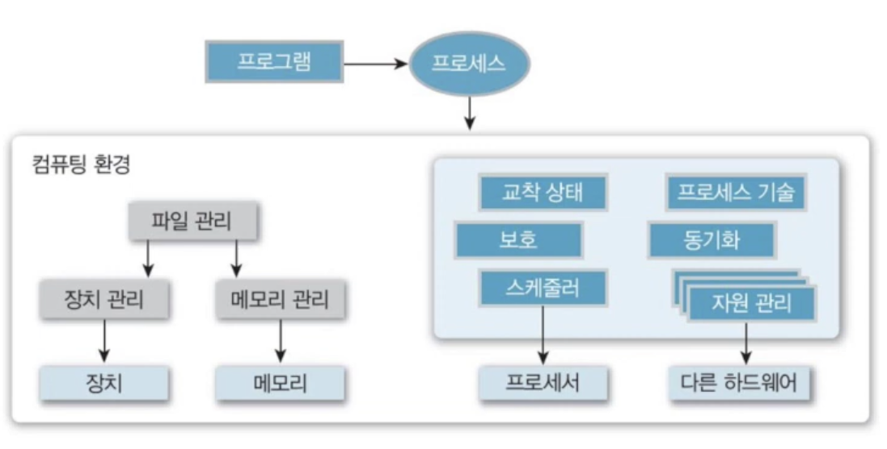
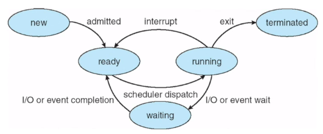
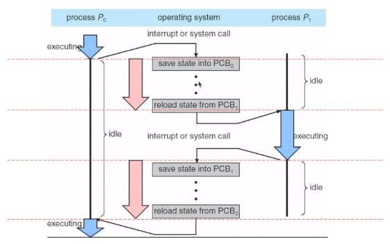

[[운영체제 개념(Operating System Concepts)]](https://youtube.com/playlist?list=PLV1ll5ct6GtzIovBUtBb6MXhxqwvKLKRj&si=_qSKQNqyplQgI4f4)

## 프로세스

- CPU에 의해 실행중인 하나의 프로그램
- 실제 처리되고 있는 프로그램
- 보조기억장치에 저장되어 있는 실행 가능한 프로그램이 메모리에 적재되어 OS의 제어를 받는 상태
- 생성/실행 중에 다양한 자원들을 할당 받음

## 프로세스의 구성

- 프로세스는 프로그램과 달리 주기억장치에 주소 공간을 가짐
- 현재의 활동 요소를 갖는 능동적인 개체임
    - 프로세서의 레지스터에 의해 표현
- 구성 요소
    - 실행 스택
        - 함수의 복귀 주소 및 지역 변수를 저장하는 영역
        - SP가 가리키고 있음
    - 실행 힙
        - 동적 할당 영역
    - 데이터(정적 변수)
        - 정적 변수(전역, 지역)을 저장
    - 텍스트(코드)
        - 실행 코드를 저장
        - PC가 가리킴

## 프로그램 vs 프로세스

- 프로그램
    - 보조기억장치에 저장된 파일
    - 수동적 존재
- 프로세스
    - PC와 관계되는 자원들의 집합을 갖는 능동적 실체
    - 하나의 프로그램이 여러 번 실행된 경우
        - 각각의 실행은 독립적인 프로세스를 만듦
        - 코드 영역은 같더라도 나머지 영역은 다를 수 있음

## 시스템 관점에서 본 프로세스

- 프로세스는 처리 상태에 있는 데이터 구조로도 표현할 수 있음

## 프로세스의 종류

- 역할에 따라
    - 시스템(커널) 프로세스
        - 프로세스들의 실행 순서 제어
        - 한 프로세스가 다른 프로세스 영역을 침범하지 못하게 감시
        - 시스템 운영에 필요한 작업 수행
    - 사용자 프로세스
        - 사용자 코드를 수행
- 수행 방법에 따라
    - 독립 프로세스
        - 다른 프로세스에 영향을 주지도 받지도 않음
        - 데이터도 공유하지 않음
        - 서로 독립적으로 실행
    - 협동 프로세스
        - 다른 프로세서에 영향을 주거나 받음
            - 시스템의 자원을 공유하는 프로세스들
        - 상호 간에 통신을 위한 수단과 동기화 기능 필요

## 프로세스 vs 시스템

- 프로세스
    - 실행중인 프로그램
    - 오늘날 시분할 시스템에서의 작업 단위
- 시스템 ⇒ 프로세스들의 집합체
    - OS에 의해 CPU는 프로세스들 간에 다중화하여 시스템 효율성을 높임
        - OS 프로세스들은 시스템 코드를 신행
        - 사용자 프로세스들은 사용자 코드 실행

## CPU 활동에 대한 다양한 표현

- 일괄 처리 시스템
- 시분할 시스템

## 프로세스 관리

- OS는 프로세스에 기본적인 서비스를 수행
    - 생성, 소멸, 일시정지, 재시작, 우선순위 변경, 블록, 깨우기 등등

## 프로세스 상태 전이

- 모든 프로세스는 시스템 내에 존재하는 동안 상태가 변함
    - OS는 프로세서 스케줄러를 이용해 프로세스 상태 변화를 관리

- 준비 → 실행 (dispatch)
    - 준비 큐에 있는 프로세스 중 하나를 선택하여 프로세서를 배당

## PCB - 프로세스 제어 블록

- 임의의 프로세스에 대해 완전한 정보를 저장하고 있는 자료구조
    - OS에서 각 프로세스는 PCB에 의해 표현됨
    - 프로세스를 관리하기 위해 유지되는 데이터 구조
    - 프로세스 생성 시 만들어져 메인 메모리에 유지
    - OS의 모든 모듈이 읽고 수정 가능
    - 작업 제어 블록이라고도 함

## 프로세스 제어 블록 구성

- 프로세스 고유 식별자
- 프로세스 현재 상태
- 각종 포인터
    - 부모 프로세스, 자식 프로세스 유지 관리
    - 프로세스가 위치한 메모리, 할당된 자원들에 대한 정보 제공
- 스케줄링 정보 및 우선순위
- PC 등 CPU 레지스터들의 저장 영역
    - 기존 프로그램이 인터럽트 되었을 때 백업하기 위해 사용
- 주기억장치 정보
- 입출력장치, 개방된 파일 목록
- 계정 정보 (CPU 사용 시간, 실제 사용 시간 등)

## 프로세스 테이블

- OS는 각 프로세스의 PCB를 가리키는 포인터를 시스템 전체 혹은 사용자별 프로세스 테이블에 유지
- PCB에 빠르게 접근할 수 있도록 함
- 프로세스가 종료하면?
    - 운영체제는 프로세스의 메모리와 기타 자원을 해제해 다른 프로세스가 사용할 수 있게 함
    - 프로세스 테이블에서 해당 프로세스를 제거

## 프로세스 스케줄링

- 프로세스가 실행될 때 필요한 시스템의 자원을 해당 프로세스에게 할당하는 작업을 의미
    - 다중 프로그래밍 시스템의 목적
        - CPU의 이용률을 높이기 위해
        - 항상 임의의 프로세스를 실행할 수 있도록 함
    - 시분할 시스템의 목적
        - 사용자 응답성을 높이기 위해
        - CPU가 프로세스들 사이를 빠르게 전환하며 수행

⇒ 프로세스 스케줄러(CPU 스케줄러)

- 프로세스들 중에 수행 가능한 프로세스를 선택

## 프로세스 우선 순위

- PCB의 우선 순위 값 변경 가능
- 프로세스 스케줄러는 준비 큐의 우선 순위를 이용해 프로세스를 스케줄링 함
    - 프로세서 중심 프로세스 (낮은 우선순위, 큰 시간 할당량) → 한 번에 오래 사용
    - 입출력 중심 프로세스 (높은 우선순위, 작은 시간 할당량) → 자주 짧게 사용

## 컨텍스트 전환 (Context Switch)

- CPU 스케줄링이 일어나 CPU에 할당된 프로세스를 교체하는 작업
    1. 현재 수행은 중단되고 교체될 프로세스의 정보들(PCB)을 저장
    2. CPU 스케줄러에 의해 새로 시작할 프로세스 선택
    3. 새로 시작할 프로세스의 정보들(PCB)을 적재

## 컨텍스트 전환 시간 (Context Switching Time)

- 시분할 시스템의 어쩔 수 없는 순수한 오버헤드
    - 전환하는 동안은 어떤 사용자도 프로그램도 수행할 수 없음
- 하드웨어에 크게 좌우됨
    - 주기억장치의 속도와 관리 기법, CPU의 레지스터 개수 등등
- OS가 복잡할 수록 더 많은 작업 필요
