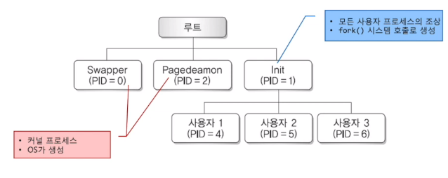
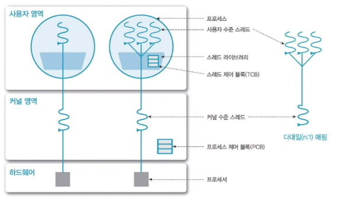
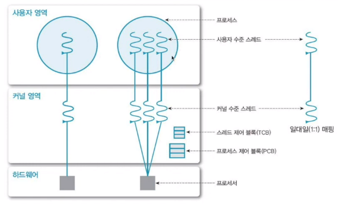

[[운영체제 개념(Operating System Concepts)]](https://youtube.com/playlist?list=PLV1ll5ct6GtzIovBUtBb6MXhxqwvKLKRj&si=_qSKQNqyplQgI4f4)

# 프로세스의 생성과 제거

## 프로세스들의 동작

- 시스템 내의 프로세스
    - 병행적으로 수행 가능
    - 동적으로 생성되고 제거됨

**⇒ 운영체제는 프로세스 생성과 종료를 위한 기법을 제공해야 함**

## 프로세스 생성

- 임의의 프로세스는 시스템 호출을 통해 새로운 프로세스 생성 가능
    - 프로세스 관리를 위한 PCB를 만든 후 프로세스에 메모리 주소 공간을 할당
    - OS와 사용자 응용 프로그램의 요청에 의해 생성
    - 부모-자식 관계를 유지하며 계층적으로 생성됨
        - 부모 프로세스 : 생성하는 프로세스
        - 자식 프로세스 : 새로 생성된 프로세스
            - 임의의 자식 프로세스는 다른 프로세스 생성 가능

## 프로세스 생성 과정 및 자원 할당

- 프로세스 생성 과정
    1. 새 프로세스에 프로세스 식별자 할당
        - OS가 각 프로세스를 구별하는 식별자
    2. 프로세스의 모든 구성 요소를 포함할 수 있는 주소 공간과 PCB 할당
    3. PCB 초기화
    4. PCB 큐에 삽입
- 프로세스는 작업을 수행하기 위해 자원 필요
    - 자식 프로세스 생성 시 필요한 자원은 OS로부터 직접 받거나 혹은 부모 프로세스의 자원 일부를 사용 가능

## 유닉스 시스템에서의 계층 구조

## 자식 프로세스의 실행 형태

- 새 프로세스 실행시
    - 부모 프로세스와 자식 프로세스는 동시에 실행됨
    - 부모 프로세스는 자식 프로세스들이 모두 종료될 때까지 대기
- 자식 프로세스의 주소 공간
    1. 부모 프로세스의 주소 공간을 복사하여 사용 - fork()
    2. 자신만의 별도 프로그램을 적재하여 사용 - exec()

## 프로세스 종료

- 프로세스는 마지막 문장을 실행하고 OS에게 자신의 삭제를 요청하며 종료
    - 자신이 직접 exit() 시스템 호출을 사용
    - 부모에게 상태 값 반환 가능
    - 프로세스에 할당된 모든 자원을 반납
- 부모 프로세스는 자식을 강제 종료 가능
    - 부모 프로세스가 abort() 시스템 호출을 사용
    - 자식 프로세스가 자원을 초과해서 사용할 때
    - 자식 프로세스에 할당된 작업이 더 이상 필요 없을 때
    - 부모 프로세스의 종료 후 자식의 수행을 불허할 때

## 프로세스 제거

- 종료된 프로세스의 정보를 없앰
    - 해당 프로세스에 할당된 모든 자원을 시스템에 반환
    - 해당 프로세스에 대한 PCB는 회수 되고 프로세스 테이블에서도 제거됨

# 스레드

## 프로세스 vs 스레드

- 프로세스
    - OS에서 실행중이 하나의 프로그램
- 스레드
    - 프로세서 내에서 실행되는 세부 작업 단위
    - 같은 프로세스의 다른 스레드와  code, data 영역 공유 (stack은 별도로 구성)
    - 하나의 프로세스는 하나 이상의 스레드로 구성 → Multi-Threading

## 프로세스의 종류

- 단일 스레드 프로세스
    - 한 프로그램에서 한 번에 한 작업만 수행 가능
- 다중 스레드 프로세스
    - 한 프로그램에서 한 번에 여러 작업 동시 수행 가능

## 스레드 사용 이점

- 사용자 응답성 증가
    - 긴 작업 수행시에도 사용자 응답성을 높일 수 있음
- 자원 공유
    - 한 프로세스에 속한 다수의 작업 스레드들이 자원과 메모리를 공유하며 처리
- 경제성
    - 프로세스를 생성/문맥 교환하는 것보다 더 빠름
- 다중 프로세서 구조 활용 가능
    - 각 스레드가 서로 다른 프로세서에서 병렬적으로 처리 가능

## 스레드의 구현 방법

- 사용자 스레드
    
    
    
    - 커널 도움 없이 사용자 주소 공간에 구현된 스레드 라이브러리에 의해 스레드 운용
        - 커널은 이 스레드를 인식하지 못하기에 커널의 지원 없이 생성/스케줄링/관리 지원
            - 높은 이식성, 오버헤드 감소
        - 한 번에 하나의 스레드만 커널에 접근 가능
- 커널 스레드
    
    
    
    - OS의 커널에 의해 스레드 운용
        - 커널이 생성/스케줄링/관리
            - 오버헤드 증가
        - 다중 프로세서에서 병렬 실행 가능
