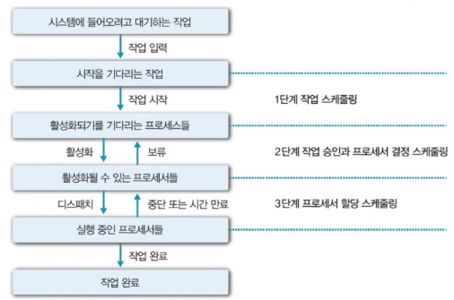
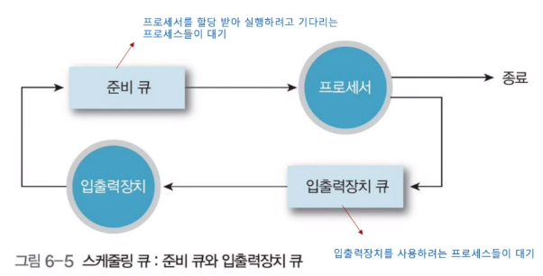
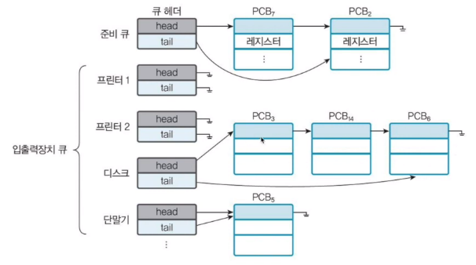
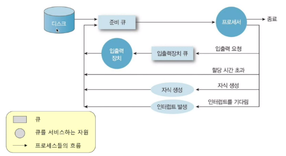
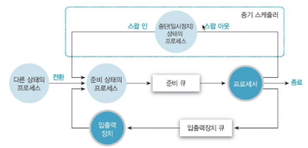
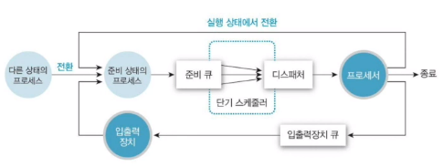
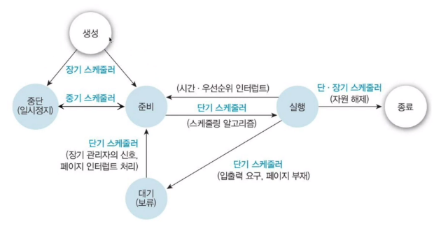

[[운영체제 개념(Operating System Concepts)]](https://youtube.com/playlist?list=PLV1ll5ct6GtzIovBUtBb6MXhxqwvKLKRj&si=_qSKQNqyplQgI4f4)

# CPU 스케줄링 개념

## 스케줄링

- 시스템의 목표를 달성할 수 있도록 프로세서를 할당하는 일련의 과정
    - 프로세서의 이용률을 높임
    - 시스템의 작업 처리 능력을 향상시킴
    - 작업의 응답 시간을 최소화 함

## 스케줄링 기본 요소

1. 프로세스 실행
    - 스케줄링 여부 확인
        - 스케줄링 하지 않고 실행하는 것
        - 스케줄링 해야 하는 것
    - 실행(프로세서 버스트)과 입출력 대기(입출력 버스트)의 순환으로 구성
2. 프로세서 버스트
    - 프로세서 버스트 지속시간은 일반적으로 지수 성질의 빈도 곡선으로 표현됨
    - 프로세서 중심의 프로그램은 긴 CPU 버스트를 가짐 → 프로세서 중심 작업
    - 입출력 중심의 프로그램은 짧은 CPU 버스트를 가짐 → 입출력 중심 작업

## 스케줄링 단계

## 스케줄링시 고려 사항

- 자원 할당의 공정성
    - 어느 프로세스도 무한정 실행이 연기되어서는 안됨
- 단위 시간 당 처리량 향상
- 적절한 응답 시간 유지
- 예측 가능성
    - 시스템 부하에 무관하게 거의 같은 시간 내에 비슷한 비용으로 실행 가능해야 함
- 일반적으로 과부하는 줄여야
- 자원 사용 시 가능한 사용율을 높일 수 있도록 스케줄링
- 응답 시간과 자원의 활용 간의 균형 유지
    - 응답 시간을 줄이기 위해선 충분한 자원 확보 필요 → 자원 활용도를 낮추게 되는 원인
- 실행 대기를 피해야 함 → 에이징 방법으로 개선
- 프로세스의 우선순위
- 서비스 사용 기회
- 서비스 수
    - 갑작스런 서비스 수 감소 방지 필요
    - 과부하에 대처

# CPU 스케줄링 큐와 스케줄러

## 프로세스 스케줄링 큐

## Ready 큐와 다양한 I/O 장치 큐들

## 프로세스 스케줄링 큐잉 도표

- 프로세스 스케줄링을 표현하는 방법

## 스케줄러의 종류와 역할

- 장기 스케줄러
    - 디스크로부터 준비 큐로 프로세스를 이동시킴
- 단기 스케줄러
    - 준비 큐에 있는 프로세스 중 하나를 선택하여 프로세서로 이동시킴
    

## 각 스케줄러의 실행 빈도

- 각 스케줄러의 이름은 실행빈도와 관련이 있다
- 단기 스케줄러는 매우 자주 호출됨
    - 수~수십 마이크로 초 마다
- 장기 스케줄러는 덜 자주 호출됨
    - 수 초 ~ 분 마다
    - 일괄 처리 시스템에서 다중 프로그래밍 정도를 제어
    - 시분할에서 사용하지 않음

## 프로세스 특징에 따른 장기 스케줄링

- 입출력 중심 프로세스
    - CPU 연산 < I/O 연산
- CPU 중심 프로세스
    - CPU 연산 > I/O 연산

⇒ 장기 스케줄러는 위 프로세스들을 적절히 혼합하여 선택해야 효율적임

## 중기 스케줄러

- 스와핑
    - 시분할 시스템에서 주기억장치에서 프로세스들을 **임시로** 제거하여 다중 프로그래밍 정도를 완화시킴
    - 프로세스들의 혼합성 개선을 위해 사용

## 단기 스케줄러

- 디스패처(Dispatcher)
    - 선택한 프로세스에 실질적으로 프로세서를 할당
    - 프로세스의 레지스터 적재 (context switching)
    - 사용자 상태(user mode)로 전환

## 스케줄링과 프로세스 상태 변환

## 선점형 vs 비선점형

- 비선점형
    - 프로세스가 스스로 CPU를 반납
- 선점형
    - 강제적으로 CPU할당을 반납 받음
    - 공유 자료에 대한 접근 조정이 필요
    - 컨텍스트 전환 전에 시스템 호출 처리를 완료하거나 I/O 요청을 blocking함
        
        → 실시간 컴퓨팅이나 멀티 프로세서 지원에 악영향
        

## CPU 스케줄링 알고리즘 비교 기준

- CPU 이용률 (Utilization) ↑
    - 얼마나  CPU 바쁘게 유지했냐
- 처리률 (Throughput) ↑
    - 단위 시간 동안 완료된 프로세스들의 개수
- 총 처리 시간(Turnaround time) ↓
    - 한 프로세스를 처리하는데 걸린 시간
- 대기 시간 (Waiting time) ↓
    - 프로세스가 ready 큐에서 대기한 기간
    - 스케줄링 알고리즘에 따라 크게 차이남
- 응답 시간 (Response time) ↓
    - 요청 후 첫 응답이 나오는 데까지 걸린 시간
    - 평균 응답 시간의 최소보다는 응답 시간 사이의 변동폭 최소가 중요하기도 함
