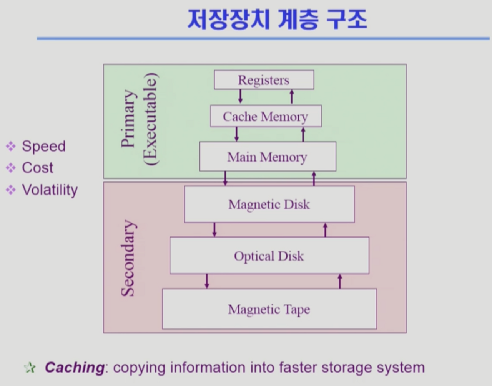
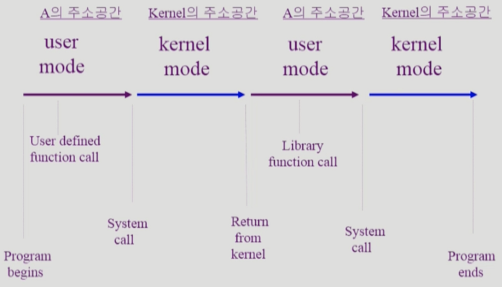

# [System Structure & Program Execution 2](https://core.ewha.ac.kr/assets/publish/C0101020140314151238067290)

## 동기식 입출력과 비동기식 입출력

- 동기식 입출력 (synchronous I/O)
    - I/O 요청 후 입출력 작업이 완료된 후에야 제어가 사용자 프로그램에 넘어감
    1. 구현 방법 1
        - I/O가 끝날 때까지 CPU를 낭비시킴
        - 매 시점 하나의 I/O만 일어날 수 있음
    2. 구현 방법 2
        - I/O가 완료될 때까지 해당 프로그램에게서 CPU를 빼앗음
        - I/O 처리를 기다리는 줄에 그 프로그램을 줄세움
        - 다른 프로그램에게 CPU를 줌
- 비동기식 입출력 (asynchronous I/O)
    - I/O가 시작된 후 입출력 작업이 끝나기를 기다리지 않고 제어가 사용자 프로그램에 즉시 넘어감

⇒ 두 경우 모두 I/O의 완료는 인터럽트로 알려줌

## DMA (Direct Memory Access)

- 빠른 입출력 장치를 메모리에 가까운 속도로 처리하기 위해 사용
- CPU의 중재 없이 device controller가 device의 buffer storage의 내용을 메모리에 block 단위로 직접 전송
- 바이트 단위가 아니라 block 단위로 인터럽트 발생시킴

## 서로 다른 입출력 명령어

- I/O를 수행하는 special instruction에 의해
- Memory Mapped I/O에 의해

## 저장장치 계층 구조

- Main Memory 위는 휘발성 / 아래는 비휘발성
- Primary(Executable) → CPU가 직접 접근함
    - Byte 단위로 접근 가능
- Secondary → CPU가 직접 접근하지 못함
    - Byte 단위가 아닌 Sector 단위로 접근해야 함

## **프로그램의 실행 (메모리 load)**

- 각 프로그램마다 Virtual Memory가 만들어지고 각각 Code, Data, Stack 영역을 가지고 있음
- 정전이 날 경우
    - File System은 유지됨
    - Swap Area는 물리 메모리의 용량 한계로 존재하므로 필요 없는 데이터가 됨

## **커널 주소 공간의 내용**

- 각 프로그램마다 독자적인 주소 공간이 생기며, 그 안에는 stack, data, code로 영역이 나누어져 있음
- stack
    - 함수를 호출하거나 리턴할 때 데이터를 임시 보관하는 영역
    - 사용자 프로그램마다 커널 스택을 따로 사용함
- data
    - 변수, 전역변수 저장
    - 프로그램이 사용하는 자료구조 영역
    - 프로세스를 관리하기 위한 자료구조(PCB) 저장
    - CPU, Memory, Disk를 관리하기 위한 자료구조 저장
- code
    - 프로그램의 기계어 코드를 저장하는 영역
    - 커널 코드
        - 시스템 콜, 인터럽트 처리 코드
        - 자원 관리를 위한 코드
        - 편리한 서비스 제공을 위한 코드

## 사용자 프로그램이 사용하는 함수

- 사용자 정의 함수
    - 자신의 프로그램에서 정의한 함수
- 라이브러리 함수
    - 자신의 프로그램에서 정의하지 않고 가져다 쓴 함수
    - 자신의 프로그램의 실행 파일에 포함되어 있음
- 커널 함수
    - 운영체제 프로그램의 함수
    - 커널 함수의 호출 == 시스템 콜
- 사용자 정의 함수, 라이브러리 함수는 해당 프로세스 Code 영역에 존재
- 커널 함수는 커널의 Code 영역에 존재

## 프로그램의 실행

