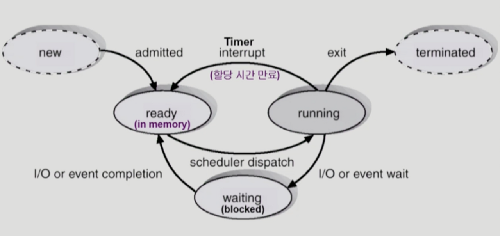
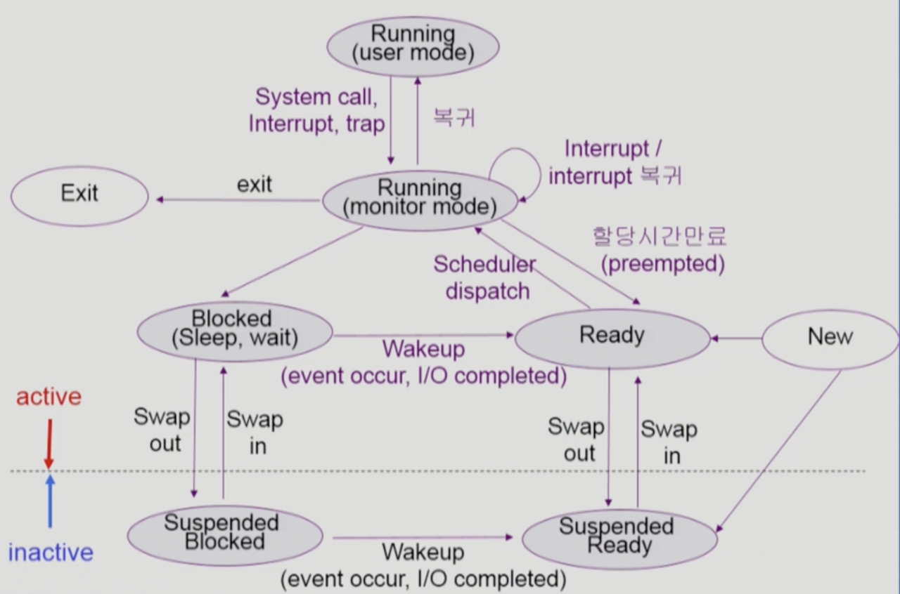

# [Process1](https://core.ewha.ac.kr/assets/publish/C0101020140318134023355997)

## 프로세스의 개념

- Process is a program in execution
- 프로세스의 문맥 (Context)
    - CPU 수행 상태를 나타내는 하드웨어 문맥
        - Program Counter
        - 각종 Register
    - 프로세스의 주소 공간
        - Code, Data, Stack
    - 프로세스 관련 커널 자료 구조
        - PCB(Process Control Block)
        - Kernel stack

## 프로세스의 상태 (process state)

- 프로세스는 상태(state)가 변경되며 수행된다
    - Running
        - CPU를 잡고 instruction을 수행중인 상태
    - Ready
        - CPU를 기다리는 상태 (메모리 등 다른 조건을 모두 만족)
    - Blocked(wait, sleep)
        - CPU를 주어도 당장 instruction을 수행할 수 없는 상태
        - Process 자신이 요청한 event(예 : I/O)가 즉시 만족되지 않아 이를 기다리는 상태
            
            ex) 디스크에서 파일을 읽어와야 하는 경우
            
        - 자신이 요청한 event가 만족되면 Ready로 상태 변경
    - Suspended (stopped)
        - 외부적인 이유로 프로세스의 수행이 정지된 상태
        - 프로세스는 통째로 디스크에 swap out 됨
            
            ex) 사용자가 프로그램을 일시 정지 시킨 경우 (break key) 시스템이 여러 이유로 프로세스를 잠시 중단 시킴 (메모리에 너무 많은 프로세스가 올라와 있을 때)
            
        - 외부에서 resume 해 주어야 Active 상태로 변경됨
    - New
        - 프로세스가 생성 중인 상태
    - Terminated
        - 수행(execution)이 끝난 상태

## 프로세스 상태도

- 한 개의 Process가 CPU에서 Running 상태가 됨
- Running 중에서 Disk I/O가 일어나면 Disk I/O Queue에 들어가고 Blocked 상태가 됨
- I/O 작업이 끝나면 Ready Queue에 다시 들어감
- 공유 데이터에 접근 시 Resource Queue에 Blocked 상태가 됨

## Process Control Block (PCB)

- 운영체제가 각 프로세스를 관리하기 위해 프로세스 당 유지하는 정보
- 구성 요소 (구조체로 유지)
    1. OS가 관리 상 사용하는 정보
        - Process state, Process ID
        - scheduling information, priority
    2. CPU 수행 관련 하드웨어 값
        - Program counter, registers
    3. 메모리 관련
        - Code, data, stack의 위치 정보
    4. 파일 관련
        - Open file descriptors…

## 문맥 교환 (Context Switch)

- CPU를 한 프로세스에서 다른 프로세스로 넘겨주는 과정
- CPU가 다른 프로세스에게 넘어갈 때 운영체제는 다음을 수행
    - CPU를 내어주는 프로세스의 상태를 그 프로세스의 PCB에 저장
    - CPU를 새롭게 얻는 프로세스의 상태를 PCB에서 읽어옴
- System call이나 Interrupt 발생 시 반드시 Context Switch가 일어나는 것은 아님

## 프로세스를 스케줄링 하기 위한 큐

- Job Queue
    - 현재 시스템 내에 있는 모든 프로세스의 집합
- Ready Queue
    - 현재 메모리 내에 있으면서 CPU를 잡아서 실행되기를 기다리는 프로세스의 집합
- Device Queues
    - I/O device의 처리를 기다리는 프로세스의 집합

⇒ 프로세스들은 각 큐를 오가며 수행

## 스케줄러 (Scheduler)

- Long-term scheduler (장기 스케줄러 or job scheduler)
    - 시작 프로세스 중 어떤 것들을 ready queue로 보낼지 결정
    - 프로세스에 memory (및 각종 자원)을 주는 문제
    - degree of Multiprogramming을 제어
    - time sharing system에는 보통 장기 스케줄러가 없음 (무조건 ready)
- Short-term scheduler (단기 스케줄러 or CPU scheduler)
    - 어떤 프로세스를 다음번에 running 시킬지 결정
    - 프로세스에 CPU를 주는 문제
    - 충분히 빨라야 함 (millisecond 단위)
- Medium-term scheduler (중기 스케줄러 or Swapper)
    - 여유 공간 마련을 위해 프로세스를 통째로 메모리에서 디스크로 쫓아냄
    - 프로세스에게서 memory를 뺏는 문제
    - degree of Multiprogramming을 제어

## **프로세스 상태도**

- inactive : 외부적인 이유로 프로세스가 정지 됨
- active : 프로세스가 동작 중
